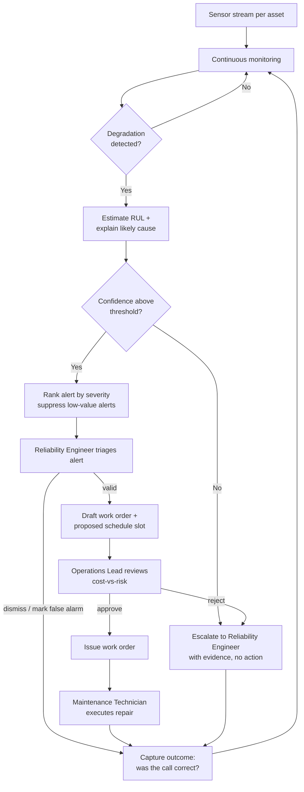

# Mech Sage — Product Requirements Document (PRD)

| Field | Value |
|---|---|
| **Project** | Mech Sage — Predictive-Maintenance Operations Copilot |
| **Client** | Ironside Manufacturing (fictional persona) |
| **Document** | PRD v1.0 |
| **Stage** | Stage 2 · Define (Sprint 0) |
| **Status** | Draft for stakeholder approval |
| **Owners** | Sudhanshu Biswas · Ayush Patil · Shubham Rangdal |
| **Last updated** | 2026-06-21 |

> **Purpose of this document.** This PRD turns the Stage 1 discovery into a contract. It defines *what* we are building, *for whom*, *why*, and *how success is measured* — in enough detail that a stakeholder could approve it and an engineer could build from it without a follow-up meeting. It deliberately does **not** specify the detailed technical design (agent topology, schemas, gateway), which is the Stage 3 deliverable.

---

## 1. Problem Statement

Ironside Manufacturing operates a fleet of expensive, hard-working machines. When an asset fails without warning, the production line stops, and an unplanned outage costs far more than a planned repair.

Each machine streams sensor data — temperatures, pressures, speeds, vibration, and wear. Today a small reliability team watches dashboards and reacts only when a value trips a threshold, which is usually too late. The signal that a machine is heading for failure is typically present in the data days earlier, but it is buried and goes unnoticed.

Leadership does not want another dashboard of red and green lights. They want a copilot that:

- watches the whole fleet continuously,
- catches degradation early,
- explains in plain language what is going wrong and how confident it is,
- estimates remaining useful life (RUL), and
- drafts the work order and the maintenance schedule for a human to approve.

The system must catch the failures that matter, operate at fleet scale, avoid drowning the team in false alarms, and stay within a defined cost and latency budget.

---

## 2. Goals and Non-Goals

### 2.1 Goals

- Detect asset degradation **before** failure, with enough lead time to act.
- Produce **trustworthy, explained** RUL estimates a reliability engineer can rely on.
- Generate **actionable** work orders and schedules that a technician can execute, gated by human approval.
- Operate at **fleet scale** within a hard cost and latency budget.
- Maintain **trust** by keeping false alarms low and abstaining when uncertain.

### 2.2 Non-Goals (out of scope for v1)

- Automatically executing maintenance actions without human approval.
- Direct control of, or write-back to, physical machines or PLCs.
- ERP, procurement, or spare-parts inventory integration.
- Mobile application; v1 ships an API plus a minimal web interface.
- Optimization of the maintenance crew roster or labor scheduling beyond proposing time slots.

---

## 3. Target Users and Personas

| Persona | Role | Primary Goal | Key Frustration |
|---|---|---|---|
| **Reliability Engineer** (primary) | Monitors fleet health, triages alerts | Catch degradation early and trust the alert | Drowning in dashboards and false alarms |
| **Maintenance Technician** | Executes repairs | Receive a clear, actionable work order | Vague "check the machine" tickets |
| **Operations Lead** | Owns uptime and cost | Maximize uptime within budget | No view of the cost-vs-risk tradeoff |
| **ML / Platform Engineer** | Maintains the system | Keep it observable and cheap | Black-box pipelines, runaway token cost |

---

## 4. Jobs To Be Done

| User | Job statement |
|---|---|
| Reliability Engineer | "Tell me which asset is heading for failure, why, and how sure you are — before it stops the line." |
| Maintenance Technician | "Hand me a work order I can act on without a follow-up call." |
| Operations Lead | "Show me the cost-vs-risk picture so I can approve the schedule with confidence." |
| ML / Platform Engineer | "Let me trace any decision and see what each monitored asset costs." |

---

## 5. Scope

| In scope (v1) | Out of scope (v1) |
|---|---|
| Continuous fleet monitoring | Auto-execution without approval |
| Early anomaly / degradation detection | Physical machine control |
| RUL estimation with explanation | ERP / inventory integration |
| Work-order drafting | Native mobile app |
| Maintenance schedule drafting | Crew roster optimization |
| Human approval workflow | Multi-tenant SaaS hardening |
| Cost and latency instrumentation | — |

---

## 6. User Flow (high level)

**Step-by-step**

1. **Monitor.** The system continuously watches each asset's sensor stream. If nothing is wrong, it stays in the monitoring loop (no alert, no cost spike).
2. **Detect.** When degradation appears, it flags the asset and moves it to analysis.
3. **Diagnose.** It estimates RUL and explains the likely failure mode in plain language.
4. **Confidence gate.** If confidence is below threshold, it **abstains** — escalating to the Reliability Engineer with evidence and taking no automated action.
5. **Rank.** Confident alerts are ranked by severity; low-value alerts are suppressed to avoid alarm fatigue.
6. **Triage.** The Reliability Engineer reviews the alert and either dismisses it (logged as a false alarm) or confirms it.
7. **Draft.** For confirmed alerts, the system drafts a work order and a proposed schedule slot.
8. **Approve.** The Operations Lead reviews the cost-vs-risk picture and approves or rejects.
9. **Execute.** On approval, the work order is issued and the Maintenance Technician carries out the repair.
10. **Learn.** Every outcome (correct catch, false alarm, miss) is captured and feeds back into monitoring and tuning.

*The system always degrades to a human path when uncertain; it never acts on a machine without approval.*

---

## 7. Functional Requirements

| ID | Requirement | Priority |
|---|---|---|
| FR-1 | Ingest and monitor sensor streams for every asset in the fleet. | Must |
| FR-2 | Detect degradation early and rank alerts by severity. | Must |
| FR-3 | Estimate remaining useful life (RUL) for an at-risk asset. | Must |
| FR-4 | Explain the likely failure mode in plain language with a confidence level. | Must |
| FR-5 | Draft a work order a technician can act on. | Must |
| FR-6 | Draft a maintenance schedule / time slot for the work. | Must |
| FR-7 | Route every consequential output through human approval. | Must |
| FR-8 | Abstain and escalate when confidence is below threshold. | Must |
| FR-9 | Suppress low-value alerts to control alarm fatigue. | Should |
| FR-10 | Surface a cost-vs-risk view for the Operations Lead. | Should |

---

## 8. Operational Definitions

Precise definitions so every later metric is unambiguous:

| Term | Definition |
|---|---|
| **Credible alert** | An alert with confidence above the agreed threshold, backed by named contributing sensors. |
| **Failure** | The point at which an asset can no longer meet its operating spec (per dataset RUL = 0). |
| **Early detection** | A credible alert raised at least the target lead time before failure. |
| **False alarm** | A credible alert for an asset that does not fail within the relevant horizon. |
| **Successful asset** | An asset for which the system produced a correct, actioned recommendation within budget. |

---

## 9. Success Metrics

Every metric carries a **baseline** and a **target**. The numbers below are **rough starting values** for the NASA C-MAPSS setting (RUL measured in operating *cycles*, where one flight cycle ≈ one unit). Treat them as starting goals to confirm and tighten against measured data in Sprint 0–1, not as final commitments.

| Metric | Definition | Baseline (rough) | Target (rough) | Type |
|---|---|---|---|---|
| **Early-detection lead time** | Avg. cycles before failure a credible alert is raised | ~5 cycles (late, threshold-based) | **≥ 25 cycles** ahead | ⭐ North-star |
| **RUL prediction error (RMSE)** | Avg. error of the RUL estimate, in cycles | ~35 cycles (naive last-value) | **≤ 18 cycles** | Supporting |
| **False-alarm rate** | Share of credible alerts not followed by a real failure | ~35% (today) | **≤ 10%** | 🛡️ Guardrail |
| **RUL explanation quality** | Human/judge rating of estimate + reasoning soundness | ~2.5 / 5 | **≥ 4.0 / 5** | Supporting |
| **Work-order usefulness** | Share of drafts a technician accepts without rework | ~50% (manual tickets) | **≥ 80%** | Supporting |
| **Cost per asset monitored** | Compute / LLM cost per asset per monitoring window | ~\$0.05 / asset | **≤ \$0.01 / asset** | 🛡️ Guardrail |

> **How to read these numbers.** They are illustrative targets to anchor the build, grounded in the C-MAPSS run-to-failure setting. For example, "≥ 25 cycles" of lead time means a credible alert roughly 25 operating cycles before predicted failure — enough runway to schedule a planned repair. Replace each value with a measured baseline once the dataset and status-quo are profiled.

> **North-star + guardrails.** Early-detection lead time is the headline metric. The false-alarm rate (≤ 10%) and cost-per-asset (≤ \$0.01) guardrails must never be crossed, even if the headline metric improves.

---

## 10. Non-Functional Requirements

| Category | Requirement |
|---|---|
| **Latency** | Per-asset analysis completes within the agreed budget (target window to be set in Stage 3). |
| **Cost** | Hard per-asset budget enforced with alarms; cheap models used for routine monitoring, stronger models only on signal. |
| **Scale** | Architecture must hold across the full fleet, with concurrent per-asset processing. |
| **Safety** | Human approval required for all actions; system abstains when unsure and degrades to a human path. |
| **Observability** | Every decision and tool call is traceable; cost, quality, and latency are reported. |
| **Security** | No secrets in code; least-privilege access to data sources. |

---

## 11. Risks (summary)

Full detail lives in the Stage 4 Risk Register. Top risks and the direction of mitigation:

| Risk | Why it matters | Mitigation direction |
|---|---|---|
| Missed critical failure | A false negative on a critical fault is the worst outcome | Bias toward recall on critical modes, conservative thresholds, escalation |
| Alarm fatigue | Too many false alarms erode trust | Precision tuning, severity ranking, alert suppression |
| Unsafe maintenance action | A bad work order wastes time or causes harm | Human approval, grounded procedures, action guards |
| Hallucinated diagnosis | An invented cause misleads the team | Grounding in manuals + model output, refusal when unsure |
| Scale / cost blow-up | Watching a fleet can be expensive | Cheap models for routine work, escalate only on signal, hard budgets |

---

## 12. Assumptions and Open Questions

### 12.1 Assumptions (to validate)

- 🔖 Sensor data arrives at a regular, known cadence per asset.
- 🔖 A public run-to-failure dataset (e.g., NASA C-MAPSS) is representative enough to prototype against.
- 🔖 A human approver is available within the maintenance workflow.

### 12.2 Open questions for the client

- What are the fleet volumes and peak streaming patterns?
- What is the system allowed to do, and what must **never** be automated?
- What false-alarm rate is acceptable before the team stops trusting the system?
- What is the budget ceiling per asset monitored?
- What lead time is operationally useful (hours, shifts, days)?

---

## 13. Acceptance Criteria — "Done looks like"

A PRD a stakeholder could approve and a team could build from on its own, with:

- a clear problem statement, personas, and jobs to be done;
- explicit scope and non-scope;
- a north-star metric, supporting metrics, and at least two guardrail metrics, each with a baseline and a target;
- stated non-functional requirements (latency, cost, safety); and
- assumptions and open questions captured and marked.

---

## 14. Appendix — References

- Futurense AI Clinic · Capstone Project Brief · Project 04 (Stages 1–2).
- Candidate datasets: NASA C-MAPSS (Turbofan), NASA N-CMAPSS, AI4I 2020 Predictive Maintenance.
