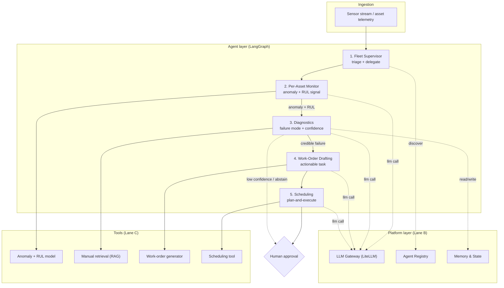
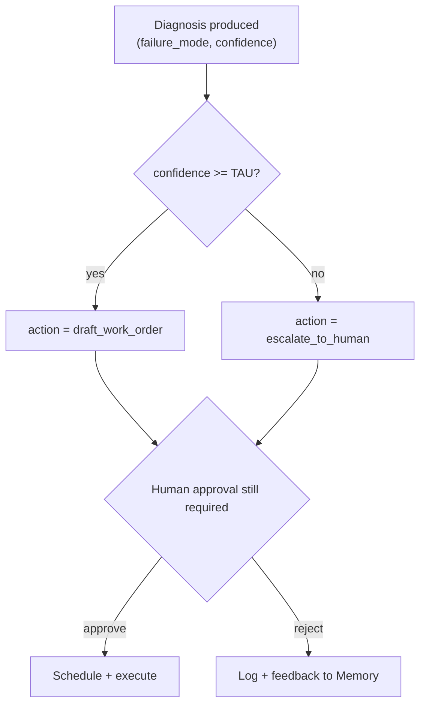

# Mech Sage — Stage 3 (Design): Architecture & Topology

> **Lane A — Owner: Sudhanshu Biswas** (Chief Agent Architect & Product Lead)
> **Project:** Mech Sage — agentic predictive-maintenance copilot for Ironside Manufacturing
> **Stage:** 3 (Design) · Sprint 1 · builds on PRD v1.0 (`docs/02_prd.md`)
> **Status:** Draft for Day-0 contract lock

---

## 0. Purpose & scope of this doc

This document owns the **shape of the system**: how the agents are arranged, how control flows between them, and the contracts every other lane builds against. It deliberately **does not repeat** the PRD — it builds on PRD §6 (user flow) and turns the five proposed agents into a buildable spec.

What's in here:
1. System architecture diagram
2. Agent topology spec (all 5 agents)
3. Orchestration decision record
4. Agent contracts as schemas (the Day-0 lock)
5. Confidence-gate / abstain + human-in-the-loop design

Downstream dependencies:
- **Lane B (Platform — Shubham):** consumes the agent list + model tiers for the registry & routing table.
- **Lane C (Tools & Data — Ayush):** consumes the agent contracts + data schemas to spec the tools.

---

## 1. System architecture diagram

The system is a **hierarchical multi-agent** topology. A Fleet Supervisor triages and delegates; specialist agents handle one job each; every model call passes through the Platform layer (Lane B); every external action happens through a Tool (Lane C).



**Reading the diagram:**
- **Solid arrows** = the main data/control flow (the PRD §6 happy path).
- **Dotted arrows to Platform** = every agent resolves peers via the Registry and makes model calls via the Gateway.
- **Dotted abstain path** = low-confidence diagnoses bypass automation and go straight to a human.

---

## 2. Agent topology spec

Each agent has **one** responsibility. "Model tier" is a request to Lane B's routing table, not a hard provider choice.

### 2.1 Fleet Supervisor
| Field | Spec |
|---|---|
| **Responsibility** | Triage incoming asset signals, decide which assets need attention, delegate to the right specialist. The only orchestrator. |
| **Inputs** | Asset telemetry events; fleet-wide state from Memory |
| **Outputs** | Delegation calls to Per-Asset Monitor; fleet status summary |
| **Tools** | None (pure orchestration) |
| **Model tier** | Cheap (routing/classification work) |
| **Talks to** | Per-Asset Monitor (down), Registry (discovery), Memory (fleet state) |

### 2.2 Per-Asset Monitor
| Field | Spec |
|---|---|
| **Responsibility** | For one asset, run anomaly detection + RUL estimation and decide if a signal is worth escalating. |
| **Inputs** | `asset_id`, sensor window |
| **Outputs** | `alert` object (anomaly score + RUL estimate + severity) |
| **Tools** | Anomaly + RUL model (the real ML model) |
| **Model tier** | Cheap (the ML model does prediction; LLM only frames the signal) |
| **Talks to** | Fleet Supervisor (up), Diagnostics (down) |

### 2.3 Diagnostics
| Field | Spec |
|---|---|
| **Responsibility** | Explain the likely failure mode behind an alert, cite evidence, and assign a confidence. Owns the confidence gate. |
| **Inputs** | `alert` object + sensor window |
| **Outputs** | `diagnosis` object (failure mode + confidence + evidence + action) |
| **Tools** | Manual retrieval (RAG) |
| **Model tier** | Strong (this is the core reasoning step) |
| **Talks to** | Per-Asset Monitor (up), Work-Order Drafting (down), Human (abstain path), Memory (history) |

### 2.4 Work-Order Drafting
| Field | Spec |
|---|---|
| **Responsibility** | Turn a credible diagnosis into a concrete, actionable work order. |
| **Inputs** | `diagnosis` object |
| **Outputs** | `work_order` object |
| **Tools** | Work-order generator |
| **Model tier** | Mid (structured drafting from a clear input) |
| **Talks to** | Diagnostics (up), Scheduling (down) |

### 2.5 Scheduling
| Field | Spec |
|---|---|
| **Responsibility** | Place the work order into a feasible slot given technician/asset availability; prepare it for human approval. |
| **Inputs** | `work_order` object + availability data |
| **Outputs** | `schedule` proposal → human approval queue |
| **Tools** | Scheduling tool |
| **Model tier** | Mid (plan-and-execute) |
| **Talks to** | Work-Order Drafting (up), Human approval (out) |

---

## 3. Orchestration decision record

**Decision: adopt a hierarchical supervisor pattern (LangGraph), with a plan-and-execute sub-pattern inside the Scheduling agent.**

| Option | What it is | Verdict | Why |
|---|---|---|---|
| **Hierarchical (supervisor)** | One supervisor triages & delegates to specialists | ✅ **Adopt** | Matches the PRD §6 flow exactly; clear single point of control; scales per-asset; easy to reason about and debug |
| **Flat parallel / swarm** | All agents peers, negotiate among themselves | ❌ Reject | Hard to guarantee the confidence gate runs before automation; non-deterministic; difficult to audit for a safety-sensitive domain |
| **Plan-and-execute (global)** | A planner builds a full plan up front, executor runs it | ⚠️ Partial | Too rigid for streaming sensor data at the top level — but ideal *inside* Scheduling, where a concrete multi-step plan is needed |

**How it holds at fleet scale:** the Fleet Supervisor fans out one Per-Asset Monitor instance per asset (or per batch); specialists are stateless given their contract input, so they scale horizontally. State lives in the Memory layer (Lane B), not in the agents.

**Framework:** LangGraph — explicit graph of nodes/edges gives us the deterministic control flow and the conditional abstain edge we need. (CrewAI/AutoGen considered; LangGraph chosen for explicit edge control + checkpointing.)

---

## 4. Agent contracts as schemas (the Day-0 lock)

These are the **frozen interfaces** every lane builds against. Field names here are canonical — Lane C's data schemas and Lane B's registry metadata must match exactly.

### 4.1 `alert` (Per-Asset Monitor → Diagnostics)
```json
{
  "asset_id": "string",
  "raised_at": "timestamp",
  "window": "timeseries_ref",
  "anomaly_score": "float",
  "rul_estimate": "float",
  "severity": "low | medium | high"
}
```

### 4.2 `diagnosis` (Diagnostics → Work-Order Drafting | Human)
```json
{
  "asset_id": "string",
  "failure_mode": "string",
  "confidence": "float",
  "evidence": ["sensor_id"],
  "manual_refs": ["doc_ref"],
  "action": "draft_work_order | escalate_to_human"
}
```

### 4.3 `work_order` (Work-Order Drafting → Scheduling)
```json
{
  "asset_id": "string",
  "failure_mode": "string",
  "recommended_action": "string",
  "parts": ["part_id"],
  "priority": "low | medium | high",
  "estimated_duration_hrs": "float"
}
```

### 4.4 `schedule` (Scheduling → Human approval)
```json
{
  "work_order_id": "string",
  "asset_id": "string",
  "proposed_start": "timestamp",
  "technician_id": "string",
  "status": "pending_approval"
}
```

### 4.5 Generic agent envelope (for the registry — Lane B)
```json
{
  "agent": "string",
  "version": "semver",
  "model_tier": "cheap | mid | strong",
  "input_schema": "ref",
  "output_schema": "ref",
  "tools": ["tool_name"]
}
```

---

## 5. Confidence-gate / abstain + human-in-the-loop

The Diagnostics agent owns the gate. This is the safety mechanism the PRD §6 flow only sketches.



**Rules:**
- **TAU (confidence threshold):** a single tunable parameter. Start conservative (e.g. 0.75) and tune against Lane C's false-alarm baseline once it exists. The exact number is set jointly with Ayush — it directly trades off against the false-alarm guardrail.
- **Abstain ≠ failure:** an abstain is a valid, logged outcome that routes to a human with the partial evidence attached.
- **Human approval is always required** before any physical action, even on high-confidence diagnoses (PRD safety NFR). The gate only decides whether automation drafts a work order first or hands raw evidence to a human.
- **Every decision is logged** to Memory (Lane B) for later metric measurement (feeds Lane C's RUL-explanation-quality + work-order-usefulness metrics).

---

## 6. Open items for the Day-0 kickoff

- [ ] Confirm the 5 agent names above are final (locks Lane B registry + Lane C tool ownership).
- [ ] Ratify the contract field names in §4 (this is the seam everyone builds against).
- [ ] Agree initial **TAU** value with Ayush (Lane C).
- [ ] Confirm model tiers in §2 map cleanly onto Shubham's routing table (Lane B).

---

*Merges into `docs/03_design.md` as sections 1–4 per the Stage 3 merge plan.*
