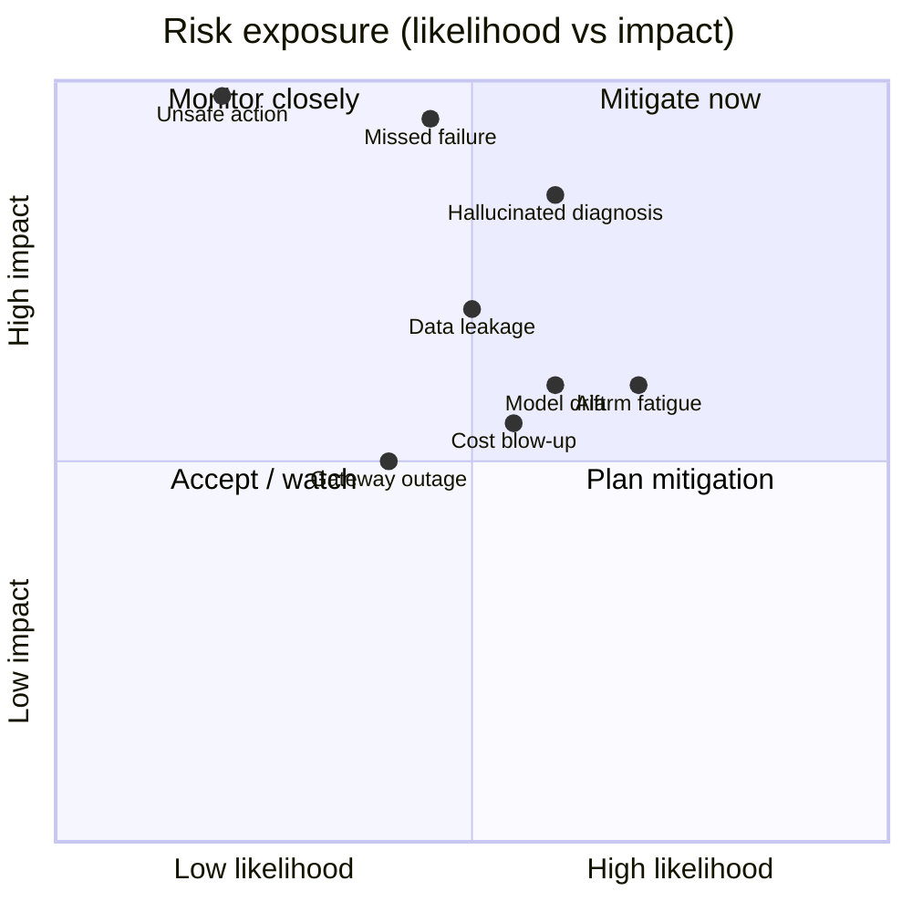

# Mech Sage — Stage 4: Risk Register

> **Stage:** 4 (Risk) · Sprint 1 · builds on PRD v1.0 (`docs/02_prd.md` §11) and the Stage 3 design (`docs/03_design.md`)
> **Project:** Mech Sage — agentic predictive-maintenance copilot for Ironside Manufacturing
> **Owners:** Sudhanshu Biswas · Ayush Patil · Shubham Rangdal
> **Status:** Draft for review

---

## 0. How to read this register

Stage 3 designed *how the system works*. This document asks *how it fails* — and proves that the safety mechanisms in the Stage 3 design (confidence gate, abstain path, mandatory human approval, cost guardrails) are deliberate answers to named risks.

**Scoring scale (human-assigned — not LLM-generated):**

| Level | Likelihood | Impact |
|---|---|---|
| **1 – Low** | Rare | Minor / cosmetic |
| **2 – Medium** | Occasional | Degrades trust or cost |
| **3 – High** | Frequent / expected | Safety, data-integrity, or project-killing |

**Risk score = Likelihood × Impact** (1–9). Anything scoring **≥6 is a priority risk** with a named owner and a mitigation that must exist before Stage 6 (Build).

> ⚠️ The golden rule still applies: the LLM helped *expand and word* this register, but every likelihood/impact rating is a **human judgment**. We do not treat LLM-invented probabilities as fact.

---

## 1. Risk heat summary

---

## 2. Priority risk register (score ≥ 6)

### R1 · Missed failure (false negative)
| | |
|---|---|
| **Failure mode** | The system fails to flag an asset that is actually about to fail. |
| **Likelihood** | 2 (Medium) |
| **Impact** | 3 (High — unplanned downtime / safety) |
| **Score** | **6** |
| **Owner** | Ayush (model) |
| **Mitigation** | Tune the RUL/anomaly model for **recall over precision** on the failure class; set conservative alert thresholds; track missed-failure rate on held-out C-MAPSS data in Stage 7; keep a human spot-check loop on "all-clear" assets. |
| **Design link** | Anomaly + RUL model (Lane C); alert severity in the `alert` contract. |

### R2 · Hallucinated diagnosis
| | |
|---|---|
| **Failure mode** | The Diagnostics LLM invents a plausible-sounding failure mode not supported by the data or manuals. |
| **Likelihood** | 3 (High — inherent LLM behaviour) |
| **Impact** | 3 (High — wrong maintenance, lost trust) |
| **Score** | **9** |
| **Owner** | Sudhanshu (design) |
| **Mitigation** | Ground every diagnosis in **RAG over real manuals** (cite `manual_refs`); require `evidence` (sensor IDs) in the `diagnosis` contract; enforce the **confidence gate (TAU)** — low-confidence diagnoses abstain to a human; LLM-as-judge explanation-quality eval in Stage 7 (RAGAS). |
| **Design link** | Confidence gate / abstain (§5 of `03_architecture.md`); RAG tool (Lane C). |

### R3 · Alarm fatigue (false positives)
| | |
|---|---|
| **Failure mode** | Too many false or low-value alerts; engineers start ignoring the system. |
| **Likelihood** | 3 (High) |
| **Impact** | 2 (Medium — erodes adoption) |
| **Score** | **6** |
| **Owner** | Ayush (metrics) |
| **Mitigation** | Enforce the **false-alarm-rate guardrail** from PRD §9; tune TAU jointly with the missed-failure trade-off; severity-rank alerts so engineers triage high first; feedback loop so dismissed alerts retune thresholds. |
| **Design link** | False-alarm guardrail (Lane C); confidence gate (Lane A). |

### R4 · Unsafe automated action
| | |
|---|---|
| **Failure mode** | The system triggers or schedules a maintenance action that is physically unsafe or wrong. |
| **Likelihood** | 1 (Low — by design) |
| **Impact** | 3 (High — safety-critical) |
| **Score** | **3** *(low score only because the mitigation is hard-wired — do not remove it)* |
| **Owner** | Sudhanshu (design) |
| **Mitigation** | **Mandatory human approval before any physical action**, even on high-confidence diagnoses (PRD safety NFR); the system only ever *proposes* a `schedule` with `status: pending_approval`. No agent has authority to execute. |
| **Design link** | Human-in-the-loop approval gate (Lane A §5). |

---

## 3. Secondary risk register (score < 6 — monitor)

### R5 · Cost blow-up
| | |
|---|---|
| **Failure mode** | Too many expensive model calls push cost-per-asset past the budget. |
| **Likelihood** | 2 | **Impact** | 2 | **Score** | **4** |
| **Owner** | Shubham (platform) |
| **Mitigation** | Model-routing table (cheap-vs-strong) + per-asset **cost ceiling** guardrail; cache repeated RAG lookups; cost dashboard in Stage 8. |
| **Design link** | LLM gateway + routing table (Lane B). |

### R6 · Data leakage (train/test contamination)
| | |
|---|---|
| **Failure mode** | Future information leaks into training features, inflating model performance. |
| **Likelihood** | 2 | **Impact** | 3 | **Score** | **6** → *treat as priority during Stage 5* |
| **Owner** | Ayush (data) |
| **Mitigation** | Strict time-ordered train/val/test split; windowing that never crosses the RUL label boundary; documented dataset cards; leakage review before model training. |
| **Design link** | Data schemas + dataset prep (Lane C / Stage 5). |

### R7 · Model drift
| | |
|---|---|
| **Failure mode** | Real-world sensor distributions drift from the C-MAPSS training distribution; accuracy silently degrades. |
| **Likelihood** | 2 | **Impact** | 2 | **Score** | **4** |
| **Owner** | Ayush / Shubham |
| **Mitigation** | Monitor input-distribution + prediction-confidence over time; alert on drift; scheduled re-evaluation; document retraining trigger in the Stage 8 runbook. |
| **Design link** | Observability (Lane B / Stage 8). |

### R8 · LLM gateway / provider outage
| | |
|---|---|
| **Failure mode** | The model provider is down or rate-limits us; agents stall. |
| **Likelihood** | 2 | **Impact** | 2 | **Score** | **4** |
| **Owner** | Shubham (platform) |
| **Mitigation** | Gateway **fallback chain** (alternate provider/model); retries with backoff; timeouts so the graph fails gracefully to the human queue rather than hanging. |
| **Design link** | LLM gateway (Lane B). |

### R9 · Orchestration / state corruption
| | |
|---|---|
| **Failure mode** | An agent loops, deadlocks, or loses state mid-flow at fleet scale. |
| **Likelihood** | 1 | **Impact** | 2 | **Score** | **2** |
| **Owner** | Sudhanshu / Shubham |
| **Mitigation** | LangGraph checkpointing; explicit max-step limits; stateless specialists (state lives in the Memory layer); per-asset isolation so one bad asset can't poison the fleet. |
| **Design link** | Orchestration decision record (Lane A §3); Memory & state (Lane B). |

### R10 · Scope / timeline risk (project)
| | |
|---|---|
| **Failure mode** | Trying to build all 5 agents + platform + model in the sprint window; nothing finishes. |
| **Likelihood** | 2 | **Impact** | 2 | **Score** | **4** |
| **Owner** | Sudhanshu (PM) |
| **Mitigation** | Parallel lane split with frozen Day-0 contracts; thin vertical slice first (one asset, one failure mode end-to-end); defer non-Must FRs. |
| **Design link** | Stage 3 merge plan. |

---

## 4. Mitigation → design traceability

Every priority mitigation must map to something real in the design. If a row has no design home, it's a gap.

| Risk | Mitigation lives in | Verified in |
|---|---|---|
| R1 Missed failure | Anomaly/RUL model, alert thresholds | Stage 7: recall, RUL RMSE |
| R2 Hallucination | Confidence gate, RAG grounding, evidence field | Stage 7: RAGAS explanation quality |
| R3 Alarm fatigue | False-alarm guardrail, TAU tuning | Stage 7: false-alarm rate |
| R4 Unsafe action | Mandatory human approval | Design review (cannot be removed) |
| R5 Cost blow-up | Routing table, cost ceiling | Stage 7/8: cost dashboard |
| R6 Data leakage | Time-ordered split, dataset cards | Stage 5 leakage review |

---

## 5. Top risks we are explicitly accepting (for now)

- **Single dataset (C-MAPSS only):** we accept that the demo is trained on turbofan data, not Ironside's real fleet. Mitigation deferred to a future "bring-your-own-data" stage.
- **Free-tier deployment limits:** acceptable for a capstone demo; not production SLA.

---

## 6. Open items for review

- [ ] Ratify likelihood/impact scores as a team (these are judgments, not facts).
- [ ] Confirm R6 (data leakage) is owned and gated before Stage 5 model training.
- [ ] Lock the initial **TAU** value — it directly trades off R1 (missed failure) vs R3 (alarm fatigue).
- [ ] Add any maintenance-floor / safety risk the team knows that an outsider would miss.

---

*Expands PRD §11 risk summary into the full register. Feeds Stage 7 (Verify), where mitigations are measured.*
