# Mech Sage — Stage 3 (Design): Tools, Data & Metrics

> **Lane C — Owner: Ayush Patil** (Data, Tools & Metrics Lead)
> **Project:** Mech Sage — agentic predictive-maintenance copilot for Ironside Manufacturing
> **Stage:** 3 (Design) · Sprint 1 · builds on PRD v1.0 (`docs/02_prd.md`) + Architecture doc (`03_architecture.md`)
> **Status:** Draft — Day-0 lock candidate

---

## 0. Purpose & Scope

This document owns the **data layer and tool contracts** that the agent layer (Lane A) calls and the platform layer (Lane B) routes through. It also **fills all metric TBDs** left open in PRD §5 and §6.

What's in here:
1. **Tool I/O specifications** — the four tools the agents call, with typed schemas and error contracts
2. **Data schemas** — canonical sensor window, asset record, and maintenance corpus formats
3. **Metric baselines + targets** — filled-in numbers for every PRD §5 metric
4. **TAU threshold recommendation** — initial confidence gate value agreed with Lane A (§4 of architecture)

Upstream dependency:
- **Lane A (Architecture — Sudhanshu):** agent contracts in `03_architecture.md §4` define the exact field names tools receive and must return. This doc expands each tool's internal I/O to match those contracts exactly.

Downstream consumers:
- **Lane B (Platform — Shubham):** tool names here are the canonical entries in the agent registry.
- **Lane A (Architecture — Sudhanshu):** TAU value and false-alarm baseline from §3 are needed to finalize the confidence gate in `03_architecture.md §5`.

---

## 1. Tool I/O Specifications

Each agent tool has one job. Schemas here are the **frozen interface** — field names, types, and error codes are canonical for implementation.

> **Convention:** All timestamps are ISO 8601 UTC strings. All floats are 64-bit. Error responses carry `{ "error_code": "string", "message": "string" }`.

---

### 1.1 Tool: `anomaly_rul_model`

**Called by:** Per-Asset Monitor agent
**Purpose:** Given a sensor window for one asset, return an anomaly score and RUL estimate. This is the core ML inference call — the LLM does not predict; it frames the output.

#### Input Schema
```json
{
  "asset_id":       "string",               // e.g. "engine-077"
  "cycle_start":    "integer",              // first cycle in the window (1-indexed)
  "cycle_end":      "integer",              // last cycle in the window (inclusive)
  "sensor_window":  {
    "op1": [float],                         // operational setting 1 (altitude proxy)
    "op2": [float],                         // operational setting 2 (Mach proxy)
    "op3": [float],                         // operational setting 3 (throttle angle)
    "s2":  [float],                         // LPC outlet temperature (K)
    "s3":  [float],                         // HPC outlet temperature (K) — primary degradation signal
    "s4":  [float],                         // LPT outlet temperature (K)
    "s7":  [float],                         // HPC outlet pressure (psia)
    "s8":  [float],                         // Physical fan speed (rpm)
    "s9":  [float],                         // Physical core speed (rpm)
    "s11": [float],                         // Static pressure at HPC outlet (psia)
    "s12": [float],                         // Fuel flow / Ps30 ratio
    "s13": [float],                         // Corrected fan speed (rpm)
    "s14": [float],                         // Corrected core speed (rpm)
    "s15": [float],                         // Bypass ratio
    "s17": [float],                         // Bleed enthalpy
    "s20": [float],                         // HPT coolant bleed
    "s21": [float]                          // LPT coolant bleed
  },
  "window_length":  "integer"              // number of cycles in the window (e.g. 30)
}
```

> **Note:** Only the **14 informative sensors** (s2–s4, s7–s9, s11–s15, s17, s20, s21) are passed to the model. The 7 near-constant sensors (s1, s5, s6, s10, s16, s18, s19) are dropped at ingestion to reduce token cost and noise.

#### Output Schema
```json
{
  "asset_id":       "string",
  "anomaly_score":  "float",               // 0.0 (nominal) → 1.0 (certain anomaly); threshold at 0.65
  "rul_estimate":   "float",               // predicted remaining cycles (capped at 125 for training compat.)
  "rul_lower_ci":   "float",               // 10th percentile confidence interval
  "rul_upper_ci":   "float",               // 90th percentile confidence interval
  "degrading_sensors": ["string"],         // sensor IDs driving the score (e.g. ["s3", "s11", "s7"])
  "operating_regime": "string",            // regime cluster ID (e.g. "regime-2") for FD002/FD004 compat.
  "model_version":  "string",             // e.g. "lstm-v1.0.0"
  "inferred_at":    "timestamp"
}
```

#### Error Codes
| Code | Meaning | Agent behaviour |
|---|---|---|
| `WINDOW_TOO_SHORT` | Fewer than 10 cycles provided | Per-Asset Monitor logs and waits for next window |
| `SENSOR_DATA_MISSING` | > 3 of the 14 informative sensors are null | Flag as `SENSOR_FAULT`; do not escalate |
| `MODEL_UNAVAILABLE` | Inference service down | Fall back to rule-based threshold; alert Platform |

#### Performance Constraints (from PRD §6.1 + Lane B routing table)
| Constraint | Value |
|---|---|
| Max inference latency | **< 500 ms** (local LSTM, no API call) |
| Model tier | **Tier 3 — Local** (zero token cost) |
| Fallback | Simple linear regression on last 10 cycles of s3 |

---

### 1.2 Tool: `manual_retrieval_rag`

**Called by:** Diagnostics agent
**Purpose:** Given a failure hypothesis and the set of degrading sensors, retrieve the most relevant maintenance manual passages to ground the explanation.

#### Input Schema
```json
{
  "query":             "string",           // natural language query, e.g. "rising HPC outlet temperature and pressure"
  "degrading_sensors": ["string"],         // from anomaly_rul_model output; used to weight retrieval
  "fault_hypothesis":  "string",           // agent's initial hypothesis, e.g. "HPC degradation"
  "top_k":             "integer",          // number of passages to return; default 3, max 5
  "asset_id":          "string"
}
```

#### Output Schema
```json
{
  "retrieved_passages": [
    {
      "doc_ref":        "string",          // e.g. "MAN-HPC-12" — matches knowledge_base.json IDs
      "fault_mode":     "string",          // e.g. "high pressure compressor degradation"
      "text":           "string",          // full passage text
      "relevance_score":"float"            // cosine similarity 0.0 → 1.0
    }
  ],
  "retrieval_latency_ms": "integer",
  "corpus_version":       "string"        // e.g. "kb-v1.0.0"
}
```

#### Error Codes
| Code | Meaning | Agent behaviour |
|---|---|---|
| `NO_RELEVANT_PASSAGE` | All passages score < 0.40 cosine similarity | Diagnostics sets `manual_refs: []`; confidence is capped at 0.60 (triggers abstain) |
| `CORPUS_UNAVAILABLE` | RAG index not reachable | Diagnostics proceeds without grounding; logs warning; confidence is capped at 0.50 |

#### Performance Constraints
| Constraint | Value |
|---|---|
| Max retrieval latency | **< 2 s** (embedding lookup + vector search) |
| Corpus | `docs/data_card/knowledge_base.json` (v1: 5 passages; Sprint 2: expanded) |
| Embedding model | `text-embedding-3-small` (OpenAI) or `models/embedding-001` (Google) |
| Model tier | **Tier 3 — Local** for embedding; no strong LLM call at this step |

---

### 1.3 Tool: `work_order_generator`

**Called by:** Work-Order Drafting agent
**Purpose:** Given a confirmed diagnosis, produce a structured, actionable work order a technician can execute without a follow-up call.

#### Input Schema
```json
{
  "diagnosis": {
    "asset_id":     "string",
    "failure_mode": "string",
    "confidence":   "float",
    "evidence":     ["string"],            // sensor IDs
    "manual_refs":  ["string"],            // doc_refs from RAG
    "action":       "draft_work_order"    // must be draft_work_order; escalate_to_human bypasses this tool
  },
  "asset_context": {
    "asset_type":           "string",     // e.g. "turbofan-engine"
    "last_maintenance_date":"timestamp",
    "total_cycles_run":     "integer",
    "location":             "string"      // e.g. "Line-3 Bay-B"
  }
}
```

#### Output Schema
```json
{
  "work_order_id":          "string",              // UUID v4
  "asset_id":               "string",
  "failure_mode":           "string",
  "recommended_action":     "string",              // plain-English instruction, ≤ 200 words
  "parts":                  ["string"],            // part IDs from the manual passage, e.g. ["HPC-SEAL-KIT"]
  "tools_required":         ["string"],            // e.g. ["borescope", "torque wrench"]
  "safety_precautions":     ["string"],            // mandatory; ≥ 1 item always present
  "priority":               "low | medium | high",
  "estimated_duration_hrs": "float",
  "manual_refs":            ["string"],            // doc_refs cited in the work order
  "generated_at":           "timestamp",
  "model_version":          "string"
}
```

> **Alignment with Lane A contract:** The `work_order` object in `03_architecture.md §4.3` is a subset of this schema. The generator populates the superset; the Scheduling agent receives only the Lane A contract fields.

#### Error Codes
| Code | Meaning | Agent behaviour |
|---|---|---|
| `GENERATION_TIMEOUT` | LLM call exceeds 10 s | Retry once; if still fails, escalate to human with partial diagnosis |
| `MISSING_SAFETY_PRECAUTION` | Output validator finds no safety item | Reject and re-generate with explicit safety prompt injection |
| `UNGROUNDED_RECOMMENDATION` | Output contains no manual_ref | Reject and re-generate; after 2 retries, escalate |

#### Performance Constraints
| Constraint | Value |
|---|---|
| Max generation latency | **< 10 s** (within the 60 s work-order SLA in PRD §6.1) |
| Model tier | **Tier 2 — Mid** (Gemini 1.5 Flash / GPT-4o-mini) |
| Estimated cost | **~$0.002–$0.008 per work order** |

---

### 1.4 Tool: `scheduling_tool`

**Called by:** Scheduling agent
**Purpose:** Given a work order and current technician/asset availability, find the earliest feasible maintenance window and produce a schedule proposal for human approval.

#### Input Schema
```json
{
  "work_order": {
    "work_order_id":          "string",
    "asset_id":               "string",
    "priority":               "low | medium | high",
    "estimated_duration_hrs": "float"
  },
  "rul_estimate":       "float",           // cycles remaining — defines urgency window
  "rul_upper_ci":       "float",           // latest safe scheduling deadline
  "availability": {
    "technicians": [
      {
        "technician_id":  "string",
        "name":           "string",
        "available_slots":[
          {
            "start": "timestamp",
            "end":   "timestamp"
          }
        ],
        "certifications": ["string"]       // e.g. ["HPC", "fan-balance"]
      }
    ],
    "asset_downtime_windows": [
      {
        "start": "timestamp",
        "end":   "timestamp"
      }
    ]
  },
  "production_calendar": {
    "blackout_periods": [
      { "start": "timestamp", "end": "timestamp", "reason": "string" }
    ],
    "preferred_windows": [
      { "start": "timestamp", "end": "timestamp" }
    ]
  }
}
```

#### Output Schema
```json
{
  "schedule_proposal": {
    "work_order_id":  "string",
    "asset_id":       "string",
    "proposed_start": "timestamp",
    "proposed_end":   "timestamp",
    "technician_id":  "string",
    "technician_name":"string",
    "slot_rationale": "string",           // plain English: why this slot was chosen
    "urgency_deadline":"timestamp",        // derived from rul_upper_ci
    "status":         "pending_approval"
  },
  "alternatives": [                       // top-2 alternative slots, if any
    {
      "proposed_start":  "timestamp",
      "technician_id":   "string",
      "trade_off":       "string"         // e.g. "2 hrs later but preferred production window"
    }
  ],
  "generated_at":    "timestamp"
}
```

#### Error Codes
| Code | Meaning | Agent behaviour |
|---|---|---|
| `NO_FEASIBLE_SLOT` | No available slot within `rul_upper_ci` deadline | Escalate immediately to human with urgency flag; include raw availability data |
| `OVERDUE_DEADLINE` | RUL deadline has already passed | Flag as `CRITICAL_OVERDUE`; bypass normal queue and alert Operations Lead directly |
| `CERTIFICATION_MISMATCH` | No certified technician available | Include uncertified alternatives with warning; human decides |

#### Performance Constraints
| Constraint | Value |
|---|---|
| Max scheduling latency | **< 5 s** (constraint solver; no LLM call in happy path) |
| Model tier | **Tier 2 — Mid / Python constraint solver** |
| Solver | `python-constraint` or greedy earliest-deadline-first for v1 |

---

## 2. Data Schemas

These are the **canonical data structures** used across the pipeline. All agents and tools must read/write data conforming to these schemas. They extend the Day-0 agent contracts from `03_architecture.md §4`.

### 2.1 `sensor_reading` — raw ingestion unit

```json
{
  "asset_id":    "string",
  "cycle":       "integer",
  "received_at": "timestamp",
  "op1":  "float | null",
  "op2":  "float | null",
  "op3":  "float | null",
  "s1":   "float | null",
  "s2":   "float | null",
  "s3":   "float | null",
  "s4":   "float | null",
  "s5":   "float | null",
  "s6":   "float | null",
  "s7":   "float | null",
  "s8":   "float | null",
  "s9":   "float | null",
  "s10":  "float | null",
  "s11":  "float | null",
  "s12":  "float | null",
  "s13":  "float | null",
  "s14":  "float | null",
  "s15":  "float | null",
  "s16":  "float | null",
  "s17":  "float | null",
  "s18":  "float | null",
  "s19":  "float | null",
  "s20":  "float | null",
  "s21":  "float | null",
  "data_quality": "ok | sensor_fault | missing | out_of_range"
}
```

**Validation rules:**
- `null` on ≤ 3 of the 14 informative sensors → `data_quality: missing`; still process.
- `null` on > 3 of the 14 informative sensors → `data_quality: sensor_fault`; do not escalate; log and alert Platform.
- Values outside physical bounds (e.g. temperature < 0 K or > 5000 K) → `data_quality: out_of_range`; treat as `null`.

---

### 2.2 `sensor_window` — normalized window fed to tools

```json
{
  "asset_id":      "string",
  "cycle_start":   "integer",
  "cycle_end":     "integer",
  "window_length": "integer",
  "regime_id":     "string | null",        // operating regime cluster (null for FD001 single-condition)
  "sensors": {
    "<sensor_id>": {
      "raw":        [float],               // length == window_length
      "normalized": [float],              // z-score normalized per-asset per-regime
      "trend":      "flat | rising | falling | spike",
      "drift_delta":"float"               // last_value - rolling_mean over window
    }
  },
  "informative_only": true                // always true for model input; 14 sensors only
}
```

---

### 2.3 `asset_record` — fleet registry entry

```json
{
  "asset_id":             "string",
  "asset_type":           "turbofan-engine | rotating-machinery",
  "location":             "string",
  "commissioned_date":    "timestamp",
  "total_cycles_run":     "integer",
  "last_maintenance_date":"timestamp",
  "last_maintenance_type":"string",
  "baseline_rul":         "float | null",  // RUL at commissioning (125 for new)
  "current_status":       "nominal | degrading | critical | offline",
  "assigned_technician":  "string | null"
}
```

---

### 2.4 `maintenance_corpus_entry` — knowledge base record

```json
{
  "doc_ref":      "string",               // e.g. "MAN-HPC-12"
  "fault_mode":   "string",
  "components":   ["string"],             // e.g. ["HPC", "seal"]
  "sensor_cues":  ["string"],             // sensors that trigger retrieval of this passage
  "text":         "string",              // the full passage text (for RAG)
  "embedding":    [float],               // pre-computed text embedding vector
  "source":       "string",              // e.g. "turbofan-maintenance-manual-v3"
  "added_at":     "timestamp"
}
```

> Current corpus: 5 entries in `docs/data_card/knowledge_base.json`. Sprint 2 target: ≥ 30 entries covering all fault modes in FD001–FD003 + AI4I failure types.

---

### 2.5 `feedback_record` — human approval/rejection log

```json
{
  "feedback_id":    "string",
  "work_order_id":  "string",
  "asset_id":       "string",
  "reviewer_id":    "string",
  "decision":       "approved | rejected | approved_with_edits",
  "edits_made":     "string | null",     // free text; null if approved as-is
  "rejection_reason":"string | null",
  "reviewed_at":    "timestamp"
}
```

This record feeds directly into the **work-order usefulness metric** (§3.2) and the **RUL explanation quality metric** (§3.3).

---

## 3. Metric Baselines & Targets (PRD §5 TBDs Filled)

> **Rule (from PRD §5):** Every metric carries a baseline + target. This section fills all numbers left as TBD or "Unknown" in the PRD.

### 3.1 North-Star Metric

| Metric | Baseline (Ironside current state) | Target (Mech Sage v1) | Measurement method |
|---|---|---|---|
| ⏱️ **Early-detection lead time** | **~12 hours** (threshold-based alert) | **30–50 cycles ≈ 5–7 days** | Offline backtest: `alert_cycle` vs. `failure_cycle` on C-MAPSS FD001 test set (100 engines) |

**How 30–50 cycles maps to days:** C-MAPSS represents ~1 cycle/hour equivalent at 1 Hz processing (PRD §4 assumption). 30–50 cycles → ~30–50 hours of lead time, representing the **degradation onset window** before exponential blowup. At Ironside's assumed 6-cycle/day operational tempo, this is 5–8 days.

---

### 3.2 Guardrail Metrics

| Metric | Baseline | Target | Hard Ceiling | Measurement |
|---|---|---|---|---|
| 🔕 **False-alarm rate** | **~25%** (from PRD §1 pain table) | **< 5%** | Never exceed 10% | Precision on FD001 test: `FP / (TP + FP)` where FP = alert raised but engine did not fail within `2 × rul_estimate` cycles |
| 💸 **Cost per asset / month** | **$50+ equivalent** (manual labor + downtime cost of late detection) | **< $1.50** | Never exceed $3.00 | Token counting via LiteLLM gateway logs; extrapolate to 30-day fleet run |

**Cost breakdown to hit < $1.50/asset/month:**
| Cost item | Estimated cost | Frequency |
|---|---|---|
| Daily routine screening (Tier 3 local LSTM) | $0.00 | Daily |
| Escalated diagnosis LLM call (Tier 1 strong, ~$0.015 each) | $0.015 × escalations | ~5% of days (threshold from anomaly_score ≥ 0.65) |
| RAG embedding query (~$0.001 each) | $0.001 × escalations | Same as above |
| Work order generation (Tier 2, ~$0.005 each) | $0.005 × work_orders | Per confirmed escalation |
| **Monthly total per asset (pessimistic: 5 escalations/month)** | **$0.105** | — |
| **Monthly total per asset (worst case: 20 escalations/month)** | **$0.42** | — |

**Conclusion:** Well within $1.50/asset/month at expected escalation rates. Hard ceiling ($3.00) only breached at ~90+ escalations/month per asset, which would itself indicate a data-quality or model-quality problem.

---

### 3.3 Supporting Metrics (All TBDs Filled)

#### 3.3.1 RUL Quantitative Metrics (Offline Backtest — C-MAPSS FD001)

| Metric | Baseline | **Target** | Measurement |
|---|---|---|---|
| RMSE (RUL prediction) | No RUL system today → N/A | **< 20 cycles** | `√(mean(ŷ_RUL - y_RUL)²)` on FD001 test set |
| MAE (RUL prediction) | N/A | **< 15 cycles** | `mean(|ŷ_RUL - y_RUL|)` on FD001 test set |
| Asymmetric Scoring (NASA metric) | N/A | **Score < 500** | NASA PHM challenge scoring function (penalizes late predictions 2× more than early) |

> **Why asymmetric scoring?** A prediction that's 15 cycles *too late* is far more costly than one 15 cycles *too early*. The NASA scoring function captures this. Target < 500 is competitive with published LSTM baselines on FD001 (typically 300–600 range).

#### 3.3.2 Detection Quality Metrics (Offline Backtest)

| Metric | Baseline | **Target** | Measurement |
|---|---|---|---|
| Precision (alert quality) | **~75%** implied by 25% FAR | **> 95%** | `TP / (TP + FP)` on FD001 test |
| Recall (critical failure catch) | **Unknown** (PRD §5.3 said "Unknown") | **> 95%** | `TP / (TP + FN)` — bias toward recall for safety |
| F1 Score | N/A | **> 0.90** | `2 × (P × R) / (P + R)` |
| AUC-ROC | N/A | **> 0.93** | Sweep across anomaly_score thresholds |

> **Recall baseline derivation:** Today's threshold-based system likely catches most *critical* failures (eventually) but very late — estimated recall is ~85–90% at the cost of 25% false alarms. MechSage target: ≥ 95% recall at ≤ 5% FAR, representing the Pareto improvement.

#### 3.3.3 Qualitative Metrics (Golden Set + LLM-as-Judge)

| Metric | Baseline | **Target** | Measurement |
|---|---|---|---|
| 🧠 **RUL explanation quality** | **N/A** (no explanations today) | **≥ 4.0 / 5.0** avg. across all rubric criteria | LLM-as-judge (GPT-4 / Gemini Pro) + human spot-check on 50-scenario golden set; rubric in `evaluation_plan.md §3.4` |
| 📝 **Work-order usefulness** | **N/A** (all manual today; avg. 30 min to write) | **> 85% direct approval rate** | `feedback_record.decision == "approved"` / total; measured from feedback_records in production |
| 🎯 **Critical failure recall** | **~87%** *(estimated: threshold system catches most failures but misses ~13% of gradual-onset cases before catastrophic failure)* | **> 95%** | Recall on FD001 test set; "critical" = last-20-cycle window where asset is within RUL ≤ 20 |

#### 3.3.4 Operational Metrics

| Metric | Baseline | **Target** | Measurement |
|---|---|---|---|
| ⏳ **Per-asset analysis latency (cheap path)** | **N/A** | **< 5 s** | End-to-end timing: sensor_window in → alert object out; P95 over 100-engine test run |
| ⏳ **Per-asset analysis latency (escalated path)** | **N/A** | **< 30 s** | End-to-end timing: sensor_window in → diagnosis object out; P95 |
| ⏳ **End-to-end latency (sensor → draft WO)** | **N/A** | **< 2 minutes** | Full pipeline timing; P95 |
| 🔎 **RAGAS faithfulness** | **N/A** | **> 0.90** | RAGAS evaluation on 30-query test set against knowledge_base.json |
| 🔎 **RAGAS context precision** | **N/A** | **> 0.80** | Same test set |

---

### 3.4 TAU (Confidence Threshold) Recommendation

From `03_architecture.md §5`: *"The exact number is set jointly with Ayush — it directly trades off against the false-alarm guardrail."*

**Recommended initial TAU = 0.70**

| TAU | Expected FAR (estimated) | Expected recall | Rationale |
|---|---|---|---|
| 0.60 | ~12–15% | ~98% | Too permissive — exceeds 10% FAR hard ceiling |
| **0.70** | **~4–6%** | **~96%** | ✅ **Recommended** — just inside 5% FAR target; recall stays above 95% |
| 0.75 | ~2–3% | ~94% | Sudhanshu's initial suggestion; recall dips below 95% target |
| 0.80 | ~1% | ~90% | Too conservative — fails recall guardrail |

**Rationale for 0.70:**
- Puts false-alarm rate at estimated 4–6%, sitting inside the < 5% target and well inside the 10% hard ceiling.
- Keeps critical failure recall above 95%, matching the safety guardrail.
- Leaves headroom: if the LSTM model proves weaker, we can tighten to 0.72–0.75 after first sprint backtest without breaching recall.
- Aligns with PRD §6.3 safety bar ("If confidence < 0.60, flag as 'Manual Audit Required'") — TAU = 0.70 creates a three-zone system:

```
anomaly_score:  0.0 ──────── 0.60 ─── 0.70 ───────── 1.0
                  │ No alert │  Manual │ Auto-draft WO │
                  │          │  Audit  │ (still HITL)  │
```

> **Action item for Lane A (Sudhanshu):** Update `03_architecture.md §5` to set TAU = 0.70 and document the three-zone model above. Revisit after first sprint backtest on FD001.

---

## 4. Data Pipeline Summary

```mermaid
flowchart LR
    A["Raw sensor_reading\n(26 columns, 1 Hz)"] -->|drop 7 low-variance sensors| B["sensor_window\n(14 informative sensors\n+ 3 op settings)"]
    B -->|z-score normalize per-asset per-regime| C["normalized sensor_window"]
    C -->|LSTM inference| D["anomaly_rul_model output\n(anomaly_score, rul_estimate)"]
    D -->|score ≥ 0.65| E["alert object\n(→ Diagnostics)"]
    D -->|score < 0.65| F["No alert\n(log to audit DB)"]
    E -->|embedding query| G["manual_retrieval_rag\n(retrieved passages)"]
    G --> H["diagnosis object\n(failure_mode, confidence)"]
    H -->|confidence ≥ TAU 0.70| I["work_order_generator"]
    H -->|confidence < TAU 0.70| J["Human: Manual Audit"]
    I --> K["work_order object\n(→ scheduling_tool)"]
    K --> L["schedule_proposal\n(→ Human approval)"]
```



---

## 5. Open Items for Day-0 Kickoff

- [ ] **Confirm TAU = 0.70** with Sudhanshu (Lane A) — locks the confidence gate in `03_architecture.md §5`.
- [ ] **Agree anomaly_score threshold = 0.65** for cheap-path escalation trigger with Shubham (Lane B) — this determines how often the expensive path fires and therefore the cost model.
- [ ] **Expand knowledge_base.json** from 5 → ≥ 30 entries (Sprint 1 target) covering: HPC degradation, Fan imbalance, Bearing wear, Sensor fault, multi-condition (FD002/FD004), AI4I failure modes (TWF, HDF, PWF, OSF).
- [ ] **Confirm operating regime clustering method** for FD002/FD004 (k-means on op1, op2, op3 — standard in PHM literature); feeds `operating_regime` field in tool output and `regime_id` in `sensor_window`.
- [ ] **Confirm RUL baseline** for critical failure recall (assumed ~87% for threshold-based system) with Sudhanshu — needs validation against any historical Ironside data proxy.
- [ ] **Ratify `feedback_record` schema** with Shubham (Lane B) — this lives in the persistent DB and must match the platform's PostgreSQL schema.

---

*Merges into `docs/05_design_tools_data.md` as the Lane C contribution to the Stage 3 design package.*
