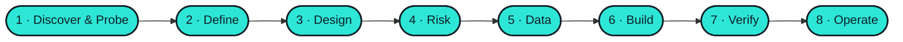

<!-- ============================================================= -->
<!-- =====================  MECH SAGE README  ==================== -->
<!-- ============================================================= -->

<a name="top"></a>

<!-- ===================== ANIMATED HEADER ===================== -->
<div align="center">


<!-- TYPING TAGLINE -->
<a href="https://github.com/shubhamrangdal2001-hash/MechSage">
  
</a>

<br/><br/>

<!-- GLOWING NEON DIVIDER -->


<!-- LIVE BADGES -->
<p>
  <a href="https://mechsage-api-ffnjatyswa-el.a.run.app/" target="_blank">
    
  </a>
  
  
  
</p>

<p>
  
  
  
  
</p>

<p>
  
  
  
  
  
  
  
</p>

<!-- STAR CTA -->
<h4>⭐ If Mech Sage looks cool, drop a star — it fuels the squad! ⭐</h4>


</div>

<!-- ===================== TABLE OF CONTENTS ===================== -->
## 🧭 Navigate

<div align="center">

[](#-what-is-mech-sage)
[](#-the-three-lenses)
[](#️-lifecycle-roadmap)
[](#-stage-1--discover--probe)
[](#-stage-2--define)
[](#-the-squad)

</div>

<!-- ===================== ABOUT ===================== -->
## ⚙️ What is Mech Sage?


> Ironside Manufacturing runs a fleet of expensive, hard-working machines. When one fails without warning, the line stops — and an unplanned outage costs far more than a planned repair.

**Mech Sage** is an **agentic operations copilot** for predictive maintenance. It does not hand the team another dashboard of red and green lights. Instead, it:

- 👀 **Watches the whole fleet** of assets, continuously.
- 🩺 **Catches degradation early** — days before a threshold trips.
- 🗣️ **Explains in plain language** what is going wrong and how sure it is.
- ⏳ **Estimates Remaining Useful Life (RUL)** with a reason you can trust.
- 📝 **Drafts the work order and the schedule** for a human to approve.
- 🔔 **Avoids alarm fatigue** — catches the failures that matter without crying wolf.
- 💸 **Stays inside a cost & latency budget** at fleet scale.

<div align="center">

</div>

<!-- ===================== THREE LENSES ===================== -->
## 🔭 The Three Lenses

<table>
<tr>
<td width="33%" valign="top" align="center">


### 🧩 Product
The people we serve, the jobs they need done, the scope we commit to, and the metrics that prove the system is worth running.

</td>
<td width="33%" valign="top" align="center">


### 🏗️ Solution Architecture
The agents and how they are arranged, the orchestration patterns we adopt and reject, and how the parts connect, recover, and stay in their roles.

</td>
<td width="33%" valign="top" align="center">


### 🔧 Engineering
A system that holds under load, stays inside a cost budget, and carries the tracing, testing, and deployment a real operator insists on.

</td>
</tr>
</table>

<!-- ===================== ROADMAP ===================== -->
## 🗺️ Lifecycle Roadmap



**Project Progress**

```text
All Sprints & Stages          ████████████████████  100%  ✅
```

> 🟢 **All Sprints Complete.** The system lifecycle is fully implemented and operational.

<div align="center">

</div>

<!-- ===================== STAGE 1 ===================== -->
## 🔍 Stage 1 · Discover & Probe

 *Before any architecture, understand the work. A system that does not match how the work actually arrives will fail in its first week. This stage is research, not building.*

<details open>
<summary><b>📊 1.1 — Profile the real data</b></summary>

- Quantify the distribution of assets, runs, sequence lengths, and sensor channels.
- Map operating regimes / conditions and how failures appear: **gradual vs sudden**.
- Identify missing values, noise, and the **small slice that drives most of the volume**.
- Output: numbers, not vibes — every claim backed by the dataset.

</details>

<details open>
<summary><b>🧑‍🔧 1.2 — Persona set (3–5 personas)</b></summary>

| Persona | Goal | Frustration |
|---|---|---|
| **Reliability Engineer** *(primary user)* | Catch degradation early, trust the alert | Drowning in dashboards & false alarms |
| **Maintenance Technician** | Get a clear, actionable work order | Vague "check the machine" tickets |
| **Operations Lead** | Maximize uptime within budget | No view of cost vs risk tradeoffs |
| **ML / Platform Engineer** | Keep the system observable & cheap | Black-box pipelines, runaway token cost |

</details>

<details open>
<summary><b>🎯 1.3 — Jobs To Be Done (one sentence each)</b></summary>

- **Reliability Engineer:** *"Tell me which asset is heading for failure, why, and how sure you are — before it stops the line."*
- **Technician:** *"Hand me a work order I can act on without a follow-up call."*
- **Operations Lead:** *"Show me the cost-vs-risk picture so I can approve the schedule."*

</details>

<details open>
<summary><b>❓ 1.4 — Probing questions for the client</b></summary>

- What are fleet **volumes** and peak streaming patterns?
- What is the system **allowed to do**, and what must **never** be automated?
- What is an acceptable **false-alarm rate** before the team stops trusting it?
- What is the **budget ceiling** per asset monitored?
- *Where we cannot ask, we state the assumption and mark it `🔖 ASSUMPTION`.*

</details>

<details open>
<summary><b>🛠️ 1.5 — Teardown: alert → action (2 products)</b></summary>

- Study two real industrial / monitoring products that turn an alert into an action.
- Bring back **one pattern worth borrowing** and **one anti-pattern** to avoid.

</details>

> **✅ Done looks like:** a short discovery brief, a persona set, and a prioritized map of the work — all backed by numbers from the data.

<div align="center">

</div>

<!-- ===================== STAGE 2 ===================== -->
## 📜 Stage 2 · Define

 *Turn the discovery into a contract. The PRD is the document a stakeholder could sign and an engineer could build against — without a follow-up meeting.*

### 📋 PRD skeleton

```
1. Problem statement
2. Target users & Jobs To Be Done
3. Scope  ✔   /   Non-scope  ✗
4. Assumptions & open questions
5. Success metrics (baseline + target)
6. Non-functional requirements (latency, cost, safety)
```

### 🎯 Success Metrics

| Target Metric | What it measures | Type |
|---|---|:--:|
| ⏱️ **Early-detection lead time** | How far ahead of failure a credible alert is raised | ⭐ north-star |
| 🔕 **False-alarm rate** | How often it cries wolf — trust depends on this | 🛡️ guardrail |
| 🧠 **RUL explanation quality** | Whether the RUL estimate & its reason are sound | ✅ supporting |
| 📝 **Work-order usefulness** | Whether a technician can act on the draft | ✅ supporting |
| 💸 **Cost per asset monitored** | The unit economics that decide whether this ships | 🛡️ guardrail |

> 📏 **Rule:** every metric carries a **baseline + target**. A target without a baseline cannot be judged.

### 🚧 Non-Functional Requirements

- **Latency budget** — per-asset analysis completes within the agreed window.
- **Cost ceiling** — hard per-asset budget with alarms; cheap models for routine monitoring.
- **Safety bar** — human approval required; the system **abstains when unsure** and degrades to a human path.

> **✅ Done looks like:** a PRD a stakeholder could approve and a team could build from on its own.

<div align="center">

</div>

<!-- ===================== DEMO TERMINAL ===================== -->
## 🖥️ What it will feel like

```console
$ mech-sage watch --fleet ironside
✨ Monitoring 218 assets ...
⚠️  ASSET-077  degradation detected   · confidence 0.91  · RUL ~ 6.2 days
🗣️  cause: rising HPC outlet temp + vibration drift (sensor s_11, s_14)
📝  draft work-order #WO-2291 created  → awaiting human approval
📅  suggested slot: Sat 02:00–04:00 (low-load window)
💸  run cost: $0.0043 / asset   · budget OK ✅
```

<!-- ===================== TECH STACK ===================== -->
## 🧰 Planned Toolbox

<div align="center">

| Layer | Tool |
|---|---|
| 🤖 Agent orchestration | LangGraph / CrewAI / AutoGen |
| 🚪 LLM gateway | LiteLLM |
| 🧪 Dev models | DeepSeek · Qwen · Llama · Gemini Flash (free tiers) |
| 🗂️ Vector store | Chroma |
| 📐 Retrieval eval | RAGAS |
| 🎛️ Prompt/pipeline opt | DSPy |
| 🌐 Service & UI | FastAPI + light front end |
| ☁️ Deployment | Free cloud tier |

</div>

<!-- ===================== REPO STRUCTURE ===================== -->
## 📁 Repository Structure (planned)

```
MechSage/
├── docs/
│   ├── 01_discovery_brief.md      # Stage 1 output
│   ├── 02_prd.md                  # Stage 2 output
│   └── personas.md
├── data/                          # dataset cards & EDA (later sprint)
├── src/                           # agentic system (later sprint)
├── eval/                          # golden set, RAGAS (later sprint)
└── README.md
```

<!-- ===================== TEAM ===================== -->
## 👥 The Squad

<div align="center">


| 🧑‍💻 Sudhanshu Biswas | 🧑‍💻 Ayush Patil | 🧑‍💻 Shubham Rangdal |
|:--:|:--:|:--:|
|  |  |  |
| *Orchestrates the agent swarm and owns the product vision* | *Turns raw sensor streams into early-failure foresight* | *Keeps the fleet live, cheap, and fully observable* |

*A small engineering squad sharing one codebase — IIT GN  AI Clinic · Capstone Project 04.*

</div>

<!-- ===================== BACK TO TOP ===================== -->
<div align="center">

<br/>

[](#top)


<sub>Built with ☕ + 🤖 for the IIT GN AI  Clinic · Ironside Manufacturing is a fictional persona for this engagement.</sub>
</div>
