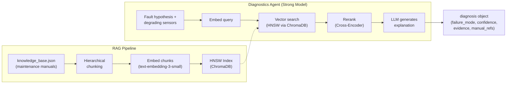

# 🗺️ RAG Approaches — Overview & MechSage Context

> **Purpose:** Entry-point to the `rag_approaches/` folder. Maps the RAG landscape, explains where RAG sits in MechSage, and provides a reading guide for all other documents.

---

## 1. What Is RAG?

**Retrieval-Augmented Generation (RAG)** is a pattern where an LLM's response is grounded in externally retrieved evidence rather than relying solely on its parametric memory. Instead of asking the model "What causes rising HPC temperature?", we first **retrieve** relevant maintenance manual passages and then ask the model to **generate** an explanation based on that evidence.

This is critical for MechSage because:
- **Reduces hallucination** — the Diagnostics Agent must cite real procedures, not invented ones
- **Enables auditability** — every explanation references specific manual passages (`doc_ref`)
- **Controls confidence** — if no relevant passage is found (cosine sim < 0.40), confidence is capped at 0.60, triggering the abstain path

---

## 2. RAG Evolution Timeline

```
2023                    2024                    2025                    2026
  │                       │                       │                       │
  ├── Naive RAG           ├── Advanced RAG         ├── Modular RAG         ├── Agentic RAG
  │   (embed → search     │   (+ query rewriting   │   (plug-and-play      │   (LLM decides when
  │    → stuff → generate)│    + reranking          │    components)        │    and what to retrieve)
  │                       │    + hybrid search)     │                       │
  │                       │                         ├── GraphRAG            ├── Adaptive RAG
  │                       │                         │   (knowledge graphs   │   (route by query
  │                       │                         │    + vector search)   │    complexity)
  │                       │                         │                       │
  │                       │                         ├── Self-RAG / CRAG     ├── MemoRAG
  │                       │                         │   (self-critique +    │   (dual-system
  │                       │                         │    corrective)        │    memory)
```

---

## 3. Where RAG Sits in MechSage

RAG is the **Diagnostics Agent's core grounding mechanism**. It powers the `manual_retrieval_rag` tool defined in the architecture.



### Current State

| Component | Status | Gap |
|---|---|---|
| Knowledge Base | 5 entries in `knowledge_base.json` | Need 30+ entries (Sprint 2 target: 200) |
| Chunking | None | Need hierarchical chunking for structured manual entries |
| Embedding | Not implemented | Need `text-embedding-3-small` integration |
| Vector Index | No ChromaDB | Need HNSW index via ChromaDB |
| Retrieval | Not implemented | Need hybrid (dense + BM25) + cross-encoder reranking |
| Evaluation | RAGAS targets defined, nothing measured | Need RAGAS pipeline + 30-query test set |

---

## 4. The RAG Component Stack (Recommended for MechSage)

Every RAG system has the same five layers. Each layer has multiple approach options documented in this folder:

| Layer | What It Does | MechSage Choice | Document |
|---|---|---|---|
| **Chunking** | Splits documents into retrievable units | Hierarchical Chunking | [`02_chunking_strategies.md`](02_chunking_strategies.md) |
| **Embedding** | Converts text → dense vectors | `text-embedding-3-small` (OpenAI) | [`03_embedding_models.md`](03_embedding_models.md) |
| **Indexing** | Organizes vectors for fast search | HNSW via ChromaDB | [`04_ann_algorithms.md`](04_ann_algorithms.md), [`05_hnsw_deep_dive.md`](05_hnsw_deep_dive.md) |
| **Retrieval** | Finds the most relevant chunks | Hybrid (Dense + BM25) + Reranking | [`07_retrieval_approaches.md`](07_retrieval_approaches.md) |
| **Generation** | Produces grounded output from context | LLM via LiteLLM Gateway | (covered by architecture docs) |

Supporting documents:
- [`01_rag_architectures.md`](01_rag_architectures.md) — End-to-end paradigms
- [`06_distance_metrics.md`](06_distance_metrics.md) — How similarity is measured
- [`08_graph_rag.md`](08_graph_rag.md) — Graph-based approaches (future)
- [`09_evaluation_metrics.md`](09_evaluation_metrics.md) — How to measure RAG quality
- [`10_mechsage_applicability.md`](10_mechsage_applicability.md) — Decision matrix and roadmap

---

## 5. Reading Guide

| If you want to understand… | Read |
|---|---|
| The big picture of RAG paradigms | `01_rag_architectures.md` |
| How to split maintenance manuals | `02_chunking_strategies.md` |
| Which embedding model to use | `03_embedding_models.md` |
| How vector search works under the hood | `04_ann_algorithms.md` + `05_hnsw_deep_dive.md` |
| The math behind similarity | `06_distance_metrics.md` |
| How to combine multiple retrieval signals | `07_retrieval_approaches.md` |
| Knowledge graphs for maintenance data | `08_graph_rag.md` |
| How to measure if RAG is working | `09_evaluation_metrics.md` |
| What MechSage should adopt and when | `10_mechsage_applicability.md` |

---

## 6. Key Constraints Driving Choices

All recommendations in this folder are shaped by MechSage's specific constraints:

| Constraint | Value | Source |
|---|---|---|
| Corpus size | 30–200 entries (Sprint 1–2) | `evaluation_plan.md` §3.3 |
| Retrieval latency | < 2 seconds | `05_design_tools_data.md` §1.2 |
| RAGAS faithfulness target | > 0.90 | `evaluation_plan.md` §3.3 |
| RAGAS context precision target | > 0.80 | `evaluation_plan.md` §3.3 |
| Cost per escalation | < $0.05 | PRD §10 |
| Monthly cost per asset | < $1.50 | PRD §10 |
| Vector store | ChromaDB (architecture decision) | `02_prd.md` §12 |
| Framework | LangGraph | `03_design.md` §3 |

---

*Last updated: 2026-07-06*
