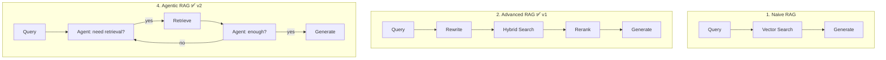

# 📐 RAG Architectures — All Approaches

> **Purpose:** Document every RAG paradigm from simplest to most advanced, with MechSage applicability verdicts.
>
> **MechSage Recommendation:** Advanced RAG (v1) → Agentic RAG (v2)

---

## Summary Table

| # | Architecture | Complexity | Recall | Precision | Cost | MechSage Verdict |
|---|---|:---:|:---:|:---:|:---:|:---:|
| 1 | Naive RAG | ⭐ | Medium | Low | $ | ❌ Reject |
| 2 | **Advanced RAG** | ⭐⭐ | High | High | $ | **✅ v1 Pick** |
| 3 | Modular RAG | ⭐⭐⭐ | High | High | $$ | ⚠️ Over-engineered |
| 4 | **Agentic RAG** | ⭐⭐⭐⭐ | Very High | Very High | $$ | **✅ v2 Pick** |
| 5 | Self-RAG | ⭐⭐⭐ | High | Very High | $$ | ⚠️ Sprint 3 |
| 6 | Corrective RAG (CRAG) | ⭐⭐⭐ | Very High | High | $$ | ⚠️ Sprint 3 |
| 7 | Adaptive RAG | ⭐⭐⭐⭐ | Very High | Very High | $$$ | ⚠️ Future |
| 8 | MemoRAG | ⭐⭐⭐⭐⭐ | Very High | Very High | $$$ | ❌ Future research |

---

## 1. Naive RAG

**The simplest possible RAG pipeline.** Embed → Search → Stuff → Generate.

```
Query → Embed → Vector Search (top-k) → Stuff all chunks into prompt → LLM generates answer
```

### How It Works
1. **Index time:** Split documents into fixed-size chunks, embed each chunk, store in vector DB
2. **Query time:** Embed the user query, find top-k similar chunks via cosine similarity, concatenate them into the LLM prompt, generate answer

### Strengths
- Simplest to implement (< 50 lines of code)
- Fast to prototype
- Works well for simple, single-hop factual questions

### Weaknesses
- **No query optimization** — the raw query may not match the vocabulary of stored documents
- **No precision filtering** — all top-k results are stuffed into context, including irrelevant ones
- **Chunk boundary problems** — fixed-size splits break semantic units
- **No self-correction** — if retrieval fails, the model hallucinates or says "I don't know"

### MechSage Verdict: ❌ Reject
With only 5 entries today, Naive RAG might coincidentally work. But it won't hit the 0.90 faithfulness target because technical queries like "rising s3 and s11 with dropping s13" need precision filtering that Naive RAG lacks.

---

## 2. Advanced RAG ✅ (v1 Pick)

**Naive RAG + pre-retrieval optimization + post-retrieval refinement.**

```
Query → Rewrite/Expand → Embed → Hybrid Search (Dense + Sparse) → Rerank (Cross-Encoder) → Top-3 → LLM generates
```

### How It Works

**Pre-Retrieval Enhancements:**
- **Query Rewriting:** LLM reformulates the query for better retrieval alignment
- **Query Expansion:** Add synonyms or related terms (e.g., "HPC" → "high pressure compressor")
- **Metadata Filtering:** Filter by fault mode, component, or sensor before vector search

**Retrieval Enhancements:**
- **Hybrid Search:** Combine dense (embedding) and sparse (BM25) retrieval via Reciprocal Rank Fusion
- **Sentence Window Retrieval:** Retrieve the matching sentence but expand context to surrounding sentences

**Post-Retrieval Enhancements:**
- **Cross-Encoder Reranking:** Score each candidate pair (query, passage) with a cross-encoder for fine-grained relevance
- **Context Compression:** Remove irrelevant parts of retrieved passages before feeding to the LLM
- **Lost-in-the-Middle Mitigation:** Reorder passages to place most relevant at start and end of context

### Strengths
- Significant precision improvement over Naive RAG (typically +15-25% in faithfulness)
- Reranking catches false positives that vector search misses
- Hybrid search captures both semantic and lexical matches
- Moderate implementation complexity

### Weaknesses
- Additional latency from reranking step (~100-200ms)
- Query rewriting adds an LLM call (can be cached or skipped for simple queries)
- Still single-pass — if the first retrieval misses, there's no retry

### MechSage Verdict: ✅ v1 Pick
This is the sweet spot for MechSage v1. With a 30–200 entry corpus:
- **Hybrid search** catches sensor IDs (BM25: "s3", "s11") AND semantic meaning (dense: "rising temperature indicates degradation")
- **Cross-encoder reranking** (free, local model, <100ms) pushes precision from ~0.75 to ~0.90+
- Total added latency: ~200ms on top of base retrieval — well within the 2s SLA
- **No additional LLM cost** — reranker is a small local model

---

## 3. Modular RAG

**A framework where every RAG component is an independently replaceable module.**

```
┌──────────┐    ┌──────────┐    ┌──────────┐    ┌──────────┐    ┌──────────┐
│  Loader  │ →  │ Chunker  │ →  │ Retriever│ →  │ Reranker │ →  │Generator │
│ (swap)   │    │ (swap)   │    │ (swap)   │    │ (swap)   │    │ (swap)   │
└──────────┘    └──────────┘    └──────────┘    └──────────┘    └──────────┘
```

### How It Works
Each component (document loader, chunker, embedder, retriever, reranker, generator) is an independent module with a defined interface. Modules can be swapped without affecting other parts of the pipeline.

### Strengths
- Maximum flexibility for experimentation
- Easy A/B testing of individual components
- Clean separation of concerns

### Weaknesses
- Over-engineered for small teams and small corpora
- Adds abstraction overhead without proportional benefit at small scale
- Requires interface standardization work upfront

### MechSage Verdict: ⚠️ Over-engineered for v1
MechSage has a fixed corpus type (maintenance manuals), a fixed embedding model (OpenAI), and a fixed vector store (ChromaDB). The modular overhead isn't justified until you're experimenting with multiple retriever types or embedding models. The tool-contract architecture already provides modularity at the agent level.

---

## 4. Agentic RAG ✅ (v2 Pick)

**The LLM acts as an agent that can iteratively decide when, what, and how to retrieve.**

```
Query → Agent (LLM) → "Do I need retrieval?" → Yes → Retrieve → "Is this enough?" → No → Rewrite query → Retrieve again → "Now enough" → Generate
```

### How It Works
Instead of a fixed retrieve-then-generate pipeline, the LLM is given retrieval as a **tool** it can call (or not call) based on its judgment:

1. **Decide:** Agent evaluates if retrieval is needed for this query
2. **Retrieve:** If yes, agent formulates a search query and calls the retrieval tool
3. **Evaluate:** Agent evaluates retrieved passages — are they sufficient?
4. **Iterate:** If not sufficient, agent rewrites the query or retrieves from a different source
5. **Generate:** Once satisfied, agent generates the grounded response

### Strengths
- **Iterative retrieval** — can retry with different queries if first attempt fails
- **Selective retrieval** — doesn't retrieve when the answer is already known (saves cost)
- **Multi-source** — can query different indices or tools in sequence
- **Natural fit with agent frameworks** like LangGraph

### Weaknesses
- Higher latency due to multiple LLM reasoning steps
- More complex to debug and trace
- Risk of retrieval loops if not bounded
- Higher cost per query (multiple LLM calls)

### MechSage Verdict: ✅ v2 Pick
This is the natural evolution for MechSage because:
- **LangGraph is already the orchestration framework** — adding retrieval as a tool node is architecturally clean
- **The Diagnostics Agent already has multi-step logic** — it evaluates confidence and decides whether to draft a work order or escalate
- **Iterative retrieval handles edge cases** — when the first query returns low-relevance passages (cosine < 0.40), the agent can rephrase and retry before capping confidence at 0.60

---

## 5. Self-RAG

**The model decides whether retrieval is needed AND self-critiques the quality of both retrieval and generation.**

```
Query → "Need retrieval?" → [RETRIEVE] → Retrieved passages → "Are these relevant?" → [RELEVANT] → Generate → "Is this supported?" → [SUPPORTED] → Output
```

### How It Works
Self-RAG trains or prompts the LLM to produce special reflection tokens:
- `[RETRIEVE]` — should I retrieve for this query?
- `[RELEVANT]` — is this retrieved passage relevant?
- `[SUPPORTED]` — is my generated claim supported by the retrieved passage?
- `[USEFUL]` — is my response useful to the user?

### Strengths
- Built-in quality control at every step
- Reduces hallucination through self-verification
- Can skip retrieval entirely for simple queries (cost savings)

### Weaknesses
- Requires fine-tuned models or very careful prompting
- Self-critique adds latency (multiple generation passes)
- Reflection tokens may not be reliable with all LLMs

### MechSage Verdict: ⚠️ Consider for Sprint 3
The self-critique pattern maps well to MechSage's confidence gate. The `[SUPPORTED]` check is essentially what the Diagnostics Agent does when it decides confidence. Could be used to improve confidence calibration.

---

## 6. Corrective RAG (CRAG)

**Evaluates retrieval quality and takes corrective action if retrieval is poor.**

```
Query → Retrieve → Evaluate quality → [CORRECT] → Use as-is
                                     → [AMBIGUOUS] → Supplement with more retrieval
                                     → [INCORRECT] → Discard and try alternative source
```

### How It Works
A lightweight evaluator (small model or heuristic) scores retrieved passages as Correct, Ambiguous, or Incorrect:
- **Correct:** Use the passages directly
- **Ambiguous:** Keep the passages but supplement with additional retrieval (e.g., web search, alternative index)
- **Incorrect:** Discard retrieved passages entirely and fall back to alternative sources or abstain

### Strengths
- Explicit quality gate prevents bad retrieval from poisoning generation
- Graceful degradation — falls back rather than hallucinating
- Maps naturally to three-zone confidence systems

### Weaknesses
- Evaluator model adds latency and complexity
- Defining "correct" vs "ambiguous" requires domain calibration
- Alternative sources may not exist in closed-domain systems

### MechSage Verdict: ⚠️ Consider for Sprint 3
CRAG's three-tier evaluation (Correct/Ambiguous/Incorrect) maps directly to MechSage's three-zone confidence system:
- `confidence >= 0.70` → Auto-draft work order (Correct)
- `0.60 <= confidence < 0.70` → Manual Audit (Ambiguous)
- `confidence < 0.60` → Escalate to human (Incorrect)

Could be used to make the confidence gate more retrieval-aware.

---

## 7. Adaptive RAG

**Dynamically routes queries to different retrieval strategies based on query complexity.**

```
Query → Classifier → [SIMPLE] → Direct LLM answer (no retrieval)
                    → [MODERATE] → Single-pass retrieval
                    → [COMPLEX] → Multi-hop iterative retrieval
```

### How It Works
A query classifier (small LLM or trained classifier) analyzes query complexity and routes to the appropriate pipeline:
- **Simple:** Answer directly from parametric knowledge (e.g., "What is an HPC?")
- **Moderate:** Single retrieval pass (e.g., "What causes rising s3 temperature?")
- **Complex:** Multi-hop retrieval with query decomposition (e.g., "Compare all fault modes that affect both s3 and s11 and list their combined repair procedures")

### Strengths
- Cost-efficient — avoids expensive retrieval for simple queries
- Optimizes latency — simple queries get fast answers
- Matches MechSage's cheap-path / escalated-path routing philosophy

### Weaknesses
- Query classifier must be reliable — misclassification leads to wrong pipeline
- More infrastructure to maintain (classifier + multiple pipelines)
- Complexity in testing and debugging

### MechSage Verdict: ⚠️ Future consideration
Interesting parallel with MechSage's existing two-path architecture (cheap screening vs. expensive diagnosis). Could be useful when the corpus grows large enough that retrieval cost varies significantly by query type.

---

## 8. MemoRAG

**Dual-system architecture: a lightweight memory model maintains long-term context while a heavy model generates responses.**

```
                    ┌──────────────────┐
                    │  Memory Model    │
                    │  (small, fast)   │
                    │  Maintains full  │
                    │  corpus summary  │
                    └────────┬─────────┘
                             │ "Retrieve from here"
Query → Memory Model → Clue generation → Heavy retriever → Heavy LLM → Answer
```

### How It Works
1. A lightweight model (e.g., 7B) processes the entire corpus and builds an internal "memory" of key facts and relationships
2. When a query arrives, the memory model generates "clues" — short hints about what to retrieve
3. These clues guide a heavier retriever to find precise passages
4. The main LLM generates the answer from retrieved passages

### Strengths
- Handles very large corpora by compressing into memory
- Clue generation improves retrieval targeting
- Two-model system balances cost and quality

### Weaknesses
- Complex two-model infrastructure
- Memory model must be retrained when corpus changes
- Research-stage — limited production deployments
- High upfront cost for memory model training

### MechSage Verdict: ❌ Not for MechSage
The corpus is 30–200 entries. A memory model designed for massive document sets is dramatically over-engineered. The entire MechSage knowledge base fits in a single LLM context window.

---

## Architecture Comparison — At a Glance



---

*Next: [02_chunking_strategies.md](02_chunking_strategies.md) — How to split maintenance manuals for retrieval*
