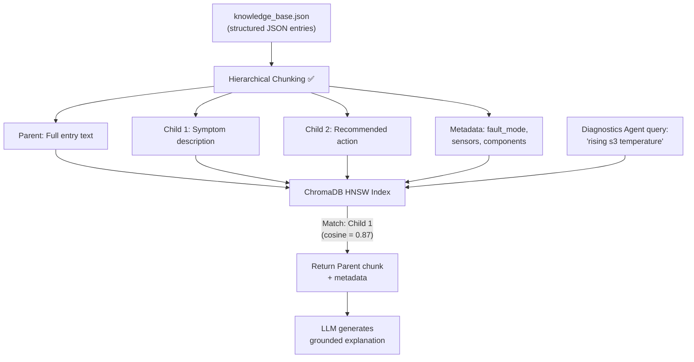

# ✂️ Chunking Strategies — All Approaches

> **Purpose:** Document all approaches for splitting source documents into retrievable units for the RAG pipeline.
>
> **MechSage Recommendation:** Hierarchical Chunking

---

## Summary Table

| # | Strategy | Preserves Semantics | Preserves Structure | Compute Cost | MechSage Verdict |
|---|---|:---:|:---:|:---:|:---:|
| 1 | Fixed-Size | ❌ | ❌ | Minimal | ❌ Reject |
| 2 | Recursive Character | ⚠️ Partial | ⚠️ Partial | Minimal | ⚠️ Baseline only |
| 3 | Sentence-Level | ✅ | ❌ | Low | ⚠️ Too granular |
| 4 | Semantic Chunking | ✅ | ❌ | Medium | ⚠️ Overkill |
| 5 | **Hierarchical** | ✅ | ✅ | Low | **✅ Pick** |
| 6 | Late Chunking | ✅ | ⚠️ | High | ❌ Unnecessary |
| 7 | Agentic Chunking | ✅ | ✅ | Very High | ❌ Overkill |
| 8 | Document-Type-Aware | ✅ | ✅ | Medium | ⚠️ Complement to #5 |

---

## Why Chunking Matters

Chunking is the **foundation** of every RAG pipeline. A bad chunking strategy poisons everything downstream:

```
Bad chunking → Fragmented context → Low retrieval recall → Poor generation → Low faithfulness
```

For MechSage, the knowledge base has a specific structure:

```json
{
  "id": "MAN-HPC-12",
  "fault_mode": "high pressure compressor degradation",
  "text": "Rising core temperature (s2, s3, s4) together with increased HPC outlet pressure..."
}
```

The chunking strategy must preserve this **Fault Mode → Sensor Cues → Procedure** structure.

---

## 1. Fixed-Size Chunking

### How It Works
Split text into chunks of exactly N tokens (or characters) with an optional overlap window.

```
Document: "ABCDEFGHIJKLMNOPQRST"
Chunk size: 5, Overlap: 2

Chunk 1: "ABCDE"
Chunk 2: "DEFGH"     ← overlaps "DE"
Chunk 3: "GHIJK"     ← overlaps "GH"
Chunk 4: "JKLMN"
...
```

### Parameters
- **Chunk size:** Typically 256–1024 tokens
- **Overlap:** Typically 10–20% of chunk size (e.g., 50–200 tokens)

### Strengths
- Simplest to implement — no dependencies
- Deterministic and reproducible
- Fast — O(n) linear scan

### Weaknesses
- **Destroys semantic boundaries** — a sentence about HPC degradation may be split across two chunks
- **Arbitrary cuts** — "Recommended action: borescope" in one chunk, "inspection of HPC stages" in the next
- Overlap helps but doesn't solve the fundamental problem
- Poor recall for structured documents

### MechSage Verdict: ❌ Reject
MechSage's manual entries are short (1–3 sentences) and already semantically coherent. Fixed-size splitting would either keep them whole (if chunk size > entry length) or destructively split them (if chunk size < entry length). No benefit.

---

## 2. Recursive Character Splitting

### How It Works
Split by a hierarchy of separators, trying the coarsest first:

```
Try: "\n\n" (paragraph)  → if chunks too large
Try: "\n" (newline)      → if chunks too large
Try: ". " (sentence)     → if chunks too large
Try: " " (word)          → last resort
```

### Strengths
- Better than fixed-size — respects paragraph and sentence boundaries
- Default in LangChain's `RecursiveCharacterTextSplitter`
- Works reasonably well for generic documents

### Weaknesses
- Still structural, not semantic — a paragraph boundary doesn't always mean a topic boundary
- Doesn't understand document structure (headers, sections, lists)
- May split a fault description from its recommended action

### MechSage Verdict: ⚠️ Acceptable as baseline
Could work as a starting point if the knowledge base is expanded to longer documents (multi-page manuals). Not ideal for the current short, structured JSON entries.

---

## 3. Sentence-Level Splitting

### How It Works
Split text into individual sentences using NLP sentence tokenization (e.g., spaCy, NLTK).

```
Input: "Rising core temperature indicates HPC degradation. Recommended action: borescope inspection."

Chunk 1: "Rising core temperature indicates HPC degradation."
Chunk 2: "Recommended action: borescope inspection."
```

### Strengths
- Each chunk is a complete thought
- Fine-grained retrieval — can match specific claims
- Good for question-answering over fact-dense text

### Weaknesses
- **Too granular** — a single sentence often lacks enough context for meaningful generation
- Loses cross-sentence relationships (e.g., the link between symptom and action)
- Generates many small embeddings — increases index size and search time
- A sentence like "Replace the seal kit" is meaningless without context

### MechSage Verdict: ⚠️ Too granular for standalone use
MechSage's manual entries typically have 2–3 sentences that form a coherent symptom-cause-action triple. Splitting at the sentence level would break this relationship. Could be useful as the **child** level in a hierarchical strategy.

---

## 4. Semantic Chunking

### How It Works
Embed consecutive sentences and measure cosine similarity between adjacent embeddings. Split at points where similarity drops below a threshold (semantic breakpoints).

```
Sentence 1: "Rising core temperature indicates degradation."     → embed → v1
Sentence 2: "HPC outlet pressure increases simultaneously."       → embed → v2
Sentence 3: "Recommended action: borescope inspection."           → embed → v3
Sentence 4: "A sustained increase in vibration indicates bearing wear." → embed → v4

Cosine(v1, v2) = 0.89  → same chunk (related: HPC symptoms)
Cosine(v2, v3) = 0.72  → same chunk (still HPC context)
Cosine(v3, v4) = 0.31  → SPLIT HERE (topic shift: HPC → bearing)
```

### Parameters
- **Breakpoint threshold:** Typically top 10% of similarity drops or a fixed cosine threshold (e.g., < 0.50)
- **Minimum chunk size:** Prevent single-sentence chunks
- **Maximum chunk size:** Prevent overly long chunks

### Strengths
- Chunks are semantically coherent — each covers one topic
- Data-driven boundaries rather than arbitrary rules
- Works well for long, flowing narrative text

### Weaknesses
- **Requires embedding every sentence** at index time — computational cost
- Threshold tuning is domain-specific
- May struggle with structured text that has abrupt topic shifts (e.g., lists, tables)
- Doesn't leverage known document structure (headers, sections)

### MechSage Verdict: ⚠️ Overkill
MechSage's knowledge base entries are already semantically coherent (each entry describes one fault mode). Semantic chunking would be redundant — it would compute embeddings to discover boundaries that already exist in the JSON structure. More useful when the corpus expands to long-form PDFs.

---

## 5. Hierarchical Chunking ✅ (MechSage Pick)

### How It Works
Create a **tree structure** of chunks at multiple granularity levels. Store parent-child relationships. Retrieve at the child (granular) level, but return the parent (contextual) level to the LLM.

```
                    ┌─────────────────────────────────────┐
                    │           PARENT CHUNK              │
                    │  Full maintenance manual entry       │
                    │  (fault_mode + symptoms + action)    │
                    └─────────┬───────────────┬───────────┘
                              │               │
                    ┌─────────┴──┐    ┌──────┴──────────┐
                    │   CHILD 1  │    │    CHILD 2      │
                    │  Symptoms  │    │  Recommended    │
                    │  & sensors │    │  action         │
                    └────────────┘    └─────────────────┘
```

### For MechSage's Knowledge Base

Given the current `knowledge_base.json` structure:

```
Parent (full entry):
  "Rising core temperature (s2, s3, s4) together with increased HPC outlet pressure
   and a drop in isentropic efficiency indicates high pressure compressor degradation.
   Recommended action: borescope inspection of HPC stages, inspect and replace HPC
   seal kit if clearance is out of limits."

Child 1 (symptoms):
  "Rising core temperature (s2, s3, s4) together with increased HPC outlet pressure
   and a drop in isentropic efficiency indicates high pressure compressor degradation."

Child 2 (action):
  "Recommended action: borescope inspection of HPC stages, inspect and replace HPC
   seal kit if clearance is out of limits."

Metadata (structured fields):
  fault_mode: "high pressure compressor degradation"
  sensors: ["s2", "s3", "s4"]
  components: ["HPC"]
```

### Retrieval Flow

```
Query: "rising s3 temperature"
  ↓
Search matches CHILD 1 (symptoms) — cosine = 0.87
  ↓
Follow parent link → return PARENT (full entry)
  ↓
LLM gets: full fault description + sensor cues + recommended action
```

### Strengths
- **Best of both worlds:** granular retrieval precision + broad generation context
- **Preserves structure:** fault mode, sensor cues, and action stay linked
- **Metadata-rich:** structured fields enable filtered search (e.g., "all HPC faults")
- **Scales well:** adding new entries doesn't require re-indexing
- **Natural fit** for technical documentation with section → subsection → detail structure

### Weaknesses
- Requires explicit parent-child relationship tracking
- More complex index structure (store both parent and child embeddings)
- Slightly more storage than flat chunking

### MechSage Verdict: ✅ Pick
This is the ideal match for MechSage because:
1. **Manual entries have natural hierarchy:** Fault Mode → Sensor Cues → Procedure → Parts
2. **Child-level search, parent-level context:** The Diagnostics Agent searches by sensor patterns but needs the full procedure for explanation
3. **Metadata filtering:** ChromaDB supports metadata — filter by `fault_mode` or `sensor_cues` before vector search
4. **Scales to expanded corpus:** When KB grows from 5 → 200 entries, hierarchy keeps retrieval precise

---

## 6. Late Chunking

### How It Works
Process the entire document through a **long-context embedding model** first. The model builds contextual representations for every token considering the full document. Then apply chunking boundaries at the embedding level (final layer only).

```
Traditional: Chunk first → Embed each chunk independently (context-free)
Late:        Embed full document → Apply chunk boundaries to final embeddings (context-aware)
```

### Strengths
- Each chunk's embedding is **context-aware** — it "knows" what the rest of the document says
- Eliminates the "vector dilution" problem where isolated chunks lose context
- Better retrieval recall for interconnected text

### Weaknesses
- **Requires long-context embedding models** (e.g., Jina-v3 with 8K+ context)
- Higher compute cost at embedding time
- Standard embedding models (OpenAI, etc.) don't support this natively
- Implementation is more complex (custom embedding pipelines)

### MechSage Verdict: ❌ Unnecessary
MechSage's manual entries are 1–3 sentences. There is no cross-chunk context to lose. Late chunking solves a problem that doesn't exist at this corpus scale. Revisit if the corpus expands to long multi-page technical manuals.

---

## 7. Agentic Chunking

### How It Works
An LLM agent analyzes each document and decides the optimal chunking strategy dynamically.

```
Document → LLM Agent → "This is a structured manual entry with symptoms and actions"
                      → "Split into: symptom chunk + action chunk + metadata"
```

### Strengths
- Most adaptive — handles any document type
- Human-like judgment on boundaries
- Can apply different strategies per document section

### Weaknesses
- **Very expensive** — requires an LLM call per document for chunk planning
- Slow at index time
- Non-deterministic — same document may be chunked differently across runs
- Overkill for small, uniform corpora

### MechSage Verdict: ❌ Overkill
At $0.01–0.05 per LLM call × 200 documents = $2–10 for chunking alone. The corpus is small and uniform (all maintenance manual entries follow the same structure). A rule-based hierarchical strategy is more cost-effective, deterministic, and reproducible.

---

## 8. Document-Type-Aware Chunking

### How It Works
Apply different chunking rules based on document format:
- **JSON entries:** Parse by field (fault_mode, text, sensor_cues)
- **Markdown/text manuals:** Split by headers and sections
- **Tables:** Keep each row or table as a single chunk
- **Code:** Split by function or class boundaries

### Strengths
- Respects the inherent structure of each document type
- Higher quality chunks for heterogeneous corpora
- Can be combined with other strategies (e.g., hierarchical + type-aware)

### Weaknesses
- Requires per-format parsing logic
- More implementation work for each new document type
- May over-engineer for simple corpora

### MechSage Verdict: ⚠️ Complement to Hierarchical
Useful as a complement to the hierarchical strategy. MechSage's knowledge base is JSON — parse by field structure. If the corpus expands to include PDF manuals or Markdown docs, add type-specific parsers.

---

## Chunking Strategy Comparison for MechSage



---

*Next: [03_embedding_models.md](03_embedding_models.md) — Which embedding model converts text to vectors*
