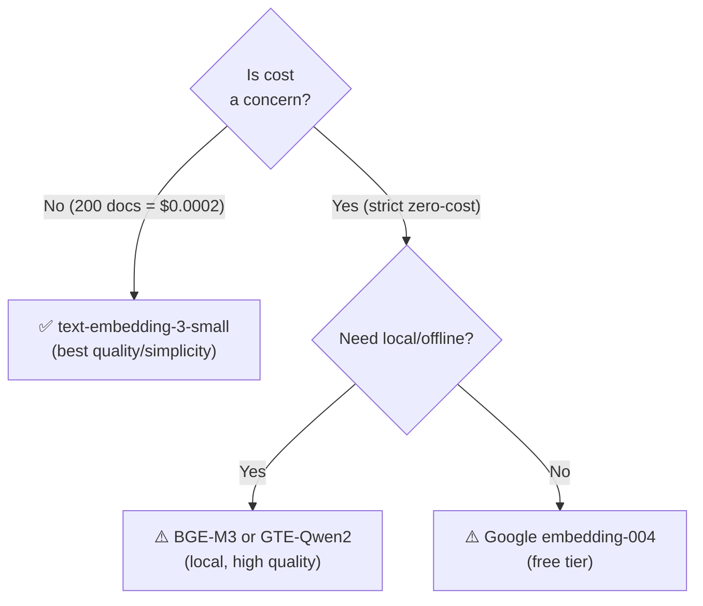

# 🧬 Embedding Models — All Options

> **Purpose:** Survey of embedding model options for converting maintenance manual text into dense vectors.
>
> **MechSage Recommendation:** `text-embedding-3-small` (OpenAI)

---

## Summary Table

| # | Model | Provider | Dims | Cost (per 1M tokens) | MTEB Avg | Context | MechSage Verdict |
|---|---|---|:---:|:---:|:---:|:---:|:---:|
| 1 | **`text-embedding-3-small`** | OpenAI | 1536 | $0.02 | 62.3 | 8191 | **✅ Pick** |
| 2 | `text-embedding-3-large` | OpenAI | 3072 | $0.13 | 64.6 | 8191 | ❌ Overkill |
| 3 | `text-embedding-ada-002` | OpenAI | 1536 | $0.10 | 61.0 | 8191 | ❌ Legacy |
| 4 | `text-embedding-004` | Google | 768 | Free tier / $0.0001 | 66.3 | 2048 | ⚠️ Backup |
| 5 | `models/embedding-001` | Google | 768 | Free tier | 63.5 | 2048 | ⚠️ Backup |
| 6 | `BGE-M3` | BAAI (open-source) | 1024 | Free (local) | 68.2 | 8192 | ⚠️ v2 consider |
| 7 | `E5-Mistral-7B` | Intfloat (open-source) | 4096 | Free (local) | 66.6 | 32768 | ❌ Too heavy |
| 8 | `GTE-Qwen2-1.5B` | Alibaba (open-source) | 1536 | Free (local) | 67.2 | 32768 | ⚠️ v2 consider |
| 9 | `Nomic-Embed-Text-v1.5` | Nomic (open-source) | 768 | Free (local) | 62.2 | 8192 | ⚠️ Budget option |
| 10 | `Jina-v3` | Jina AI | 1024 | Free tier / $0.02 | 65.5 | 8192 | ⚠️ Late chunking support |

> **MTEB** = Massive Text Embedding Benchmark. Higher is better. Scores are approximate and version-dependent.

---

## 1. OpenAI `text-embedding-3-small` ✅ (MechSage Pick)

### Characteristics
- **Dimensions:** 1536 (supports Matryoshka — can reduce to 512 or 256 with minor quality loss)
- **Context window:** 8,191 tokens
- **Cost:** $0.02 per 1M tokens (~$0.00002 per 1K tokens)
- **Training objective:** Cosine similarity optimized
- **Normalization:** Outputs are L2-normalized by default

### Why It's the Pick for MechSage
1. **Already in the design spec** — referenced in `05_design_tools_data.md` §1.2
2. **Trivial cost** — embedding 200 manual entries (avg 50 tokens each) = 10,000 tokens = **$0.0002 total**
3. **Excellent quality/cost ratio** — within 2 points of much larger models on MTEB
4. **Native cosine similarity** — matches the distance metric chosen for ChromaDB
5. **Matryoshka support** — can reduce dimensions (1536 → 512) if storage becomes a concern at scale
6. **Battle-tested** — largest deployed embedding model in production

### Limitations
- Requires API call (not local) — adds ~100ms latency per embedding
- Proprietary — vendor lock-in with OpenAI
- Not domain-specific — may miss nuances in industrial/engineering terminology

### MechSage Cost Estimate
| Operation | Volume | Cost |
|---|---|---|
| Initial KB embedding (200 entries) | ~10K tokens | $0.0002 |
| Monthly query embeddings (100 queries/day × 30) | ~150K tokens | $0.003 |
| **Total monthly embedding cost** | | **< $0.01** |

---

## 2. OpenAI `text-embedding-3-large`

### Characteristics
- **Dimensions:** 3072 (Matryoshka to 256)
- **Context window:** 8,191 tokens
- **Cost:** $0.13 per 1M tokens (6.5× more expensive)
- **MTEB:** 64.6 (+2.3 over small)

### MechSage Verdict: ❌ Overkill
The 2.3-point MTEB improvement doesn't justify 6.5× cost increase. At 200 documents, the quality difference is negligible. The 3072-dimension vectors also double ChromaDB storage and slow down search (though still sub-millisecond at this scale).

---

## 3. OpenAI `text-embedding-ada-002`

### Characteristics
- **Dimensions:** 1536
- **Cost:** $0.10 per 1M tokens (5× more than `3-small`)
- **MTEB:** 61.0 (lower than `3-small`)

### MechSage Verdict: ❌ Legacy
Superseded by `text-embedding-3-small` in every dimension — lower quality AND higher cost. Only relevant for backward compatibility with existing embeddings.

---

## 4. Google `text-embedding-004`

### Characteristics
- **Dimensions:** 768
- **Context window:** 2,048 tokens
- **Cost:** Free tier available; $0.0001/1K chars in production
- **MTEB:** 66.3 (highest among commercial APIs)
- **Task types:** Supports task-specific modes (RETRIEVAL_DOCUMENT, RETRIEVAL_QUERY, etc.)

### MechSage Verdict: ⚠️ Backup Option
Strong alternative if cost sensitivity increases or if the team wants to stay fully within the Google/Gemini ecosystem. The task-type specialization (separate modes for queries vs documents) could improve retrieval. Lower dimensionality (768 vs 1536) means faster search but slightly less representational capacity.

---

## 5. Google `models/embedding-001`

### Characteristics
- **Dimensions:** 768
- **Context window:** 2,048 tokens
- **Cost:** Free tier
- **MTEB:** 63.5

### MechSage Verdict: ⚠️ Backup
Referenced in the design spec as an alternative. Lower quality than `embedding-004`. Primarily useful for zero-cost prototyping.

---

## 6. BAAI `BGE-M3` (Open-Source)

### Characteristics
- **Dimensions:** 1024
- **Context window:** 8,192 tokens
- **Cost:** Free (runs locally)
- **MTEB:** 68.2 (highest in this comparison)
- **Special:** Supports hybrid retrieval natively — produces **both dense AND sparse** representations from a single model
- **Languages:** 100+ languages

### MechSage Verdict: ⚠️ Strong v2 Consideration
The native hybrid (dense + sparse) output is compelling — it eliminates the need for a separate BM25 index. The top MTEB score is attractive. However:
- Requires local GPU or CPU inference infrastructure
- Adds operational complexity (model serving, updates)
- For a 200-doc corpus, the infrastructure cost outweighs the embedding quality gain

**Revisit when:** The team wants to eliminate OpenAI dependency or needs multilingual support.

---

## 7. Intfloat `E5-Mistral-7B` (Open-Source)

### Characteristics
- **Dimensions:** 4096
- **Context window:** 32,768 tokens
- **Cost:** Free (requires significant GPU — 7B parameters)
- **MTEB:** 66.6

### MechSage Verdict: ❌ Way Too Heavy
A 7-billion parameter model for embedding 200 short manual entries is like using a freight train to deliver a letter. Requires substantial GPU resources, and the 4096-dimension vectors are unnecessarily large.

---

## 8. Alibaba `GTE-Qwen2-1.5B` (Open-Source)

### Characteristics
- **Dimensions:** 1536
- **Context window:** 32,768 tokens
- **Cost:** Free (local, 1.5B parameters — runnable on CPU)
- **MTEB:** 67.2

### MechSage Verdict: ⚠️ v2 Consideration
A strong middle ground — 1.5B parameters is small enough to run on CPU, competitive MTEB scores, same dimensionality as OpenAI. Good option if the team wants to eliminate API dependency while keeping reasonable quality.

---

## 9. Nomic `Nomic-Embed-Text-v1.5` (Open-Source)

### Characteristics
- **Dimensions:** 768 (Matryoshka to 64)
- **Context window:** 8,192 tokens
- **Cost:** Free (local, small model)
- **MTEB:** 62.2

### MechSage Verdict: ⚠️ Budget/Privacy Option
Useful if the team needs fully offline embedding (no API calls, no data leaving the network). Lower quality than OpenAI but runnable on any machine.

---

## 10. Jina AI `Jina-v3`

### Characteristics
- **Dimensions:** 1024
- **Context window:** 8,192 tokens
- **Cost:** Free tier available
- **MTEB:** 65.5
- **Special:** Native support for **late chunking** — embed full document, chunk at embedding layer

### MechSage Verdict: ⚠️ Specialized
Only interesting if late chunking is adopted (which it isn't for MechSage v1). The late chunking feature is unique but adds implementation complexity.

---

## Key Decision Factors for MechSage

### The Golden Rule
> **Always use the distance metric that matches your embedding model's training objective.**
>
> `text-embedding-3-small` → **Cosine Similarity** (training objective)
>
> This is why the distance metric choice (doc `06`) and embedding model choice are tightly coupled.

---

*Next: [04_ann_algorithms.md](04_ann_algorithms.md) — How vectors are indexed for fast search*
