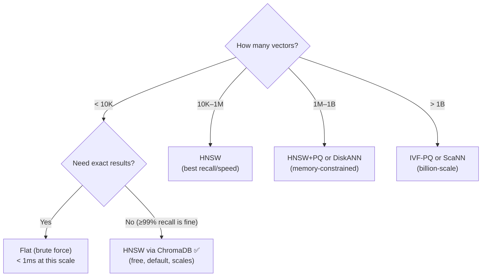

# 🔍 ANN Algorithms — All Approaches

> **Purpose:** Comprehensive catalog of Approximate Nearest Neighbor search algorithms for vector retrieval.
>
> **MechSage Recommendation:** HNSW (via ChromaDB)

---

## What Is ANN?

When you embed 200 maintenance manual entries into 1536-dimensional vectors, you need to find the **k most similar** vectors to a query vector. **Exact** nearest neighbor search (brute-force) compares the query against every stored vector — O(n) per query. **Approximate** nearest neighbor (ANN) algorithms build an index structure that trades a small amount of accuracy for massive speed gains — O(log n) or better.

At MechSage's current scale (200 vectors), brute-force is sub-millisecond. But ANN algorithms are the standard because:
1. They scale gracefully if the corpus grows to 10K+ entries
2. ChromaDB uses HNSW by default — you get it for free
3. The recall trade-off is negligible at small scale (> 99.9%)

---

## Summary Table

| # | Category | Algorithm | Recall@10 | Query Speed | Memory | Build Speed | MechSage Verdict |
|---|---|---|:---:|:---:|:---:|:---:|:---:|
| 1 | Graph | **HNSW** | ⭐⭐⭐⭐⭐ | ⭐⭐⭐⭐ | ⭐⭐ | ⭐⭐⭐ | **✅ Pick** |
| 2 | Graph | DiskANN | ⭐⭐⭐⭐ | ⭐⭐⭐⭐ | ⭐⭐⭐⭐ | ⭐⭐ | ❌ Wrong scale |
| 3 | Graph | NSG | ⭐⭐⭐⭐ | ⭐⭐⭐⭐⭐ | ⭐⭐⭐ | ⭐⭐ | ❌ Research |
| 4 | Graph | ONNG/PANNG | ⭐⭐⭐⭐ | ⭐⭐⭐⭐ | ⭐⭐⭐ | ⭐⭐⭐ | ❌ Niche |
| 5 | Quantization | IVF-PQ | ⭐⭐⭐ | ⭐⭐⭐⭐⭐ | ⭐⭐⭐⭐⭐ | ⭐⭐⭐⭐ | ❌ Wrong trade-off |
| 6 | Quantization | IVF-Flat | ⭐⭐⭐⭐⭐ | ⭐⭐⭐ | ⭐⭐⭐ | ⭐⭐⭐⭐ | ❌ Doesn't scale |
| 7 | Quantization | ScaNN | ⭐⭐⭐⭐ | ⭐⭐⭐⭐⭐ | ⭐⭐⭐⭐ | ⭐⭐⭐ | ❌ Wrong scale |
| 8 | Quantization | RaBitQ | ⭐⭐⭐ | ⭐⭐⭐⭐⭐ | ⭐⭐⭐⭐⭐ | ⭐⭐⭐⭐ | ❌ Emerging |
| 9 | Hashing | LSH | ⭐⭐ | ⭐⭐⭐⭐⭐ | ⭐⭐⭐ | ⭐⭐⭐⭐⭐ | ❌ Low recall |
| 10 | Hashing | Multi-Probe LSH | ⭐⭐⭐ | ⭐⭐⭐⭐ | ⭐⭐⭐ | ⭐⭐⭐⭐ | ❌ Low recall |
| 11 | Tree | Annoy | ⭐⭐⭐ | ⭐⭐⭐⭐ | ⭐⭐⭐⭐ | ⭐⭐⭐⭐⭐ | ❌ Lower recall |
| 12 | Tree | KD-Tree | ⭐⭐⭐⭐⭐ | ⭐ | ⭐⭐⭐ | ⭐⭐⭐⭐ | ❌ Dims too high |
| 13 | Hybrid | HNSW + PQ | ⭐⭐⭐⭐ | ⭐⭐⭐⭐⭐ | ⭐⭐⭐⭐ | ⭐⭐ | ❌ Wrong scale |
| 14 | Hybrid | IVF-HNSW | ⭐⭐⭐⭐ | ⭐⭐⭐⭐⭐ | ⭐⭐⭐⭐ | ⭐⭐ | ❌ Wrong scale |
| 15 | Exact | Flat (Brute Force) | ⭐⭐⭐⭐⭐ | ⭐ | ⭐⭐⭐ | ⭐⭐⭐⭐⭐ | ⚠️ Actually viable |

> Rating scale: ⭐ = poor, ⭐⭐⭐⭐⭐ = excellent

---

## Category 1: Graph-Based Algorithms

Graph-based ANN algorithms build a navigable graph where nodes are vectors and edges connect similar vectors. Search traverses the graph from entry points toward the query vector.

### 1. HNSW (Hierarchical Navigable Small World) ✅

**The industry standard for ANN search. Used by ChromaDB, Qdrant, Weaviate, Milvus, Pinecone.**

```
Layer 3:  A ──────────────── D                (few nodes, long-range links)
Layer 2:  A ──── C ──── D ──── F              (more nodes, medium links)
Layer 1:  A ─ B ─ C ─ D ─ E ─ F ─ G ─ H     (all nodes, short links)
Layer 0:  A ─ B ─ C ─ D ─ E ─ F ─ G ─ H     (all nodes, full neighborhood)
```

- **Approach:** Build a multi-layer graph. Top layers have few nodes with long-range connections (for fast navigation). Bottom layers have all nodes with local connections (for precision). Search starts at the top and greedily descends.
- **Complexity:** Build O(n × log n), Query O(log n)
- **Memory:** High — stores the graph structure (~1KB per vector for M=16)
- **Recall@10:** > 99% with proper tuning

**Detailed coverage in [05_hnsw_deep_dive.md](05_hnsw_deep_dive.md)**

**MechSage Verdict: ✅ Pick** — Default in ChromaDB. At 200 vectors, delivers exact-search-equivalent recall with zero configuration.

---

### 2. DiskANN (Vamana)

- **Approach:** Graph-based algorithm optimized for SSD storage. Builds a Vamana graph that minimizes random disk reads during search.
- **Key innovation:** Stores graph structure on SSD, not RAM. Uses beam search with prefetching to hide disk latency.
- **Complexity:** Build O(n × log² n), Query O(log n) with disk I/O
- **Memory:** Very low RAM (only index metadata in memory, vectors on SSD)

**Use case:** Billion-scale vector search where RAM is too expensive.

**MechSage Verdict: ❌ Wrong Scale** — Designed for billion-vector datasets that don't fit in RAM. MechSage's 200 vectors use < 1MB of RAM. DiskANN's SSD optimization adds complexity with zero benefit.

---

### 3. NSG (Navigating Spreading-out Graph)

- **Approach:** Builds a graph with monotonic search property — every step during search moves closer to the target. Eliminates backtracking.
- **Key innovation:** Constructs the graph to guarantee monotonic convergence, reducing search steps.
- **Complexity:** Build O(n × log n), Query O(log n) — fewer steps than HNSW

**MechSage Verdict: ❌ Research Stage** — Fewer production deployments than HNSW. Limited library support. No benefit at MechSage scale.

---

### 4. ONNG / PANNG (Optimized/Parallel Approximate Nearest Neighbor Graph)

- **Approach:** Post-optimization of a basic neighborhood graph. PANNG parallelizes the construction.
- **Library:** NGT (Yahoo Japan)

**MechSage Verdict: ❌ Niche** — Limited ecosystem. Not supported by ChromaDB or other standard vector DBs.

---

## Category 2: Quantization-Based Algorithms

Quantization algorithms compress vectors into smaller representations, trading recall for massive memory savings.

### 5. IVF-PQ (Inverted File + Product Quantization)

- **Approach:** Two-level structure:
  1. **IVF:** Cluster vectors into cells using k-means. Only search cells near the query.
  2. **PQ:** Compress vectors within each cell using Product Quantization (split vector into sub-vectors, quantize each independently).
- **Memory:** Very low — can compress 1536-dim float32 vectors from 6KB to ~64 bytes
- **Recall:** 85–95% depending on compression ratio

**MechSage Verdict: ❌ Wrong Trade-off** — Quantization trades recall for memory savings. MechSage needs maximum recall (can't miss relevant maintenance procedures). 200 vectors × 6KB = 1.2MB total — no memory pressure.

---

### 6. IVF-Flat (Inverted File, No Compression)

- **Approach:** Cluster vectors into cells (IVF), but store full (uncompressed) vectors in each cell. Search is exact within the selected cells.
- **Recall:** 100% within searched cells; depends on `nprobe` (number of cells searched)

**MechSage Verdict: ❌ No Advantage** — The clustering overhead doesn't help at 200 vectors. Searching all cells (nprobe = n_clusters) degrades to brute-force.

---

### 7. ScaNN (Scalable Nearest Neighbors by Google)

- **Approach:** Uses anisotropic vector quantization — quantizes in a way that preserves the relative ordering of distances rather than minimizing absolute reconstruction error.
- **Key innovation:** Better recall/speed trade-off than PQ for inner product search
- **Library:** Google ScaNN (TensorFlow ecosystem)

**MechSage Verdict: ❌ Wrong Scale** — Designed for Google's billion-scale search infrastructure. Overkill for 200 vectors.

---

### 8. RaBitQ (Random Bit Quantization)

- **Approach:** Emerging ultra-compact quantization that reduces vectors to binary codes with random rotation.
- **Memory:** Extremely low — 1 bit per dimension
- **Status:** Research stage (2024–2025), gaining traction in production

**MechSage Verdict: ❌ Too Emerging** — Insufficient production track record. Quality guarantees not yet well-established.

---

## Category 3: Hashing-Based Algorithms

Hashing algorithms map vectors to hash buckets. Similar vectors should hash to the same bucket.

### 9. LSH (Locality-Sensitive Hashing)

- **Approach:** Use random hash functions that map nearby vectors to the same bucket with high probability. Query by hashing the query and checking its bucket.
- **Complexity:** Build O(n), Query O(1) per hash table (but need many tables for recall)
- **Recall:** Low (60–80%) without many hash tables
- **Theoretical guarantees:** Provable approximation bounds (unique among ANN algorithms)

**MechSage Verdict: ❌ Low Recall** — MechSage cannot afford to miss relevant maintenance procedures. LSH's recall is too low for safety-critical applications.

---

### 10. Multi-Probe LSH

- **Approach:** Improvement on LSH — probe multiple nearby buckets instead of just the query's bucket. Reduces the number of hash tables needed.
- **Recall:** 75–90%

**MechSage Verdict: ❌ Still Insufficient Recall** — Better than vanilla LSH but still below HNSW's 99%+ recall.

---

## Category 4: Tree-Based Algorithms

### 11. Annoy (Approximate Nearest Neighbors Oh Yeah)

- **Approach:** Build multiple random projection trees. Each tree recursively splits the space using random hyperplanes. Search queries all trees and combines results.
- **Library:** Spotify's Annoy
- **Build:** Very fast
- **Recall:** 85–95%

**MechSage Verdict: ❌ Lower Recall** — Good for recommendation systems where approximate results are fine. Not ideal when retrieval precision directly impacts diagnostic quality.

---

### 12. KD-Tree (K-Dimensional Tree)

- **Approach:** Binary space partitioning tree. Each node splits the space along one dimension. Exact nearest neighbor in low dimensions.
- **Complexity:** Build O(n log n), Query O(log n) in low dims, **O(n) in high dims**
- **Critical limitation:** Performance degrades exponentially above ~20 dimensions (curse of dimensionality)

**MechSage Verdict: ❌ Unsuitable** — MechSage embeddings are 1536-dimensional. KD-Trees degrade to brute-force above ~20 dimensions.

---

## Category 5: Hybrid Algorithms

### 13. HNSW + PQ

- **Approach:** Use HNSW graph for navigation but store PQ-compressed vectors to reduce memory. During search, use compressed vectors for distance estimation and optionally re-rank with full vectors.
- **Memory:** Significantly lower than pure HNSW
- **Recall:** 95–98% (slight loss from quantization)

**MechSage Verdict: ❌ Wrong Scale** — Memory savings unnecessary at 200 vectors.

---

### 14. IVF-HNSW

- **Approach:** Use HNSW for the coarse-level search (finding relevant IVF cells) instead of flat k-means. Faster cell selection for IVF.
- **Used in:** FAISS `IndexIVFHNSW`

**MechSage Verdict: ❌ Wrong Scale** — IVF partitioning adds no value at 200 vectors.

---

## Category 6: Exact Search

### 15. Flat (Brute Force)

- **Approach:** Compare the query vector against every stored vector. Return the k smallest distances.
- **Complexity:** Build O(1), Query O(n × d) where d = dimensionality
- **Recall:** 100% (exact)
- **Memory:** Stores all vectors in full — no index overhead

**MechSage Verdict: ⚠️ Actually Viable**
At 200 vectors × 1536 dims × 4 bytes = **1.2 MB**. Brute-force search over 1.2 MB takes **< 0.1 ms**. You literally don't need an index. However, using HNSW (via ChromaDB) costs nothing extra and provides graceful scaling.

---

## Why HNSW Wins for MechSage



**The practical answer for MechSage:** ChromaDB uses HNSW by default. You get industry-standard ANN search with zero configuration. At 200 vectors, it delivers functionally exact results. If the corpus grows to 10K+ entries, HNSW continues to perform without architectural changes.

---

*Next: [05_hnsw_deep_dive.md](05_hnsw_deep_dive.md) — Deep technical reference on HNSW parameters and tuning*
