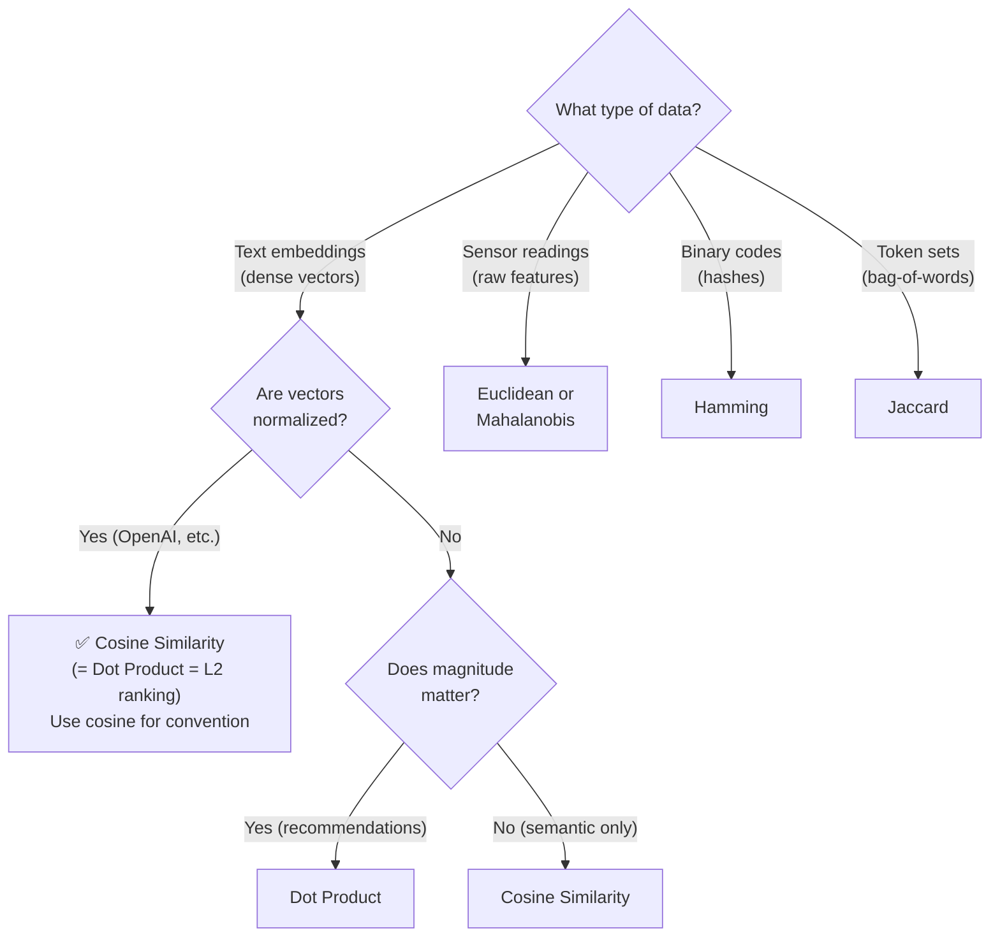

# 📏 Distance & Similarity Metrics — All Approaches

> **Purpose:** Document all distance/similarity metrics used in vector search, with mathematical definitions and geometric intuition.
>
> **MechSage Recommendation:** Cosine Similarity

---

## Summary Table

| # | Metric | Type | Formula Focus | Best For | MechSage Verdict |
|---|---|---|---|---|:---:|
| 1 | **Cosine Similarity** | Similarity | Angle between vectors | NLP / semantic search | **✅ Pick** |
| 2 | Euclidean (L2) | Distance | Straight-line distance | Clustering, spatial | ❌ |
| 3 | Manhattan (L1) | Distance | City-block distance | High-dim, grid data | ❌ |
| 4 | Dot Product | Similarity | Orientation + magnitude | Recommendations | ⚠️ Equivalent |
| 5 | Hamming | Distance | Bit disagreement | Binary codes / LSH | ❌ |
| 6 | Jaccard | Similarity | Set overlap | Token-level / sparse | ❌ |
| 7 | Minkowski | Distance | Generalized Lp | Parametric tuning | ❌ |
| 8 | Chebyshev (L∞) | Distance | Max coordinate diff | Worst-case analysis | ❌ |
| 9 | Mahalanobis | Distance | Correlation-aware | Sensor data | ❌ (for RAG) |

---

## The Critical Rule

> **Always match the distance metric to the embedding model's training objective.**
>
> If the model was trained with cosine similarity loss, use cosine similarity in your vector database.
> Using the wrong metric causes **silent quality degradation** — the system returns results, but they're subtly wrong.

For MechSage:
- **Embedding model:** `text-embedding-3-small` (OpenAI)
- **Training objective:** Cosine similarity
- **Therefore:** Use **Cosine Similarity** in ChromaDB ✅

---

## 1. Cosine Similarity ✅ (MechSage Pick)

### Definition

Measures the **angle** between two vectors, ignoring their magnitude (length).

```
                    A · B         Σ(aᵢ × bᵢ)
cos(θ) = ──────────────── = ─────────────────────
              ‖A‖ × ‖B‖     √(Σaᵢ²) × √(Σbᵢ²)
```

**Range:** -1 (opposite) to +1 (identical direction). For normalized embeddings: 0 to +1.

### Geometric Intuition

```
           B
          ╱
         ╱  θ = small angle
        ╱     → high similarity
       ╱
      A ─────────── (reference)

           B
          │
          │  θ = 90°
          │     → zero similarity (orthogonal)
          │
      A ─────────── (reference)
```

### Why It Works for Text Embeddings
- **Scale-invariant:** A short sentence and a long paragraph about the same topic have similar directions (high cosine) even if their vector magnitudes differ
- **Focus on semantics:** Two texts about "HPC degradation" will point in similar directions regardless of text length
- **Normalized embeddings:** OpenAI's `text-embedding-3-small` outputs L2-normalized vectors (unit length), so cosine = dot product

### MechSage Application
When the Diagnostics Agent queries "rising s3 temperature with HPC pressure increase":
```
query_embedding   = embed("rising s3 temperature with HPC pressure increase")
passage_embedding = embed("Rising core temperature (s2, s3, s4) indicates HPC degradation")

cosine_similarity = 0.87  → HIGH MATCH ✅
```

The 0.40 threshold in MechSage's `manual_retrieval_rag` tool means: if all passages score below 0.40, return `NO_RELEVANT_PASSAGE` and cap confidence at 0.60.

---

## 2. Euclidean Distance (L2)

### Definition

**Straight-line distance** between two points in n-dimensional space.

```
d(A, B) = √(Σ(aᵢ - bᵢ)²)
```

**Range:** 0 (identical) to ∞

### Geometric Intuition
The "as the crow flies" distance. Measures how far apart two points are in absolute terms.

### When to Use
- Clustering (k-means uses L2 by default)
- Anomaly detection (points far from cluster centers)
- Spatial data where absolute position matters

### Why NOT for MechSage's RAG
- **Sensitive to magnitude:** A longer document produces a larger embedding vector, increasing Euclidean distance even if the content is semantically identical
- **Doesn't match training objective:** `text-embedding-3-small` wasn't optimized for L2 distance
- **Exception:** For L2-normalized vectors, Euclidean distance is **monotonically related** to cosine similarity: `d_L2² = 2(1 - cos(θ))`. So rankings would be identical, but cosine is the canonical choice.

### MechSage Verdict: ❌
Would produce the same rankings as cosine (since embeddings are normalized) but is not the canonical metric for the model. Stick with cosine for clarity and correctness.

---

## 3. Manhattan Distance (L1)

### Definition

Sum of **absolute differences** across all dimensions. The "city block" distance.

```
d(A, B) = Σ|aᵢ - bᵢ|
```

**Range:** 0 (identical) to ∞

### Geometric Intuition
```
    B ──┐
        │  Manhattan: |x₂-x₁| + |y₂-y₁| = 3 + 2 = 5
        │  Euclidean: √(3² + 2²) = √13 ≈ 3.6
    ────┘
    A
```
Like navigating a grid — you can only move along axes, not diagonally.

### When to Use
- Grid-like data (geographic coordinates in city layouts)
- High-dimensional spaces where L1 is more robust to outliers than L2
- Feature spaces with independent, non-correlated dimensions

### MechSage Verdict: ❌
No advantage over cosine for text embeddings. L1 doesn't match the training objective and doesn't capture semantic orientation.

---

## 4. Dot Product (Inner Product)

### Definition

Sum of element-wise products. Measures both **orientation AND magnitude**.

```
A · B = Σ(aᵢ × bᵢ)
```

**Range:** -∞ to +∞

### Relationship to Cosine
```
A · B = ‖A‖ × ‖B‖ × cos(θ)

If A and B are L2-normalized (‖A‖ = ‖B‖ = 1):
    A · B = cos(θ)   ← IDENTICAL to cosine similarity
```

### When to Use
- **Recommendation systems:** Where magnitude carries meaning (e.g., user engagement level)
- **When embeddings are NOT normalized:** Dot product captures both direction and "importance weight"
- **Performance:** Computationally faster than cosine (no normalization step)

### When NOT to Use
- When you only care about semantic direction (use cosine)
- When vectors have inconsistent magnitudes (dot product will favor longer vectors)

### MechSage Verdict: ⚠️ Functionally Equivalent
Since OpenAI's `text-embedding-3-small` outputs L2-normalized vectors, dot product = cosine similarity exactly. Could use either, but cosine is the documented training objective. Stick with cosine for explicitness.

---

## 5. Hamming Distance

### Definition

Number of positions where corresponding bits differ. Only for **binary vectors**.

```
d(A, B) = Σ(aᵢ ⊕ bᵢ)     where ⊕ is XOR
```

**Range:** 0 (identical) to n (totally different)

### When to Use
- LSH (Locality-Sensitive Hashing) with binary hash codes
- Binary embeddings (e.g., after binarization)
- Error detection in communications

### MechSage Verdict: ❌
MechSage uses dense float32 embeddings, not binary codes. Hamming distance is irrelevant.

---

## 6. Jaccard Similarity

### Definition

**Set overlap** between two sets. Not for dense vectors — for token sets or binary features.

```
J(A, B) = |A ∩ B| / |A ∪ B|
```

**Range:** 0 (no overlap) to 1 (identical sets)

### When to Use
- Comparing token sets (bag-of-words overlap)
- Document deduplication
- Sparse binary feature comparison

### MechSage Verdict: ❌
Operates on sets, not dense vectors. Could be used for BM25-style sparse retrieval comparison, but not as the primary metric for vector search.

---

## 7. Minkowski Distance

### Definition

**Generalized distance** parameterized by p. Encompasses L1, L2, and L∞ as special cases.

```
d(A, B) = (Σ|aᵢ - bᵢ|ᵖ)^(1/p)
```

| p | Name | Behavior |
|:---:|---|---|
| 1 | Manhattan (L1) | Sum of absolute differences |
| 2 | Euclidean (L2) | Straight-line distance |
| ∞ | Chebyshev (L∞) | Maximum coordinate difference |

### When to Use
- When you want to tune the distance behavior between L1 and L2
- Research and experimentation

### MechSage Verdict: ❌
Over-parameterized for text embedding search. Use cosine.

---

## 8. Chebyshev Distance (L∞)

### Definition

**Maximum absolute difference** across any single dimension.

```
d(A, B) = max(|aᵢ - bᵢ|)
```

### When to Use
- Worst-case analysis (what's the maximum disagreement on any feature?)
- Game theory (chess king movement distance)

### MechSage Verdict: ❌
No relevance to text embedding similarity.

---

## 9. Mahalanobis Distance

### Definition

**Correlation-aware distance** that accounts for feature covariance. Normalizes by the covariance matrix.

```
d(A, B) = √((A - B)ᵀ × Σ⁻¹ × (A - B))

Where Σ⁻¹ is the inverse covariance matrix
```

### When to Use
- **Sensor data with correlated features** — MechSage's sensors (s3, s7, s11) are correlated during HPC degradation
- Anomaly detection in multivariate sensor streams
- When features have different scales and correlations

### Interesting for MechSage — But Not for RAG
Mahalanobis distance is actually relevant to MechSage's **anomaly detection pipeline** (the `anomaly_rul_model` tool), where sensor readings have known correlations. But for the **RAG pipeline** (text embeddings), it's unnecessary — embedding dimensions don't have interpretable correlations that a covariance matrix would capture.

### MechSage Verdict: ❌ for RAG, ⚠️ Interesting for Anomaly Detection

---

## Normalization Effect — When Metrics Are Equivalent

When vectors are **L2-normalized** (unit length, ‖v‖ = 1):

```
Cosine Similarity:  cos(θ) = A · B         (since ‖A‖ = ‖B‖ = 1)
Dot Product:        A · B = cos(θ)          ← SAME as cosine
Euclidean Distance: ‖A - B‖² = 2(1 - cos(θ))  ← monotonically related

Rankings are IDENTICAL for all three metrics when vectors are normalized.
```

**OpenAI's `text-embedding-3-small` outputs L2-normalized vectors.** This means cosine, dot product, and Euclidean distance will all produce the same ranking for a given query. The choice of cosine is therefore about **convention and explicitness**, not mathematical necessity.

---

## Decision Flowchart



---

*Next: [07_retrieval_approaches.md](07_retrieval_approaches.md) — How to combine multiple retrieval signals*
