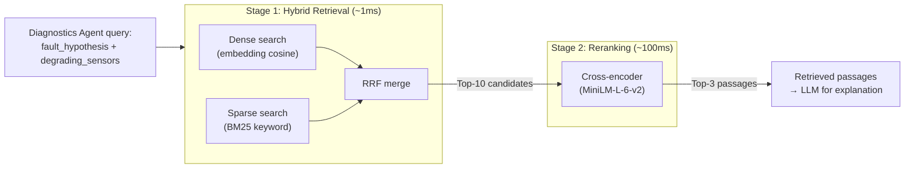

# 🔎 Retrieval Approaches — All Strategies

> **Purpose:** Document all retrieval strategies from sparse keyword to multi-stage hybrid pipelines.
>
> **MechSage Recommendation:** Hybrid (Dense + BM25) + Cross-Encoder Reranking

---

## Summary Table

| # | Approach | Captures Semantics | Captures Keywords | Precision | Latency | MechSage Verdict |
|---|---|:---:|:---:|:---:|:---:|:---:|
| 1 | Sparse (BM25) | ❌ | ✅ | Medium | Fast | ⚠️ Part of hybrid |
| 2 | Dense Retrieval | ✅ | ⚠️ | Medium-High | Fast | ⚠️ Part of hybrid |
| 3 | **Hybrid (Dense + Sparse)** | ✅ | ✅ | High | Fast | **✅ Pick (retrieval)** |
| 4 | Reciprocal Rank Fusion | ✅ | ✅ | High | Fast | **✅ Pick (fusion)** |
| 5 | **Cross-Encoder Reranking** | ✅ | ✅ | Very High | +100ms | **✅ Pick (reranking)** |
| 6 | ColBERT | ✅ | ✅ | Very High | Medium | ❌ Overkill |
| 7 | SPLADE | ✅ | ✅ | High | Medium | ⚠️ v2 consider |
| 8 | HyDE | ✅ | ⚠️ | High | +LLM call | ⚠️ v2 consider |
| 9 | Query Expansion | ✅ | ✅ | High | +LLM call | ⚠️ v2 consider |
| 10 | Multi-Query Retrieval | ✅ | ✅ | Very High | +LLM call | ⚠️ v2 consider |
| 11 | Contextual Retrieval | ✅ | ✅ | High | Minimal | ⚠️ Complement |
| 12 | Parent-Document Retrieval | ✅ | ✅ | High | Minimal | **✅ Via hierarchical chunking** |
| 13 | Ensemble Retrieval | ✅ | ✅ | Very High | Slow | ❌ Overkill |
| 14 | Predictive Retrieval | ✅ | ✅ | High | Pre-fetched | ❌ No multi-turn |

---

## 1. Sparse Retrieval (BM25 / TF-IDF)

### How It Works
Classic **keyword-based** retrieval using term frequency statistics.

**BM25** (Best Matching 25) scores documents based on:
- **Term Frequency (TF):** How often the query term appears in the document
- **Inverse Document Frequency (IDF):** How rare the query term is across all documents
- **Document length normalization:** Penalizes very long documents

```
Query: "HPC degradation s3 s11"

BM25 scores each document by matching exact tokens:
  Document A: "...HPC degradation..." → matches "HPC", "degradation" → score: 4.2
  Document B: "...bearing wear..."    → no match                     → score: 0.1
  Document C: "...s3 temperature..."  → matches "s3"                → score: 2.1
```

### Strengths
- **Exact term matching** — catches sensor IDs ("s3", "s11"), component names ("HPC"), fault codes
- **No embedding model needed** — zero cost
- **Interpretable** — you can see exactly which terms matched
- **Fast** — inverted index lookup is O(1) per term

### Weaknesses
- **No semantic understanding** — "rising temperature" won't match "thermal increase"
- **Vocabulary mismatch** — query uses "compressor failure" but doc says "HPC degradation"
- **No contextual meaning** — can't distinguish "fan speed" (component) from "fan speed" (measurement type)

### MechSage Role: Part of Hybrid ✅
Essential for catching exact sensor IDs and component names that dense search may miss.

---

## 2. Dense Retrieval

### How It Works
Embed both query and documents into dense vectors using an embedding model. Find the nearest vectors by cosine similarity.

```
Query: "rising temperature indicates compressor problem"
  → embed → [0.23, -0.15, 0.87, ...]

Documents (pre-embedded):
  Doc A: "HPC degradation..."  → [0.21, -0.14, 0.85, ...]  → cosine = 0.94 ✅
  Doc B: "bearing wear..."     → [0.55, 0.32, -0.11, ...]   → cosine = 0.23 ❌
```

### Strengths
- **Semantic matching** — understands that "rising temperature" ≈ "thermal increase"
- **Cross-lingual potential** — multilingual embeddings match across languages
- **Handles paraphrasing** — different wordings of the same concept match well

### Weaknesses
- **Misses exact terms** — may not distinguish "s3" from "s4" or "HPC" from "LPC" well
- **Embedding cost** — requires API call per query
- **Black box** — hard to explain why a passage was retrieved

### MechSage Role: Part of Hybrid ✅
Captures semantic meaning of fault descriptions that BM25 keyword matching would miss.

---

## 3. Hybrid Retrieval (Dense + Sparse) ✅ (MechSage Pick — Retrieval Stage)

### How It Works
Run **both** dense (embedding) and sparse (BM25) retrieval in parallel, then merge results.

```
Query: "rising s3 temperature HPC"
  ├── Dense search → [Doc A: 0.87, Doc C: 0.82, Doc D: 0.71, ...]
  ├── BM25 search  → [Doc A: 4.2,  Doc E: 3.8,  Doc C: 2.1, ...]
  └── Merge (RRF)  → [Doc A: #1,   Doc C: #2,   Doc E: #3, ...]
```

### Why Hybrid Is Essential for MechSage

| Query Component | Dense Catches | BM25 Catches |
|---|---|---|
| "rising temperature" | ✅ Semantic match to "thermal increase" | ❌ No exact term |
| "s3" (sensor ID) | ⚠️ Weak — embedding may not distinguish s3 from s4 | ✅ Exact token match |
| "HPC" (component) | ✅ Matches "high pressure compressor" | ✅ Exact acronym match |
| "degradation" | ✅ Matches "deterioration", "wear" | ✅ Exact term match |

**Hybrid captures ALL signals** — semantic meaning from dense + exact technical terms from BM25.

### MechSage Verdict: ✅ Pick for Retrieval
The maintenance domain has both natural language descriptions AND precise technical identifiers (sensor IDs, component codes). Hybrid retrieval is the only approach that reliably catches both.

---

## 4. Reciprocal Rank Fusion (RRF) ✅ (MechSage Pick — Fusion Method)

### How It Works
Merge ranked lists from multiple retrievers using reciprocal rank scores.

```
RRF_score(doc) = Σ  1 / (k + rank_i(doc))
                 i

Where:
  k = constant (typically 60)
  rank_i(doc) = rank of doc in retriever i's results
```

**Example:**
```
Dense ranks:  Doc A = #1, Doc C = #2, Doc D = #3
BM25 ranks:   Doc A = #1, Doc E = #2, Doc C = #3

RRF(Doc A) = 1/(60+1) + 1/(60+1) = 0.0328    ← #1 (strong in both)
RRF(Doc C) = 1/(60+2) + 1/(60+3) = 0.0320    ← #2
RRF(Doc E) = 0 + 1/(60+2) = 0.0161            ← #3 (BM25 only)
RRF(Doc D) = 1/(60+3) + 0 = 0.0159            ← #4 (dense only)
```

### Why RRF Over Simple Score Averaging
- **Score normalization is hard** — BM25 scores (0–10) and cosine similarity (0–1) are not comparable
- **RRF uses ranks, not scores** — rank #1 in both systems is always boosted, regardless of raw score scales
- **Parameter-free** — k=60 works well across most domains without tuning

### MechSage Verdict: ✅ Pick for Fusion
Standard, parameter-free, proven method to merge dense and sparse results. Used by Elasticsearch, Weaviate, and most production hybrid search systems.

---

## 5. Cross-Encoder Reranking ✅ (MechSage Pick — Reranking Stage)

### How It Works
A **second-pass** model that takes (query, passage) pairs and produces a fine-grained relevance score. Unlike bi-encoders (which embed query and passage independently), cross-encoders process them **together** through a transformer.

```
Stage 1 (Retrieval): Hybrid search returns top-10 candidates (fast, ~1ms)
Stage 2 (Reranking): Cross-encoder scores each (query, candidate) pair (slow, ~10ms each)
Final:               Return top-3 by cross-encoder score

Total latency: ~1ms + 10 × ~10ms = ~101ms ✅ (well within 2s SLA)
```

### Why Reranking Is Critical

| Step | Precision | Recall | Speed |
|---|---|---|---|
| Dense retrieval (top-10) | ~70% | ~95% | 0.1ms |
| + BM25 hybrid (top-10) | ~75% | ~98% | 0.5ms |
| **+ Cross-encoder rerank (top-3)** | **~95%** | **~95%** | **~100ms** |

The cross-encoder provides a **massive precision boost** (75% → 95%) at minimal latency cost.

### Recommended Models (Free, Local)
| Model | Size | Speed | Quality |
|---|---|---|---|
| `cross-encoder/ms-marco-MiniLM-L-6-v2` | 22M params | ~10ms/pair | Good |
| `cross-encoder/ms-marco-MiniLM-L-12-v2` | 33M params | ~15ms/pair | Better |
| `BAAI/bge-reranker-v2-m3` | 568M params | ~50ms/pair | Best |

### MechSage Verdict: ✅ Pick for Reranking
- `ms-marco-MiniLM-L-6-v2` runs locally, zero API cost, ~10ms per pair
- Reranking 10 candidates = ~100ms total — well within the 2s retrieval SLA
- Transforms "roughly relevant" top-10 into "precisely relevant" top-3
- Critical for hitting the 0.90 faithfulness target

---

## 6. ColBERT (Late Interaction)

### How It Works
Unlike bi-encoders (one vector per passage) or cross-encoders (joint encoding), ColBERT produces **per-token embeddings** and computes relevance through a **late interaction** mechanism.

```
Query tokens:    [rising] [s3] [temperature]
Passage tokens:  [HPC] [outlet] [temperature] [increases]

MaxSim: For each query token, find the most similar passage token.
Score = sum of MaxSim scores across all query tokens.
```

### Strengths
- Token-level matching captures fine-grained relevance
- Pre-computes passage token embeddings (fast search)
- Better than bi-encoders for exact term matching

### Weaknesses
- **Storage heavy** — stores per-token embeddings (128× more than bi-encoders)
- **Specialized infrastructure** — requires ColBERT-specific indexing (PLAID, etc.)
- **Overkill** for small corpora

### MechSage Verdict: ❌ Overkill
The cross-encoder reranking already provides fine-grained relevance. ColBERT's per-token storage overhead is unnecessary for 200 documents. The hybrid (dense + BM25) + reranking pipeline achieves comparable quality with simpler infrastructure.

---

## 7. SPLADE (Sparse Lexical and Expansion)

### How It Works
A learned sparse model that produces **sparse representations** (like BM25) but with vocabulary **expansion** — adding related terms that don't appear in the text.

```
Input: "HPC degradation"
SPLADE output: {"HPC": 2.1, "degradation": 1.8, "compressor": 1.5, "failure": 1.2, "temperature": 0.8, ...}
```

Note: "compressor", "failure", and "temperature" are **expanded** — they don't appear in the input but are semantically related.

### Strengths
- Best of sparse AND dense — keyword matching with semantic expansion
- Compatible with inverted index infrastructure (fast)
- Interpretable — you can see which terms were expanded

### MechSage Verdict: ⚠️ v2 Consideration
Interesting alternative to BM25 in the hybrid pipeline. Could replace the separate dense + sparse retrieval with a single SPLADE model. Requires specialized model serving. Consider when moving from Advanced RAG to Agentic RAG.

---

## 8. HyDE (Hypothetical Document Embedding)

### How It Works
1. Ask the LLM to **generate a hypothetical answer** to the query
2. Embed the hypothetical answer (not the query)
3. Use the hypothetical answer's embedding to retrieve real documents

```
Query: "What causes rising s3?"
  → LLM generates: "Rising s3 (HPC outlet temperature) typically indicates degradation
                     of the high-pressure compressor due to seal wear or blade erosion."
  → Embed this hypothetical answer
  → Search for real documents similar to this hypothetical answer
```

### Strengths
- The hypothetical answer is in the same "language" as the stored documents → better embedding alignment
- Bridges the query-document vocabulary gap
- Particularly effective for short queries that lack context

### Weaknesses
- **Adds one LLM call per retrieval** — latency + cost
- LLM may hallucinate in the hypothetical answer, skewing retrieval
- Doesn't help when the query is already well-formed

### MechSage Verdict: ⚠️ v2 Consideration
Useful when queries are ambiguous (e.g., a reliability engineer types "engine 077 acting weird"). In v2 (Agentic RAG), the agent could decide whether HyDE is needed based on query clarity. Not worth the LLM cost for v1 where queries come from structured alert objects with specific sensor IDs.

---

## 9. Query Expansion / Rewriting

### How It Works
Use an LLM to expand or rewrite the query before retrieval.

```
Original: "s3 high"
Expanded: "rising HPC outlet temperature sensor s3 high pressure compressor degradation"
```

### MechSage Verdict: ⚠️ v2 Consideration
The Diagnostics Agent already constructs structured queries from `alert` objects (sensor IDs + fault hypothesis). Query expansion could help when queries are ambiguous, but the structured input format reduces this need in v1.

---

## 10. Multi-Query Retrieval

### How It Works
Generate multiple query variants, retrieve for each, deduplicate and combine results.

```
Original: "rising s3 temperature"
Variant 1: "HPC outlet temperature increase"
Variant 2: "sensor s3 abnormal readings compressor"
Variant 3: "high pressure compressor thermal degradation"

Retrieve for all 3 → Combine unique results → Rerank
```

### MechSage Verdict: ⚠️ v2 (Agentic RAG)
Natural fit for Agentic RAG phase where the agent can generate and evaluate multiple queries iteratively. Adds 3× LLM cost per retrieval — not justified for v1.

---

## 11. Contextual Retrieval

### How It Works
At indexing time, prepend a **contextual summary** to each chunk before embedding.

```
Original chunk: "Recommended action: borescope inspection of HPC stages."

Contextual chunk: "This passage describes the recommended maintenance action for
high pressure compressor degradation in turbofan engines. The action involves
borescope inspection of HPC stages."
```

### MechSage Verdict: ⚠️ Useful Complement
Could improve retrieval recall by adding context to short chunks. Lightweight to implement at indexing time. Consider as an enhancement to the hierarchical chunking strategy.

---

## 12. Parent-Document Retrieval ✅ (Already Covered)

### How It Works
Retrieve at the child (granular) chunk level, but return the parent (broader) chunk to the LLM.

**This is exactly what MechSage's Hierarchical Chunking does.** See [02_chunking_strategies.md](02_chunking_strategies.md) §5.

---

## 13. Ensemble Retrieval

### How It Works
Run multiple independent retrievers (different models, different parameters) and combine results via voting or weighted fusion.

### MechSage Verdict: ❌ Overkill
Two retrievers (dense + BM25) is already a form of ensemble. Adding more retrievers increases latency without proportional quality gain at 200 documents.

---

## 14. Predictive / Speculative Retrieval

### How It Works
In multi-turn conversations, pre-fetch context for likely follow-up questions.

### MechSage Verdict: ❌ Not Applicable
MechSage's RAG is single-turn per diagnosis — the Diagnostics Agent makes one retrieval per alert. No multi-turn conversation to predict.

---

## The MechSage Retrieval Pipeline



**Total latency:** ~101ms — well within the 2-second retrieval SLA.

---

*Next: [08_graph_rag.md](08_graph_rag.md) — Knowledge graph approaches for structured maintenance data*
