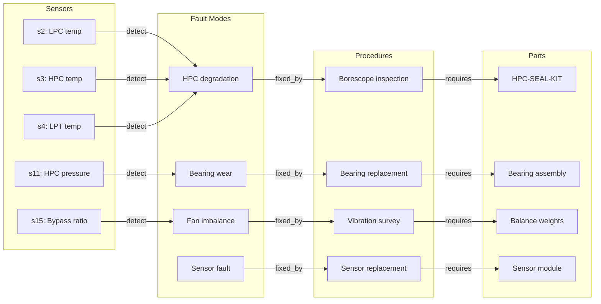

# 🕸️ GraphRAG — Knowledge Graph Approaches

> **Purpose:** Document all graph-based RAG approaches and their applicability to MechSage's maintenance domain.
>
> **MechSage Recommendation:** ❌ Not for v1. Property Graph RAG for v2 (when corpus > 200 entries).

---

## Summary Table

| # | Approach | Corpus Size Needed | Build Cost | Query Capability | MechSage Verdict |
|---|---|:---:|:---:|---|:---:|
| 1 | Microsoft GraphRAG | Large (1000+) | Very High | Global + local search | ❌ Wrong scale |
| 2 | KG + Vector Hybrid | Medium (200+) | High | Relational + semantic | ⚠️ v2 |
| 3 | Entity-Linked RAG | Medium (100+) | Medium | Entity-centric queries | ⚠️ v2 |
| 4 | Community Detection RAG | Large (500+) | Very High | Thematic summaries | ❌ Wrong scale |
| 5 | Multi-Hop Graph Traversal | Medium (100+) | Medium | Cross-document reasoning | ⚠️ v2 |
| 6 | **Property Graph RAG** | Small (30+) | Low-Medium | Structured queries | **⚠️ v2 Pick** |
| 7 | MemGraphRAG | Large (1000+) | Very High | Long-context memory | ❌ Research |
| 8 | LinearRAG | Medium (200+) | Low | Efficient graph retrieval | ⚠️ Future |

---

## Why Consider GraphRAG at All?

MechSage's maintenance data has **natural graph structure** already visible in `knowledge_base.json`:

```
[Component: HPC] ──causes──→ [Fault: degradation] ──detected_by──→ [Sensor: s3, s11]
                                     │
                                     └──fixed_by──→ [Procedure: borescope inspection]
                                                           │
                                                           └──requires──→ [Part: HPC-SEAL-KIT]
```

Standard vector search treats each passage as an independent blob. GraphRAG preserves **relationships** between entities, enabling queries like:
- "What faults affect the HPC AND show up on sensor s3?"
- "What parts are needed for all procedures related to temperature anomalies?"
- "Which components share failure modes?"

These **relational queries** are impossible with pure vector search but trivial with a knowledge graph.

---

## 1. Microsoft GraphRAG

### How It Works
1. **Extract entities and relationships** from the entire corpus using an LLM
2. **Build a knowledge graph** from extracted triples (entity → relationship → entity)
3. **Detect communities** in the graph using Leiden algorithm
4. **Summarize each community** for "global" queries
5. At query time:
   - **Local search:** Standard vector retrieval + graph context
   - **Global search:** Summarize across communities for thematic queries

### Strengths
- Handles "global" questions ("What are all the failure modes in our fleet?")
- Community summaries provide bird's-eye views
- Well-documented (Microsoft open-sourced the framework)

### Weaknesses
- **Very expensive to build** — LLM call per chunk for entity extraction ($10–50 for large corpora)
- **Designed for large corpora** (research papers, news archives, codebases)
- Community detection requires hundreds of nodes to form meaningful clusters
- Overkill for structured, small-scale maintenance manuals

### MechSage Verdict: ❌ Wrong Scale
With 5–200 entries, the corpus is too small for meaningful community detection. The LLM extraction cost ($5–20) exceeds the monthly RAG budget for a fleet of 218 assets. The structured JSON format already provides entity information — no extraction needed.

---

## 2. Knowledge Graph + Vector Hybrid

### How It Works
Maintain **two parallel indices**:
1. **Vector index** (ChromaDB/HNSW) for semantic similarity search
2. **Knowledge graph** (Neo4j, NetworkX) for relational traversal

At query time, combine results from both:
```
Query: "What causes rising s3 temperature?"
  ├── Vector search → [Doc A: HPC degradation, Doc E: sensor fault]
  ├── Graph traversal → s3 ──measured_by──→ HPC ──failure_mode──→ HPC degradation
  └── Combined: Doc A ranked higher (confirmed by both vector + graph)
```

### Strengths
- **Semantic + relational** — catches both meaning and structure
- Relationship paths provide **explainable** retrieval ("found via s3 → HPC → degradation")
- Reduces false positives by cross-referencing vector results with graph structure

### Weaknesses
- Two index systems to maintain (vector DB + graph DB)
- Graph construction requires entity extraction or manual curation
- More complex query routing logic

### MechSage Verdict: ⚠️ v2 Consideration
The hybrid approach is compelling for MechSage because the maintenance domain is inherently relational. However, at 30–200 entries, the hybrid search overhead isn't justified. When the corpus grows beyond 200 entries and includes cross-referencing manuals, this becomes the natural upgrade path.

---

## 3. Entity-Linked RAG

### How It Works
1. Extract **named entities** from queries and documents (components, sensors, fault modes)
2. Link entities to a knowledge graph or ontology
3. Retrieve documents associated with the linked entities

```
Query: "s3 and s11 anomaly"
  → Entity extraction: [s3: HPC outlet temp, s11: static HPC pressure]
  → Entity linking: s3 → HPC, s11 → HPC
  → Retrieve: all documents linked to "HPC" entity
```

### Strengths
- Precise entity-level retrieval
- Handles synonyms via entity linking ("HPC" = "high pressure compressor")
- Explainable — shows which entities were matched

### MechSage Verdict: ⚠️ v2 Consideration
MechSage's `sensor_cues` field in the knowledge base already functions as a manual entity link. Automating this with NER could improve retrieval when the corpus grows, but the current structured JSON already provides the same benefit.

---

## 4. Community Detection RAG

### How It Works
1. Build a knowledge graph from the corpus
2. Apply community detection (Leiden, Louvain) to find clusters of related entities
3. Summarize each community
4. For global queries, search across community summaries

### MechSage Verdict: ❌ Wrong Scale
200 entities would produce 2–5 communities — too few for meaningful global search. Community detection adds value at 500+ entities where manual categorization is impractical.

---

## 5. Multi-Hop Graph Traversal

### How It Works
Answer complex questions by traversing multiple edges in a knowledge graph.

```
Query: "What parts are needed to fix faults detected by sensor s3?"

Traversal: s3 ──detects──→ HPC degradation ──fixed_by──→ borescope inspection ──requires──→ HPC-SEAL-KIT

Answer: HPC-SEAL-KIT
```

### Strengths
- Answers complex, multi-step questions that vector search cannot
- Follows causal chains (sensor → fault → procedure → parts)
- Natural fit for maintenance domain knowledge

### MechSage Verdict: ⚠️ v2 Consideration
Multi-hop queries are exactly the kind of reasoning MechSage's Diagnostics Agent needs:
- "Sensor s3 is rising → What fault does this indicate → What procedure fixes it → What parts are needed?"

In v1, this chain is handled by the RAG retrieval (get the full manual entry which contains all steps). In v2, a graph could make this traversal explicit and more reliable.

---

## 6. Property Graph RAG ⚠️ (v2 Pick)

### How It Works
Build a **property graph** where nodes and edges carry typed properties.

```
Node: {type: "Component", name: "HPC", category: "compressor"}
Node: {type: "Fault", name: "degradation", severity: "high"}
Node: {type: "Sensor", name: "s3", measurement: "temperature"}
Node: {type: "Procedure", name: "borescope inspection", duration_hrs: 4.0}

Edge: {type: "detects", from: "s3", to: "degradation", confidence: 0.92}
Edge: {type: "fixed_by", from: "degradation", to: "borescope inspection"}
```

### Why Property Graph for MechSage

The knowledge base structure **already maps to a property graph**:

```json
{
  "id": "MAN-HPC-12",
  "fault_mode": "high pressure compressor degradation",     ← Fault node
  "components": ["HPC"],                                     ← Component nodes
  "sensor_cues": ["s2", "s3", "s4"],                        ← Sensor nodes
  "text": "...borescope inspection of HPC stages..."        ← Procedure node
}
```

### Strengths
- Low build cost — structured data can be directly converted to graph nodes
- Property queries ("all faults with severity > high AND affecting HPC")
- Scales well from small (30 nodes) to large (10K nodes)
- Compatible with lightweight graph libraries (NetworkX) — no Neo4j needed

### MechSage Verdict: ⚠️ v2 Pick
When the knowledge base expands beyond 200 entries in Sprint 2:
1. Convert `knowledge_base.json` entries to property graph nodes
2. Use NetworkX (already in Python ecosystem) — no new infrastructure
3. Combine with vector search: graph for structural queries, vectors for semantic
4. Enable multi-hop reasoning for the Diagnostics Agent

---

## 7. MemGraphRAG

### How It Works
Memory-augmented graph retrieval — a lightweight model maintains a compressed representation of the knowledge graph for fast, approximate traversal.

### MechSage Verdict: ❌ Research Stage
Limited production deployments. Not applicable at MechSage's corpus scale.

---

## 8. LinearRAG

### How It Works
A "relation-free" graph approach — builds lightweight structural connections between documents without explicit entity-relationship extraction.

### Strengths
- Much cheaper than full GraphRAG (no LLM extraction needed)
- Faster to build
- Good for loosely structured corpora

### MechSage Verdict: ⚠️ Future Consideration
Interesting efficiency approach if full GraphRAG is too expensive when the corpus grows large. MechSage's structured data makes full property graphs feasible, so LinearRAG's "relation-free" advantage is less compelling.

---

## MechSage's Graph Structure (Already Present)



**This graph already exists implicitly in the knowledge base.** The v2 decision is whether to make it explicit in a graph data structure for more powerful queries.

---

*Next: [09_evaluation_metrics.md](09_evaluation_metrics.md) — How to measure if the RAG pipeline is working*
