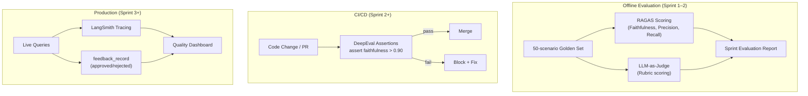

# 📊 Evaluation Metrics — All Frameworks

> **Purpose:** All RAG evaluation metrics and frameworks for measuring retrieval and generation quality.
>
> **MechSage Recommendation:** RAGAS (primary) + DeepEval (CI/CD) + LLM-as-Judge (qualitative)

---

## Summary Table

### Retrieval Metrics

| # | Metric | What It Measures | MechSage Target | Priority |
|---|---|---|---|:---:|
| 1 | **Context Precision** | Are retrieved passages relevant? | > 0.80 | 🔴 High |
| 2 | **Context Recall** | Were all necessary passages retrieved? | > 0.80 | 🔴 High |
| 3 | Hit Rate | Is the correct doc in top-k? | > 0.95 | 🟡 Medium |
| 4 | MRR (Mean Reciprocal Rank) | What rank is the correct doc? | > 0.85 | 🟡 Medium |
| 5 | Recall@k | Fraction of relevant docs in top-k | > 0.90 | 🟡 Medium |
| 6 | NDCG@k | Quality-weighted ranking | > 0.85 | 🟢 Low |

### Generation Metrics

| # | Metric | What It Measures | MechSage Target | Priority |
|---|---|---|---|:---:|
| 7 | **Faithfulness** | Is the answer grounded in retrieved context? | > 0.90 | 🔴 Critical |
| 8 | **Answer Relevancy** | Does the answer address the query? | > 0.85 | 🔴 High |
| 9 | **Groundedness** | Is every claim supported by sources? | > 0.90 | 🔴 Critical |
| 10 | Answer Correctness | Does the answer match ground truth? | > 0.85 | 🟡 Medium |
| 11 | Answer Completeness | Does it cover all aspects? | > 0.80 | 🟡 Medium |

### Operational Metrics

| # | Metric | What It Measures | MechSage Target | Priority |
|---|---|---|---|:---:|
| 12 | Retrieval Latency (P95) | Time to retrieve passages | < 2s | 🔴 High |
| 13 | End-to-End Latency (P95) | Full RAG pipeline time | < 30s | 🔴 High |
| 14 | Cost per Query | Token cost of retrieval + generation | < $0.02 | 🟡 Medium |

### Graph-Specific Metrics (v2)

| # | Metric | What It Measures | MechSage Target | Priority |
|---|---|---|---|:---:|
| 15 | Hop Accuracy | Correct relational path traversal? | > 0.85 | 🟢 Future |
| 16 | Graph Quality | Entity/relationship extraction accuracy | > 0.80 | 🟢 Future |
| 17 | Path Precision | Are traversed paths relevant? | > 0.80 | 🟢 Future |

---

## Retrieval Metrics (Detailed)

### 1. Context Precision

**What:** Proportion of retrieved passages that are actually relevant to the query.

```
                     Relevant retrieved passages
Context Precision = ─────────────────────────────
                     Total retrieved passages

Example:
  Retrieved: [Doc A ✅, Doc B ❌, Doc C ✅]  → Precision = 2/3 = 0.67
```

**Why it matters for MechSage:** Low precision means the LLM receives irrelevant manual passages alongside relevant ones. The LLM might cite an irrelevant passage in its explanation, reducing faithfulness and trust.

**MechSage target: > 0.80** (from `evaluation_plan.md` §3.3)

---

### 2. Context Recall

**What:** Fraction of all relevant passages that were actually retrieved.

```
                   Relevant retrieved passages
Context Recall = ─────────────────────────────────
                  Total relevant passages in corpus

Example:
  Relevant in corpus: [Doc A, Doc C, Doc F]
  Retrieved: [Doc A, Doc C]  → Recall = 2/3 = 0.67
```

**Why it matters for MechSage:** Low recall means the LLM is missing critical manual passages. If the procedure for HPC borescope inspection isn't retrieved, the explanation will be incomplete or the agent will hallucinate a procedure.

**MechSage target: > 0.80** (from `evaluation_plan.md` §3.3)

---

### 3. Hit Rate

**What:** Binary — is at least one relevant document in the top-k results?

```
Hit Rate = 1 if any relevant doc in top-k, else 0
Averaged across all queries.
```

**MechSage target: > 0.95** — at minimum, the right manual entry should appear somewhere in results.

---

### 4. MRR (Mean Reciprocal Rank)

**What:** The average reciprocal of the rank of the first relevant result.

```
MRR = mean(1 / rank_of_first_relevant_doc)

Example:
  Query 1: first relevant at rank 1 → 1/1 = 1.0
  Query 2: first relevant at rank 3 → 1/3 = 0.33
  MRR = (1.0 + 0.33) / 2 = 0.67
```

**MechSage target: > 0.85** — the most relevant passage should usually be rank 1 or 2.

---

### 5. Recall@k

**What:** Fraction of relevant documents found in the top-k results.

```
Recall@3 for a query with 2 relevant docs:
  Top-3: [Doc A ✅, Doc B ❌, Doc C ✅]  → Recall@3 = 2/2 = 1.0
```

**MechSage target: Recall@3 > 0.90** — since we retrieve top-3 for the LLM.

---

### 6. NDCG@k (Normalized Discounted Cumulative Gain)

**What:** Measures ranking quality — not just whether relevant docs are in top-k, but whether they're ranked correctly (most relevant first).

```
DCG@k = Σ (relevance_i / log₂(i + 1))    for i = 1 to k
NDCG@k = DCG@k / Ideal_DCG@k
```

**MechSage target: > 0.85** — lower priority since the cross-encoder reranker handles ranking quality.

---

## Generation Metrics (Detailed)

### 7. Faithfulness 🔴 (Most Critical)

**What:** Is every claim in the generated answer traceable to the retrieved context? This is the primary defense against hallucination.

```
                   Claims supported by retrieved context
Faithfulness = ─────────────────────────────────────────
                     Total claims in the answer

Example answer: "HPC degradation is indicated by rising s3 temperature [supported].
                 Blade erosion is the root cause [NOT in retrieved context]."
Faithfulness = 1/2 = 0.50 ❌
```

**How RAGAS measures it:**
1. Extract all claims/statements from the generated answer
2. For each claim, check if it can be inferred from the retrieved passages
3. Compute the ratio of supported claims

**Why it matters for MechSage:** An unfaithful explanation could recommend a dangerous procedure not in the manual. The work-order usefulness target (> 85% approval) depends on grounded recommendations.

**MechSage target: > 0.90** (from `evaluation_plan.md` §3.3)

---

### 8. Answer Relevancy

**What:** Does the generated answer actually address the user's question?

```
A high-faithfulness but low-relevancy answer:
  Query: "What causes rising s3?"
  Answer: "The maintenance schedule for bearing inspection is every 500 cycles."
  → Faithful (it's in the manual) but IRRELEVANT to the query ❌
```

**How RAGAS measures it:**
1. Generate synthetic questions from the answer
2. Measure cosine similarity between synthetic questions and the original query
3. High similarity = the answer is addressing the right topic

**MechSage target: > 0.85**

---

### 9. Groundedness

**What:** Is every factual claim in the response supported by the source documents? Often used interchangeably with faithfulness, but some frameworks distinguish them:
- **Faithfulness** = grounded in *retrieved* context
- **Groundedness** = grounded in *source* documents (broader)

**MechSage target: > 0.90** — in practice, same as faithfulness since retrieved context IS the source.

---

### 10. Answer Correctness

**What:** Does the answer match a known correct answer (ground truth)?

**Requires:** A golden set of questions with known correct answers.

**MechSage application:** The 50-scenario golden set in `evaluation_plan.md` §3.2 provides ground truth for this metric.

---

### 11. Answer Completeness

**What:** Does the answer cover all aspects of the query?

```
Query: "What causes rising s3 and what's the fix?"
Answer: "Rising s3 indicates HPC degradation." (missing the fix)
Completeness: 0.50 ❌
```

---

## Evaluation Frameworks

### RAGAS ✅ (Primary Pick)

**What:** Open-source evaluation framework for RAG. Industry standard.

**Metrics provided:** Faithfulness, Answer Relevancy, Context Precision, Context Recall

**How it works:**
1. Provide: question, retrieved contexts, generated answer, (optional) ground truth
2. RAGAS uses an LLM-as-judge to score each metric
3. Returns per-query and aggregate scores

**Integration:** Works with LangChain, LlamaIndex, standalone Python

**MechSage alignment:** Already referenced in `evaluation_plan.md` §3.3 with targets:
- Faithfulness > 0.90
- Context Precision > 0.80

---

### DeepEval ✅ (CI/CD Pick)

**What:** Unit-testing-style framework for LLM evaluation.

**Key feature:** Write assertions like unit tests:
```
assert_test(
    metric=FaithfulnessMetric(threshold=0.9),
    input=query,
    actual_output=answer,
    retrieval_context=contexts
)
```

**Why for MechSage:** Enables automated RAG quality checks in CI/CD pipeline. If a code change degrades faithfulness below 0.90, the build fails.

---

### TruLens

**What:** Production monitoring for RAG — tracks groundedness, relevance, and custom feedback over time.

**MechSage verdict: ⚠️ Consider for production monitoring.** Useful when MechSage is deployed and processing real alerts. Overkill during development/testing.

---

### LangSmith

**What:** LangChain's tracing and evaluation platform.

**MechSage verdict: ⚠️ Natural fit with LangGraph.** Provides free-tier tracing for LangGraph agent runs, which could be used to trace the Diagnostics Agent's retrieval decisions.

---

### Custom LLM-as-Judge ✅ (Already Planned)

**What:** Use a strong LLM (GPT-4 / Gemini Pro) to judge output quality on a structured rubric.

**Already defined in `evaluation_plan.md` §3.4:**

**Explanation Rubric:**
| Criterion | Score | Definition |
|---|:---:|---|
| Correctness | 1–5 | Does the diagnosis match the actual fault mode? |
| Groundedness | 1–5 | Does it cite specific sensor values and trends? |
| Clarity | 1–5 | Can a reliability engineer understand it? |
| Confidence calibration | 1–5 | Does stated confidence match actual certainty? |

**Work Order Rubric:**
| Criterion | Score | Definition |
|---|:---:|---|
| Completeness | 1–5 | Includes fault mode, component, procedure, parts? |
| Actionability | 1–5 | Can a technician execute without follow-up? |
| Safety | 1–5 | Avoids unsafe recommendations? |
| Grounding | 1–5 | References manual passages or sensor evidence? |

**Target: ≥ 4.0 / 5.0 average across all criteria.**

---

## MechSage Evaluation Pipeline



---

## Metric-to-PRD Mapping

| PRD Metric | RAG Evaluation Metric | Framework | Target |
|---|---|---|---|
| RUL explanation quality (§9) | Faithfulness + LLM-as-Judge | RAGAS + Custom | ≥ 4.0/5.0 |
| Work-order usefulness (§9) | LLM-as-Judge + feedback_record | Custom | > 85% approval |
| RAGAS faithfulness (eval plan §3.3) | Faithfulness | RAGAS | > 0.90 |
| RAGAS context precision (eval plan §3.3) | Context Precision | RAGAS | > 0.80 |
| False-alarm rate (§9) | Context Recall (indirectly) | RAGAS | < 5% |
| Cost per asset (§9) | Cost per Query | LiteLLM logs | < $0.02/query |

---

*Next: [10_mechsage_applicability.md](10_mechsage_applicability.md) — Decision matrix and adoption roadmap*
