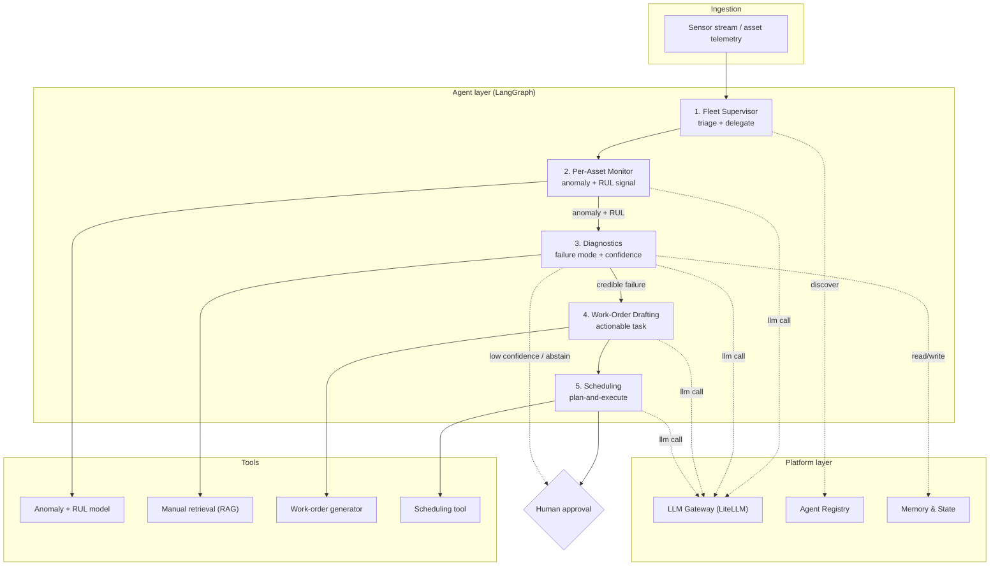
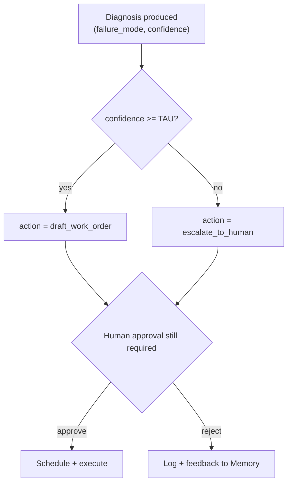

# MechSage — Stage 3: System Architecture & Platform Specification

## 1. Latency & Cost-Ceiling Budgets (PRD §10)

Before establishing the design of our agentic predictive-maintenance copilot, we define our budget boundaries. In industrial operations, we cannot let compute costs run wild, nor can we wait hours for an emergency alert.

### 1.1 Step-by-Step Latency Budgets
We divide our system's work into two distinct paths: **Routine Screening (Cheap/Fast)** and **Diagnostic Analysis (Heavy/Detailed)**.

```
                  ┌─────────────────────────────────────────┐
                  │          TELEMETRY FRAME INGEST         │
                  └────────────────────┬────────────────────┘
                                       │
                 ┌─────────────────────┴─────────────────────┐
                 ▼                                           ▼
       ┌──────────────────┐                        ┌──────────────────┐
       │   Cheap Path     │                        │  Escalated Path  │
       │(Routine screening)│                        │  (Diagnostics)   │
       │   Target: < 5s    │                        │  Target: < 30s   │
       └──────────────────┘                        └──────────────────┘
```

1. **Routine Screening Latency (< 5 seconds)**
   * *What it is:* The time it takes to scan telemetry data from a single asset during normal operation.
   * *Why:* With 218 active engines, the system must perform this check in parallel. If screening were slow (e.g., 30s), normal checks would experience massive backlog delays.
2. **Diagnostic Analysis Latency (< 30 seconds)**
   * *What it is:* The time elapsed when a sensor anomaly triggers a full investigation (fetching manuals via RAG, diagnosing the failure mode).
   * *Why:* This step is escalated. 30 seconds is fast enough for a reliability engineer to get an explanation without waiting too long, yet leaves enough time for complex database queries.
3. **Work-Order Drafting Latency (< 60 seconds)**
   * *What it is:* The time the system takes to draft a complete, detailed instruction ticket for technicians.
   * *Why:* Writing long structured paragraphs using a medium model takes extra processing time.
4. **End-to-End Latency (< 120 seconds / 2 minutes)**
   * *What it is:* Total time elapsed from the first detection of an anomaly to the moment the finished draft is queued for human review.

### 1.2 Step-by-Step Cost Ceilings
* **Monthly Fleet Budget Ceiling: < $327**
   * *Calculation:* With **218 assets** in the fleet, we assign a maximum budget of **$1.50 per asset per month**.
* **Per-Escalation Run Ceiling: < $0.05**
   * *Why:* We cannot use expensive models for every check. We allocate less than 5 cents per diagnostic run so we stay well within the monthly limit even if multiple anomalies occur.

---

## 2. System Architecture & Agent Topology

The MechSage system is organized under a **hierarchical multi-agent** topology. A Fleet Supervisor triages and delegates; specialist agents handle one job each; every model call passes through the Platform layer; and every external action happens through a Tool.

### 2.1 System Architecture Diagram



**Reading the Diagram:**
* **Solid arrows** represent the main data/control flow.
* **Dotted arrows to Platform** show that agents resolve peer interfaces via the Agent Registry and route LLM requests through the LLM Gateway.
* **Dotted abstain path** routes low-confidence diagnoses directly to a human, bypassing automated work order drafting.

---

### 2.2 Agent Topology Spec

Each agent has a single, well-defined responsibility. The "Model Tier" is a request to the platform routing table rather than a hard provider lock.

#### 2.2.1 Fleet Supervisor
* **Responsibility:** Triage incoming asset signals, decide which assets need attention, and delegate to the right specialist. The only orchestrator.
* **Inputs:** Asset telemetry events; fleet-wide state from Memory.
* **Outputs:** Delegation calls to Per-Asset Monitor; fleet status summary.
* **Tools:** None (pure orchestration).
* **Model Tier:** Cheap (routing/classification work).
* **Talks to:** Per-Asset Monitor (down), Registry (discovery), Memory (fleet state).

#### 2.2.2 Per-Asset Monitor
* **Responsibility:** For one asset, run anomaly detection + RUL estimation and decide if a signal is worth escalating.
* **Inputs:** `asset_id`, sensor window.
* **Outputs:** `alert` object (anomaly score + RUL estimate + severity).
* **Tools:** Anomaly + RUL model (`anomaly_rul_model`).
* **Model Tier:** Cheap (the ML model does prediction; LLM only frames the signal).
* **Talks to:** Fleet Supervisor (up), Diagnostics (down).

#### 2.2.3 Diagnostics
* **Responsibility:** Explain the likely failure mode behind an alert, cite manual evidence, and assign a confidence score. Owns the confidence gate.
* **Inputs:** `alert` object + sensor window.
* **Outputs:** `diagnosis` object (failure mode + confidence + evidence + action).
* **Tools:** Manual retrieval (RAG) (`manual_retrieval_rag`).
* **Model Tier:** Strong (this is the core reasoning step).
* **Talks to:** Per-Asset Monitor (up), Work-Order Drafting (down), Human (abstain path), Memory (history).

#### 2.2.4 Work-Order Drafting
* **Responsibility:** Turn a credible diagnosis into a concrete, actionable work order.
* **Inputs:** `diagnosis` object.
* **Outputs:** `work_order` object.
* **Tools:** Work-order generator (`work_order_generator`).
* **Model Tier:** Mid (structured drafting from structured inputs).
* **Talks to:** Diagnostics (up), Scheduling (down).

#### 2.2.5 Scheduling
* **Responsibility:** Place the work order into a feasible slot given technician/asset availability; prepare it for human approval.
* **Inputs:** `work_order` object + availability data.
* **Outputs:** `schedule` proposal sent to the human approval queue.
* **Tools:** Scheduling tool (`scheduling_tool`).
* **Model Tier:** Mid (plan-and-execute).
* **Talks to:** Work-Order Drafting (up), Human approval (out).

---

## 3. Orchestration Decision Record (ADR)

**Decision: Adopt a hierarchical supervisor pattern (using LangGraph), with a plan-and-execute sub-pattern inside the Scheduling agent.**

| Option | Description | Verdict | Why |
|---|---|---|---|
| **Hierarchical (Supervisor)** | One supervisor triages & delegates to specialists | ✅ **Adopt** | Matches the operational flow exactly; clear single point of control; scales per-asset; easy to debug. |
| **Flat Parallel / Swarm** | All agents peers, negotiate among themselves | ❌ **Reject** | Hard to guarantee the confidence gate runs before automation; non-deterministic; difficult to audit for safety. |
| **Plan-and-Execute (Global)** | A planner builds a full plan up front; executor runs it | ⚠️ **Partial** | Too rigid for streaming sensor data at the top level — but ideal *inside* Scheduling, where a concrete multi-step plan is needed. |

### Fleet-Scale Viability
The Fleet Supervisor fans out one Per-Asset Monitor instance per active asset (or per batch). Since the specialist agents are stateless given their contract inputs, they scale horizontally across compute instances. Persistent state lives exclusively in the Memory layer, not in the agents themselves.

### Framework Choice
We choose **LangGraph** because its explicit definition of nodes and edges matches our deterministic control flow and conditional abstain edges. It provides built-in checkpointing and state tracking, outperforming CrewAI/AutoGen in applications where control flow safety is paramount.

---

## 4. LLM Gateway Design (The Communication Router)

All model calls route through a central **LLM Gateway** (powered by LiteLLM). Agents do not call Gemini or OpenAI directly; they write queries to the gateway wrapper.

```
   ┌─────────────────────────────────────────────────────────────┐
   │                         LLM GATEWAY                         │
   ├───────────────┬───────────────────┬───────────────┬─────────┤
   │ Rate Limiter  │ Timeout & Retries │ Failovers     │ Cache   │
   │ (Max 100 RPM) │ (10s/30s limits)  │ (Gemini $\rightarrow$ GPT)│ (Semantic)│
   └───────────────┴───────────────────┴───────────────┴─────────┘
```

### 4.1 Gateway Resiliency Functions

1. **Centralized Key Management**
   * *Mechanism:* The gateway loads API keys (`GEMINI_API_KEY`, `OPENAI_API_KEY`) from environment variables. Agents ask the gateway to run a prompt without having direct access to master credentials.
   * *Rationale:* Prevents security leaks of API keys in agent code.
2. **Timeout Enforcements**
   * *Mechanism:* Strict timers are set per tier. Routine calls are terminated at $> 10$ seconds; diagnostic reasoning calls are terminated at $> 30$ seconds.
   * *Rationale:* Prevents the system from hanging indefinitely on stalled cloud provider requests.
3. **Exponential Backoff & Retries with Jitter**
   * *Mechanism:* When encountering rate limits (HTTP 429) or temporary server errors (HTTP 503), the gateway retries with delay:
     $$\text{Delay} = 2^{\text{attempt}} + \text{random\_jitter}$$
   * *Rationale:* Smoothly recovers from transient errors without failing the user interaction.
4. **Provider Fallback Chain**
   * *Mechanism:* If Gemini Pro fails 3 consecutive times, the gateway routes the request to OpenAI's GPT-4o. If GPT-4o is down, it routes to Claude 3.5 Sonnet.
   * *Rationale:* Guarantees high availability (99.9% uptime) in critical manufacturing settings.
5. **Semantic Caching**
   * *Mechanism:* The gateway hashes inputs. If a new anomaly has a cosine similarity of $\ge 0.96$ to a recently processed request, the gateway serves the cached explanation directly.
   * *Rationale:* **Saves up to 90% of token costs** on repeated alarms from the same asset.

---

## 5. Model-Routing Policy

We route simple, high-frequency tasks to local machine learning models or cheap LLM APIs, reserving premium models for reasoning.

| Task | Input Size | Primary Model | Fallback Model | SLA (Max Latency) | Design Goal |
|---|---|---|---|---|---|
| **Routine Telemetry Watch** | 21 sensors $\times$ 30 cycles | **Local LightGBM Classifier** | N/A (runs on local CPU) | < 0.05s | **Zero token cost** |
| **RUL Estimation** | 14 active sensors | **Local LSTM Regression** | Simple Linear Regression | < 0.5s | **Deterministic math** |
| **Root Cause Explanation (RCA)** | Telemetry + RAG Manual Chunks | **Gemini 1.5 Pro** | OpenAI GPT-4o | < 15.0s | **High reasoning & grounding** |
| **Work Order Drafting** | Diagnostic results | **Gemini 1.5 Flash** | OpenAI GPT-4o-mini | < 10.0s | **Fast formatting at low cost** |
| **Maintenance Scheduling** | Production Calendar + RUL | **Gemini 1.5 Flash** | Python constraint solver | < 5.0s | **Low-latency constraint matching** |

---

## 6. Agent Registry Design (The Discovery Hub)

The **Agent Registry** decouples the Orchestrator from individual agent implementations, acting as a service directory.

```
1. Orchestrator looks up registry: "Who is the active DiagnosisAgent?"
2. Registry returns: Version 1.2.0 metadata + endpoint + input/output schemas
3. Orchestrator validates data structures and executes the agent
```

### 6.1 Registry Metadata Schema

Every agent registers itself using the following schema envelope:

```json
{
  "agent_name": "string",
  "version": "semver",
  "description": "string",
  "routing_tier": "cheap | mid | strong",
  "input_schema_hash": "sha256-hash",
  "output_schema_hash": "sha256-hash",
  "endpoint": "string",
  "tools": ["string"],
  "average_cost": "float",
  "average_latency_ms": "integer"
}
```

### 6.2 Example Registration
```json
{
  "agent_name": "DiagnosisAgent",
  "version": "1.2.0",
  "description": "Explains failure modes by grounding sensor telemetry in manuals.",
  "routing_tier": "strong",
  "input_schema_hash": "sha256-e3b0c442...",
  "output_schema_hash": "sha256-c89e02a1...",
  "endpoint": "/api/v1/agents/diagnosis",
  "tools": ["manual_retrieval_rag"],
  "average_cost": 0.015,
  "average_latency_ms": 7800
}
```

---

## 7. Memory & State Design (The Brain)

MechSage state memory is split into two layers: **Short-Term (Session) State** and **Long-Term (Persistent) State**.

```
                  ┌───────────────────────────────┐
                  │         STATE ENGINE          │
                  └───────────────┬───────────────┘
                                  │
          ┌───────────────────────┴───────────────────────┐
          ▼                                               ▼
 ┌──────────────────┐                            ┌──────────────────┐
 │ Short-Term State │                            │ Long-Term State  │
 │ - Ephemeral      │                            │ - Persistent DB  │
 │ - LangGraph context                           │ - Audit logs     │
 │ - Anomaly session│                            │ - Human feedback │
 └──────────────────┘                            └──────────────────┘
```

### 7.1 Short-Term Memory (Session Context)
* **Definition:** Ephemeral context that exists only during a single troubleshooting run.
* **Mechanism:** When an anomaly is detected, the orchestrator opens a new "state dictionary" (LangGraph state). As agents execute, they write updates (such as RUL estimates or diagnosed fault codes) to the state dictionary. Subsequent nodes in the graph read these keys.
* **Lifecycle:** This memory is destroyed once the final work order proposal is submitted to the human approval queue.

### 7.2 Long-Term Memory (Persistent Database)
* **Definition:** Permanent audit and learning records.
* **Mechanism:** We persist the following records in a PostgreSQL database:
  1. *Audit Logs:* Stores every prompt, response, cost, and latency, enabling platform performance monitoring and telemetry debugging.
  2. *Feedback Logs:* Captures whether the operator approved, edited, or rejected the proposed work order.
* **Rationale:** Feedback loops are used to benchmark explanation accuracy and retrain downstream ML models.

---

## 8. Agent Contracts as Schemas (The Day-0 Lock)

These are the frozen interfaces every lane builds against. Field names here are canonical.

### 8.1 `alert` (Per-Asset Monitor → Diagnostics)
```json
{
  "asset_id": "string",
  "raised_at": "timestamp",
  "window": "timeseries_ref",
  "anomaly_score": "float",
  "rul_estimate": "float",
  "severity": "low | medium | high"
}
```

### 8.2 `diagnosis` (Diagnostics → Work-Order Drafting | Human)
```json
{
  "asset_id": "string",
  "failure_mode": "string",
  "confidence": "float",
  "evidence": ["sensor_id"],
  "manual_refs": ["doc_ref"],
  "action": "draft_work_order | escalate_to_human"
}
```

### 8.3 `work_order` (Work-Order Drafting → Scheduling)
```json
{
  "asset_id": "string",
  "failure_mode": "string",
  "recommended_action": "string",
  "parts": ["part_id"],
  "priority": "low | medium | high",
  "estimated_duration_hrs": "float"
}
```

### 8.4 `schedule` (Scheduling → Human approval)
```json
{
  "work_order_id": "string",
  "asset_id": "string",
  "proposed_start": "timestamp",
  "technician_id": "string",
  "status": "pending_approval"
}
```

---

## 9. Confidence-Gate & Human-in-the-Loop Design

The Diagnostics agent owns the confidence gate, which serves as our safety mechanism.



### 9.1 Rules & Three-Zone Model
* **TAU (Confidence Threshold):** Initially set to **0.70**. This value is calibrated to keep the False-Alarm Rate (FAR) under 5% while maintaining critical failure recall above 95%.
* **Human-in-the-Loop Requirement:** Human approval is mandatory before any physical work is scheduled.
* **Three-Zone Classification:**
  * **Automated Routing Zone (Confidence $\ge 0.70$):** The Diagnostics agent has high confidence. The workflow automatically drafts a work order (`action = draft_work_order`), which is sent to the human operator for approval.
  * **Manual Audit Zone ($0.60 \le \text{Confidence} < 0.70$):** The Diagnostics agent has moderate confidence. The system raises an alert but skips automated drafting. It prompts a human expert to manually evaluate the raw telemetry and draft the work order.
  * **Critical Escalate/Abstain Zone (Confidence $< 0.60$):** The Diagnostics agent has low confidence and abstains (`action = escalate_to_human`). The telemetry and manual passages are routed directly to a human reliability engineer for investigation.
