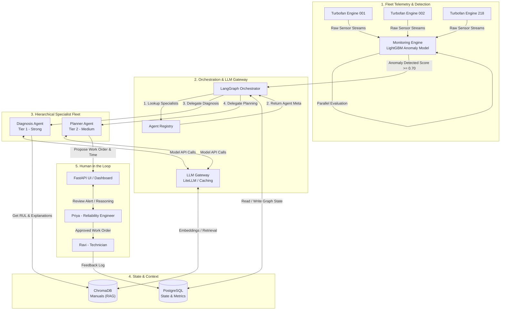

# 🏛️ Stage 3 · System Design Specification
## Mech Sage — Predictive-Maintenance Operations Copilot

**Squad:** Sudhanshu Biswas · Ayush Patil · Shubham Rangdal  
**Sprint:** 1 — Design & De-risk  
**Status:** Approved Technical Design  
**Date:** 2026-06-23  

---

## 1. Executive Design Decisions (Step-by-Step Rationale)

Before detailing the individual components, this section lays out the core architectural choices that shape MechSage, defending *why* the system is arranged this way.

1. **Separation of Concerns between Ingestion, Detection, and Explanation:**
   * *Decision:* Raw sensor streams bypass the LLM gateway entirely. We run statistical and numeric machine learning models (LightGBM/Isolation Forest) for routine screening.
   * *Why:* Telemetry streams are high-volume (21 sensors at 1 Hz for 218 assets = ~18.8 million points daily). Processing this through LLMs is cost-prohibitive ($1,500+/day) and slow. A lightweight numeric monitoring layer filters 99% of normal operations, escalating to the agentic layer only when a credible anomaly is detected.
2. **Hybrid Orchestration (Parallel Monitoring + Hierarchical Escalation):**
   * *Decision:* Concurrently evaluate all asset streams in parallel using a rule/ML engine. When an anomaly is flagged, spawn a localized hierarchical agent graph to perform deep diagnosis and planning.
   * *Why:* A flat list of 218 independent agents running LLMs would blow the budget and create coordination chaos. A supervisor-led hierarchical team only active on anomaly detection ensures that reasoning resources are allocated dynamically and cost-efficiently.
3. **Refusal-When-Unsure (Calibrated Abstention):**
   * *Decision:* If the Diagnosis Agent's confidence score falls below 0.60, the orchestrator halts automated drafting and routes to a "Manual Audit Required" queue.
   * *Why:* Safety first. Industrial equipment maintenance is high-risk. Hallucinated diagnoses waste technician time or lead to incorrect repairs, eroding system trust.
4. **Resilient LLM Gateway with Provider Fallbacks & Semantic Caching:**
   * *Decision:* Route all LLM traffic through a unified gateway (LiteLLM-backed API) with automatic retries, provider fallback paths (Gemini $\rightarrow$ GPT $\rightarrow$ Claude), and cache keying based on sensor anomaly vectors.
   * *Why:* Protects the system from third-party API downtime, reduces latency, and saves costs on repetitive sensor degradation patterns.

---

## 2. System Architecture & Data/Control Flow

The diagram below maps the components, data paths, and control handoffs as telemetry moves from the machinery to a human-approved work order.



### Control and Data Handoff Sequence
1. **Telemetry Ingest:** Telemetry is written directly to a time-series buffer.
2. **Screening Handoff:** The `Monitoring Engine` continuously runs in parallel across all assets. It queries the `SensorAnomalyDetectorTool`.
3. **Escalation Trigger:** When an anomaly score exceeds `0.70`, the Monitoring Engine pushes an event containing the `asset_id` and the anomaly window to the `LangGraph Orchestrator`.
4. **Specialist Selection:** The Orchestrator queries the `Agent Registry` to discover active versions of the `DiagnosisAgent` and `PlannerAgent`.
5. **Reasoning Loop:** 
   - The Orchestrator invokes the `DiagnosisAgent`. The agent executes the RUL model and performs semantic RAG queries against `ChromaDB` for repair manuals.
   - The `DiagnosisAgent` returns a structured diagnosis and a confidence score. If confidence `< 0.60`, control is routed immediately to the human queue as "Abstained".
   - If confidence is sufficient ($\ge 0.60$), the Orchestrator invokes the `PlannerAgent` with the diagnostic context.
   - The `PlannerAgent` calls the `SchedulingTool` and `WorkOrderDraftingTool` to draft an action plan.
6. **Human Approval:** The final payload (Diagnosis + RUL + Draft Work Order + Suggested Schedule) is saved to the persistent `State Database` and displayed on the UI for human review.

---

## 3. Orchestration Decision Record (ODR)

### Context & Scale Constraint
We monitor a fleet of **218 assets** generating 21 sensor feeds continuously. The system must operate within a strict budget ceiling of **$1.50 per asset per month** ($327/month total) and a latency target of **< 2 minutes** from anomaly detection to work-order output.

### Evaluated Architectures

#### Pattern 1: Pure Hierarchical Arrangement
* *Description:* A global Fleet Supervisor agent manages 218 individual "Asset Supervisor" agents. Each Asset Supervisor manages sub-agents (Diagnosis, Planning, Retrieval) for its assigned machine.
* *Verdict:* **REJECTED**.
* *Why:* Under healthy operating conditions, 95%+ of the fleet operates normally. Running 218 active supervisor loops calling LLMs on a continuous cadence results in runaway token usage. The base cost would exceed $4,500/month, failing the cost guardrail by a factor of 13×.

#### Pattern 2: Pure Parallel Processing (Flat Architecture)
* *Description:* 218 independent, isolated agents process telemetry data in parallel. Each agent has direct access to all tools (RUL prediction, manuals RAG, work order builder) and operates autonomously.
* *Verdict:* **REJECTED**.
* *Why:* While highly parallel, this lacks coordination. There is no single point to enforce confidence gates, safety fallbacks, or consistent formatting. It leads to duplicate alerts, conflicting schedules, and makes tracing decisions extremely difficult for Arjun (Platform Engineer).

#### Pattern 3: Plan-and-Execute (Maintenance Scheduler Priority)
* *Description:* The orchestrator is a planning loop. When a problem occurs, it dynamically generates a step-by-step checklist (e.g., Step 1: get manuals, Step 2: run RUL, Step 3: check calendar) and executes it sequentially, replanning on failure.
* *Verdict:* **REJECTED for the entire flow** (but adopted locally within the Scheduling tool).
* *Why:* Dynamic planning makes system outcomes unpredictable and debugging difficult. It increases latency and token count due to iterative planning loops, which violates the < 30s diagnostics SLA.

### Adopted Pattern: Hybrid Routing-Escalation (Concurrently Screen, Dynamically Escalate)
* *Description:* We split the system into two distinct runtime phases:
  1. **Phase 1: Parallel Routine Screening (Non-LLM Engine):** Concurrently monitor all 218 engines using a fast, local gradient-boosted classifier (LightGBM) running on a scheduler. Cost is $0.00 in LLM tokens. Latency is < 50ms per asset run.
  2. **Phase 2: Hierarchical Specialist Execution (On-Demand):** When Phase 1 alerts, the Orchestrator instantiates a dedicated LangGraph state machine containing a `DiagnosisAgent` and a `PlannerAgent`. The Orchestrator enforces strict schemas and gates between these agents.
* *Why:*
  - **Cost-Efficiency:** Routinely monitors healthy assets for free. LLM costs are only incurred when assets degrade (expected 1–2 escalations per day), keeping costs below $0.05 per escalation.
  - **Determinism:** The flow between diagnosis, planning, and human gate is structured and repeatable, ensuring reliability.
  - **Latency:** Execution completes in parallel, easily hitting the < 30s target.

---

## 4. Agent Topology

The following agents form the core system. Each is designed as a single-responsibility component with strict boundaries.

```
┌─────────────────────────────────────────────────────────────────────────────┐
│                               AGENT TOPOLOGY                                │
├──────────────────────────┬────────────────────────┬─────────────────────────┤
│ FleetMonitorAgent        │ DiagnosisAgent         │ PlannerAgent            │
│ (Tier 3 - Local ML/Rule) │ (Tier 1 - Strong LLM)  │ (Tier 2 - Medium LLM)   │
│ Responsibility:          │ Responsibility:        │ Responsibility:         │
│ Flag anomalies           │ Explain fault & RUL    │ Draft WO & schedule     │
└──────────────────────────┴────────────────────────┴─────────────────────────┘
```

### 4.1 Fleet Monitor Agent (`FleetMonitorAgent`)
* **Single Responsibility:** Concurrently evaluate incoming telemetry windows per asset to detect early-stage degradation.
* **Model Tier:** **Tier 3 (Local Numeric ML)** — Runs a light gradient-boosting classifier (LightGBM) + statistical rule checks locally.
* **Inputs:**
  ```json
  {
    "asset_id": "string",
    "telemetry_window": [
      {"cycle": 120, "s2": 642.1, "s3": 1589.2, "s4": 1403.1, "s11": 47.4, "s13": 2388.1, "s15": 8.4}
    ]
  }
  ```
* **Outputs:**
  ```json
  {
    "asset_id": "string",
    "is_anomaly": true,
    "anomaly_score": 0.84,
    "primary_indicators": ["s3", "s11", "s15"]
  }
  ```
* **Tools Call:** `SensorAnomalyDetectorTool`

### 4.2 Diagnosis Agent (`DiagnosisAgent`)
* **Single Responsibility:** Determine the specific fault mode (e.g., HPC wear, Fan degradation) and predict remaining useful life (RUL) with plain-language explanations grounded in manuals.
* **Model Tier:** **Tier 1 (Strong LLM)** — Gemini 1.5 Pro / GPT-4o.
* **Inputs:**
  ```json
  {
    "asset_id": "string",
    "anomaly_score": 0.84,
    "primary_indicators": ["s3", "s11", "s15"],
    "telemetry_history": [ ... ]
  }
  ```
* **Outputs:**
  ```json
  {
    "asset_id": "string",
    "predicted_rul": 22,
    "confidence_score": 0.89,
    "fault_mode": "HPC Degradation",
    "explanation": "Significant upward trend detected in HPC outlet temperature (s3) and static pressure (s11) over the last 30 cycles, combined with bypass ratio (s15) drift. This matches standard high-pressure compressor degradation signatures. Estimated RUL is 22 cycles before mechanical threshold breach.",
    "citations": ["MAN-HPC-04: Section 2.1"]
  }
  ```
* **Tools Call:** `RULPredictionTool`, `ManualRetrievalTool`

### 4.3 Planner Agent (`PlannerAgent`)
* **Single Responsibility:** Draft a structured, safe work order and propose a specific maintenance window that minimizes production impact.
* **Model Tier:** **Tier 2 (Medium LLM)** — Gemini 1.5 Flash / GPT-4o-mini.
* **Inputs:**
  ```json
  {
    "asset_id": "string",
    "fault_mode": "HPC Degradation",
    "predicted_rul": 22,
    "explanation": "string",
    "production_schedule": [ ... ]
  }
  ```
* **Outputs:**
  ```json
  {
    "asset_id": "string",
    "work_order_draft": {
      "title": "HPC Seal Inspection & Replacement",
      "priority": "HIGH",
      "required_skills": ["L2 Technician", "Turbofan Specialist"],
      "estimated_duration_hours": 4.5,
      "steps": [
        "1. Isolate fuel valves and lock-out/tag-out asset.",
        "2. Access High Pressure Compressor housing per manual section 4.2.",
        "3. Inspect carbon seals for thermal wear."
      ],
      "required_parts": ["HPC-SEAL-X21", "O-RING-KIT-04"]
    },
    "proposed_schedule_slot": {
      "start_time": "2026-06-25T08:00:00Z",
      "end_time": "2026-06-25T12:30:00Z",
      "impact_score": 0.20
    }
  }
  ```
* **Tools Call:** `WorkOrderDraftingTool`, `SchedulingTool`

---

## 5. Agent Contracts (JSON Schema Specifications)

To prevent runtime integration failures and allow plug-and-play swapping of underlying LLM models, the inputs and outputs of each agent are governed by schemas.

### 5.1 Diagnosis Agent Contract Schema
```json
{
  "$schema": "http://json-schema.org/draft-07/schema#",
  "title": "DiagnosisAgentContract",
  "type": "object",
  "properties": {
    "asset_id": { "type": "string" },
    "predicted_rul": { 
      "type": "integer", 
      "minimum": 0, 
      "maximum": 500 
    },
    "confidence_score": { 
      "type": "number", 
      "minimum": 0.0, 
      "maximum": 1.0 
    },
    "fault_mode": { 
      "type": "string",
      "enum": ["HPC Degradation", "Fan Degradation", "Sensor Fault", "Unknown / Multiple"]
    },
    "explanation": { 
      "type": "string",
      "minLength": 50
    },
    "citations": {
      "type": "array",
      "items": { "type": "string" }
    }
  },
  "required": ["asset_id", "predicted_rul", "confidence_score", "fault_mode", "explanation", "citations"]
}
```

### 5.2 Planner Agent Contract Schema
```json
{
  "$schema": "http://json-schema.org/draft-07/schema#",
  "title": "PlannerAgentContract",
  "type": "object",
  "properties": {
    "asset_id": { "type": "string" },
    "work_order_draft": {
      "type": "object",
      "properties": {
        "title": { "type": "string" },
        "priority": { "type": "string", "enum": ["LOW", "MEDIUM", "HIGH", "CRITICAL"] },
        "required_skills": { "type": "array", "items": { "type": "string" } },
        "estimated_duration_hours": { "type": "number", "minimum": 0.5 },
        "steps": { "type": "array", "items": { "type": "string" } },
        "required_parts": { "type": "array", "items": { "type": "string" } }
      },
      "required": ["title", "priority", "required_skills", "estimated_duration_hours", "steps", "required_parts"]
    },
    "proposed_schedule_slot": {
      "type": "object",
      "properties": {
        "start_time": { "type": "string", "format": "date-time" },
        "end_time": { "type": "string", "format": "date-time" },
        "impact_score": { "type": "number", "minimum": 0.0, "maximum": 1.0 }
      },
      "required": ["start_time", "end_time", "impact_score"]
    }
  },
  "required": ["asset_id", "work_order_draft", "proposed_schedule_slot"]
}
```

---

## 6. LLM Gateway & Resiliency Design

The gateway is the single entry point for every LLM and embedding invocation. We design it to wrap raw APIs in a robust layer that manages keys, limits, and failures.

```
                  ┌───────────────────────────────┐
                  │          LLM GATEWAY          │
                  │       (LiteLLM Engine)        │
                  └───────────────┬───────────────┘
                                  │
         ┌────────────────────────┼────────────────────────┐
         ▼                        ▼                        ▼
┌──────────────────┐    ┌──────────────────┐    ┌──────────────────┐
│ Rate-Limit Jitter│    │ Timeout & Retry  │    │ Provider Fallback│
│ - Leaky bucket   │    │ - 30s timeout    │    │ - Gemini Pro     │
│ - Max 100 req/min│    │ - 3x exp backoff │    │ - Fallback: GPT4o│
└──────────────────┘    └──────────────────┘    └──────────────────┘
```

### 6.1 Resilience Strategies
* **API Keys & Secrets Management:** No provider keys are compiled or committed. The Gateway reads directly from environment variables (`GEMINI_API_KEY`, `OPENAI_API_KEY`).
* **Timeout Policies:** 
  - Tier 2 (Cheap Path/Screening LLM): **5 seconds** timeout.
  - Tier 1 (Escalated Path/Diagnosis): **25 seconds** timeout.
* **Automatic Retry Policies:** 
  - Max Retries: **3**.
  - Backoff Algorithm: Exponential backoff with random jitter (`wait_time = base * (2 ^ attempt) + uniform(0, 1)`).
* **Provider Fallback Chain:**
  ```mermaid
  graph LR
      Primary[Gemini 1.5 Pro] -->|Timeout / 5xx| Secondary[GPT-4o]
      Secondary -->|Failure| Tertiary[Claude 3.5 Sonnet]
      Tertiary -->|Outage| DegradedMode[Rule-Based Degradation Alert]
  ```
* **Rate-Limit Handling:** Active tracking of tokens-per-minute (TPM) and requests-per-minute (RPM). The gateway queues messages when capacity hits 80% to avoid provider throttles.

### 6.2 Semantic Caching
To optimize token economy, we implement a **Semantic Cache** using vector embeddings:
* *Cache Key:* The combined vector of the top 3 anomaly indicators (e.g., s3, s11, s15 gradients) and the target engine's general operating regime.
* *Hit Condition:* Cosine similarity $\ge 0.96$ against a previously cached diagnostic run.
* *Action:* Returns the previous diagnostic explanation draft, updating only the `asset_id` and the specific date. Saves ~90% of token costs on repeated engine-wear events.

---

## 7. Model-Routing Policy Decision Table

This policy maps tasks directly to the most cost-efficient model tier that fits the task's complexity, ensuring we stay within our **$1.50/asset/month** limit.

| Task Category | Responsibility | Input Format | Primary Model | Fallback Model | SLA (Max Latency) | Cost Profile |
|---|---|---|---|---|---|---|
| **Routine Telemetry Watch** | Flag anomalous sensor patterns. | 21 sensors $\times$ 30 cycles | **Local LightGBM Classifier** (Rule Engine) | N/A (Runs on local compute) | < 0.05s | **$0.00** |
| **Abstention Gate** | Filter low-signal anomalies. | Anomaly metrics | **Local Python Logic** | N/A | < 0.01s | **$0.00** |
| **RUL Estimation** | Predict remaining cycles. | 14 informative sensors | **Local LSTM Regression Model** | Static linear extrapolation | < 0.5s | **$0.00** |
| **Root Cause Explanation** | Ground telemetry, write plain-text analysis. | Anomaly vector + RAG manual passages | **Gemini 1.5 Pro** | GPT-4o | < 15.0s | **~$0.015** per call |
| **Work Order Builder** | Write steps, skills, and tools. | Diagnostic report + templates | **Gemini 1.5 Flash** | GPT-4o-mini | < 10.0s | **~$0.002** per call |
| **Maintenance Scheduling** | Fit slot into production schedule. | Calendar JSON + RUL | **Gemini 1.5 Flash** | Python Constraint Solver | < 5.0s | **~$0.001** per call |

---

## 8. Agent Registry

The registry provides a centralized catalog for runtime service discovery, agent instantiation, and operational observability.

### Metadata Schema
Each agent registers itself with the following metadata:
```json
{
  "agent_name": "DiagnosisAgent",
  "version": "1.2.0",
  "description": "Performs root cause failure mode classification and grounding on turbofan sensors.",
  "routing_tier": "tier-1-strong",
  "input_schema_hash": "sha256-e3b0c442...",
  "output_schema_hash": "sha256-c89e02a1...",
  "health_endpoint": "/api/v1/agents/diagnosis/health",
  "average_cost_per_run": 0.015,
  "average_latency_ms": 7800
}
```

### Discovery Interface
The platform locates agents using a service locator helper:
```python
class AgentRegistry:
    def __init__(self):
        self._registry = {}

    def register(self, agent_meta: dict):
        self._registry[agent_meta["agent_name"]] = agent_meta

    def discover(self, agent_name: str, target_version: str = "latest") -> dict:
        # Returns model, endpoint, and routing rules
        ...
```

---

## 9. Memory & State Design

To ensure reliability, tracing, and multi-turn user interaction, MechSage maintains two distinct layers of state:

```
                  ┌───────────────────────────────┐
                  │         STATE ENGINE          │
                  └───────────────┬───────────────┘
                                  │
         ┌────────────────────────┴────────────────────────┐
         ▼                                                 ▼
┌──────────────────┐                             ┌──────────────────┐
│ Short-Term State │                             │ Long-Term State  │
│ - Ephemeral      │                             │ - Persistent DB  │
│ - LangGraph context                            │ - Audit logs     │
│ - Anomaly session│                             │ - Human feedback │
└──────────────────┘                             └──────────────────┘
```

### 9.1 Short-Term (Session Context)
* **Lifecycle:** Instantiated at the start of an anomaly escalation; destroyed once the final draft is submitted to the human review queue.
* **Storage:** In-memory thread state managed by LangGraph (`StateGraph`).
* **Attributes:**
  - `anomaly_id` (UUID)
  - `asset_id` (string)
  - `sensor_snapshot` (dictionary of telemetry features)
  - `predicted_rul` (integer)
  - `diagnostic_explanation` (string)
  - `retrieved_manual_chunks` (list of text blocks)
  - `draft_work_order` (dictionary)
  - `proposed_schedule` (dictionary)

### 9.2 Long-Term (Persistent Audit & Learning)
* **Lifecycle:** Permanent storage in database.
* **Storage:** PostgreSQL.
* **Key Tables:**
  1. `asset_anomaly_history`: Records every escalation event, anomaly score, and resulting RUL.
  2. `agent_audit_log`: Stores every model input, output, tokens consumed, latency, and cost for Platform Engineer review.
  3. `human_feedback_log`: Logs human approval decisions (Approved as-is, edited, rejected) to support future model tuning.

---

## 10. Core Tool Specifications

### 10.1 Telemetry Anomaly & RUL Tool (`SensorAnomalyDetectorTool` / `RULPredictionTool`)
* **Input Schema:**
  ```json
  {
    "type": "object",
    "properties": {
      "asset_id": { "type": "string" },
      "data_matrix": {
        "type": "array",
        "items": {
          "type": "array",
          "minItems": 21,
          "maxItems": 21,
          "items": { "type": "number" }
        }
      }
    },
    "required": ["asset_id", "data_matrix"]
  }
  ```
* **Output Schema:**
  ```json
  {
    "type": "object",
    "properties": {
      "anomaly_score": { "type": "number" },
      "predicted_rul_cycles": { "type": "integer" },
      "top_feature_importances": {
        "type": "object",
        "additionalProperties": { "type": "number" }
      }
    },
    "required": ["anomaly_score", "predicted_rul_cycles", "top_feature_importances"]
  }
  ```

### 10.2 Maintenance Manual Retrieval Tool (`ManualRetrievalTool`)
* **Description:** Queries the Chroma vector database to fetch the top 3 most relevant segments of maintenance procedures.
* **Input Schema:**
  ```json
  {
    "type": "object",
    "properties": {
      "query_text": { "type": "string" },
      "component_filter": { "type": "string", "enum": ["Fan", "LPC", "HPC", "HPT", "LPT", "Combustor", "Bypass"] }
    },
    "required": ["query_text"]
  }
  ```
* **Output Schema:**
  ```json
  {
    "type": "object",
    "properties": {
      "retrieved_documents": {
        "type": "array",
        "items": {
          "type": "object",
          "properties": {
            "doc_id": { "type": "string" },
            "text": { "type": "string" },
            "similarity_score": { "type": "number" }
          }
        }
      }
    }
  }
  ```

### 10.3 Work-Order Drafting Tool (`WorkOrderDraftingTool`)
* **Input Schema:**
  ```json
  {
    "type": "object",
    "properties": {
      "asset_id": { "type": "string" },
      "fault_mode": { "type": "string" },
      "rul_cycles": { "type": "integer" },
      "grounding_citations": { "type": "array", "items": { "type": "string" } }
    },
    "required": ["asset_id", "fault_mode", "rul_cycles"]
  }
  ```
* **Output Schema:**
  ```json
  {
    "type": "object",
    "properties": {
      "work_order_payload": {
        "type": "object",
        "properties": {
          "wo_number": { "type": "string" },
          "steps": { "type": "array", "items": { "type": "string" } },
          "parts_list": { "type": "array", "items": { "type": "string" } },
          "safety_precautions": { "type": "array", "items": { "type": "string" } }
        }
      }
    }
  }
  ```

### 10.4 Maintenance Scheduling Tool (`SchedulingTool`)
* **Description:** Cross-references the asset's predicted RUL with the production line calendar to find a low-impact repair window before failure.
* **Input Schema:**
  ```json
  {
    "type": "object",
    "properties": {
      "asset_id": { "type": "string" },
      "predicted_rul_cycles": { "type": "integer" },
      "required_duration_hours": { "type": "number" }
    },
    "required": ["asset_id", "predicted_rul_cycles", "required_duration_hours"]
  }
  ```
* **Output Schema:**
  ```json
  {
    "type": "object",
    "properties": {
      "available_slots": {
        "type": "array",
        "items": {
          "type": "object",
          "properties": {
            "start_time": { "type": "string" },
            "end_time": { "type": "string" },
            "production_impact_score": { "type": "number" }
          }
        }
      }
    }
  }
  ```

---

## 11. Verification & Safety Safeguards

To prevent failures in production, the design specifies three layers of guards:
1. **Schema Check:** The platform orchestrator automatically validates agent inputs and outputs against JSON schemas before passing control.
2. **Confidence Refusal:** If `confidence_score` returned by the Diagnosis Agent is `< 0.60`, the execution halts, generating an alert flagged as "Abstained - Manual Triage Required".
3. **Hard Sensor Limit Guard:** If raw sensor thresholds are breached (e.g., s3 temperature $> 1650$ K), the monitoring layer bypasses the LLM chain entirely and raises an immediate, deterministic alarm.
