# MechSage — Stage 3: Tools, Data & Metrics Specification

This specification outlines the data layer, tool contracts, metrics, and tuning parameters for the MechSage predictive-maintenance platform.

---

## 1. Tool I/O Specifications

Each agent tool has a single, well-defined responsibility. The schemas below represent the frozen interfaces. Field names, types, and error codes are canonical for implementation.

> **Convention:** All timestamps are ISO 8601 UTC strings. All floats are 64-bit. Error responses carry `{ "error_code": "string", "message": "string" }`.

### 1.1 Tool: `anomaly_rul_model`
* **Called by:** Per-Asset Monitor agent.
* **Purpose:** Given a sensor window for one asset, return an anomaly score and remaining useful life (RUL) estimate. This is the core machine learning inference call.

#### Input Schema
```json
{
  "asset_id": "string",
  "cycle_start": "integer",
  "cycle_end": "integer",
  "sensor_window": {
    "op1": ["float"],
    "op2": ["float"],
    "op3": ["float"],
    "s2": ["float"],
    "s3": ["float"],
    "s4": ["float"],
    "s7": ["float"],
    "s8": ["float"],
    "s9": ["float"],
    "s11": ["float"],
    "s12": ["float"],
    "s13": ["float"],
    "s14": ["float"],
    "s15": ["float"],
    "s17": ["float"],
    "s20": ["float"],
    "s21": ["float"]
  },
  "window_length": "integer"
}
```
> **Note:** Only the **14 informative sensors** (s2–s4, s7–s9, s11–s15, s17, s20, s21) are passed to the model. The 7 near-constant sensors (s1, s5, s6, s10, s16, s18, s19) are dropped at ingestion to reduce token cost and noise.

#### Output Schema
```json
{
  "asset_id": "string",
  "anomaly_score": "float",
  "rul_estimate": "float",
  "rul_lower_ci": "float",
  "rul_upper_ci": "float",
  "degrading_sensors": ["string"],
  "operating_regime": "string",
  "model_version": "string",
  "inferred_at": "timestamp"
}
```

#### Error Codes
| Code | Meaning | Agent Behaviour |
|---|---|---|
| `WINDOW_TOO_SHORT` | Fewer than 10 cycles provided | Per-Asset Monitor logs and waits for next window |
| `SENSOR_DATA_MISSING` | > 3 of the 14 informative sensors are null | Flag as `SENSOR_FAULT`; do not escalate |
| `MODEL_UNAVAILABLE` | Inference service down | Fall back to rule-based threshold; alert Platform |

#### Performance Constraints
* **Max Inference Latency:** < 500 ms (local LSTM, no API call).
* **Model Tier:** Tier 3 — Local (zero token cost).
* **Fallback:** Simple linear regression on last 10 cycles of s3.

---

### 1.2 Tool: `manual_retrieval_rag`
* **Called by:** Diagnostics agent.
* **Purpose:** Given a failure hypothesis and degrading sensors, retrieve the most relevant maintenance manual passages to ground the explanation.

#### Input Schema
```json
{
  "query": "string",
  "degrading_sensors": ["string"],
  "fault_hypothesis": "string",
  "top_k": "integer",
  "asset_id": "string"
}
```

#### Output Schema
```json
{
  "retrieved_passages": [
    {
      "doc_ref": "string",
      "fault_mode": "string",
      "text": "string",
      "relevance_score": "float"
    }
  ],
  "retrieval_latency_ms": "integer",
  "corpus_version": "string"
}
```

#### Error Codes
| Code | Meaning | Agent Behaviour |
|---|---|---|
| `NO_RELEVANT_PASSAGE` | All passages score < 0.40 cosine similarity | Diagnostics sets `manual_refs: []`; confidence is capped at 0.60 (triggers abstain) |
| `CORPUS_UNAVAILABLE` | RAG index not reachable | Diagnostics proceeds without grounding; logs warning; confidence is capped at 0.50 |

#### Performance Constraints
* **Max Retrieval Latency:** < 2 s (embedding lookup + vector search).
* **Corpus Source:** `docs/data_card/knowledge_base.json`.
* **Embedding Model:** `text-embedding-3-small` (OpenAI) or `models/embedding-001` (Google).
* **Model Tier:** Tier 3 — Local for embedding lookup; no strong LLM call at this step.

---

### 1.3 Tool: `work_order_generator`
* **Called by:** Work-Order Drafting agent.
* **Purpose:** Given a confirmed diagnosis, produce a structured, actionable work order a technician can execute.

#### Input Schema
```json
{
  "diagnosis": {
    "asset_id": "string",
    "failure_mode": "string",
    "confidence": "float",
    "evidence": ["string"],
    "manual_refs": ["string"],
    "action": "draft_work_order"
  },
  "asset_context": {
    "asset_type": "string",
    "last_maintenance_date": "timestamp",
    "total_cycles_run": "integer",
    "location": "string"
  }
}
```

#### Output Schema
```json
{
  "work_order_id": "string",
  "asset_id": "string",
  "failure_mode": "string",
  "recommended_action": "string",
  "parts": ["string"],
  "tools_required": ["string"],
  "safety_precautions": ["string"],
  "priority": "low | medium | high",
  "estimated_duration_hrs": "float",
  "manual_refs": ["string"],
  "generated_at": "timestamp",
  "model_version": "string"
}
```

#### Error Codes
| Code | Meaning | Agent Behaviour |
|---|---|---|
| `GENERATION_TIMEOUT` | LLM call exceeds 10 s | Retry once; if still fails, escalate to human with partial diagnosis |
| `MISSING_SAFETY_PRECAUTION` | Output validator finds no safety item | Reject and re-generate with explicit safety prompt injection |
| `UNGROUNDED_RECOMMENDATION` | Output contains no manual_ref | Reject and re-generate; after 2 retries, escalate |

#### Performance Constraints
* **Max Generation Latency:** < 10 s (within the 60 s work-order SLA).
* **Model Tier:** Tier 2 — Mid (Gemini 1.5 Flash / GPT-4o-mini).
* **Estimated Cost:** ~$0.002–$0.008 per work order.

---

### 1.4 Tool: `scheduling_tool`
* **Called by:** Scheduling agent.
* **Purpose:** Find the earliest feasible maintenance window and produce a schedule proposal.

#### Input Schema
```json
{
  "work_order": {
    "work_order_id": "string",
    "asset_id": "string",
    "priority": "low | medium | high",
    "estimated_duration_hrs": "float"
  },
  "rul_estimate": "float",
  "rul_upper_ci": "float",
  "availability": {
    "technicians": [
      {
        "technician_id": "string",
        "name": "string",
        "available_slots": [
          {
            "start": "timestamp",
            "end": "timestamp"
          }
        ],
        "certifications": ["string"]
      }
    ],
    "asset_downtime_windows": [
      {
        "start": "timestamp",
        "end": "timestamp"
      }
    ]
  },
  "production_calendar": {
    "blackout_periods": [
      { "start": "timestamp", "end": "timestamp", "reason": "string" }
    ],
    "preferred_windows": [
      { "start": "timestamp", "end": "timestamp" }
    ]
  }
}
```

#### Output Schema
```json
{
  "schedule_proposal": {
    "work_order_id": "string",
    "asset_id": "string",
    "proposed_start": "timestamp",
    "proposed_end": "timestamp",
    "technician_id": "string",
    "technician_name": "string",
    "slot_rationale": "string",
    "urgency_deadline": "timestamp",
    "status": "pending_approval"
  },
  "alternatives": [
    {
      "proposed_start": "timestamp",
      "technician_id": "string",
      "trade_off": "string"
    }
  ],
  "generated_at": "timestamp"
}
```

#### Error Codes
| Code | Meaning | Agent Behaviour |
|---|---|---|
| `NO_FEASIBLE_SLOT` | No available slot within deadline | Escalate immediately to human; include raw availability |
| `OVERDUE_DEADLINE` | RUL deadline has already passed | Flag as `CRITICAL_OVERDUE`; bypass normal queue and alert Operations Lead |
| `CERTIFICATION_MISMATCH` | No certified technician available | Include uncertified alternatives with warning; human decides |

#### Performance Constraints
* **Max Scheduling Latency:** < 5 s (constraint solver; no LLM call in happy path).
* **Model Tier:** Tier 2 — Mid / Python constraint solver.
* **Solver Engine:** Greedy earliest-deadline-first or `python-constraint` library.

---

## 2. Data Schemas

These are the canonical data structures used across the pipeline. All agents and tools must read/write data conforming to these schemas.

### 2.1 `sensor_reading` (Raw Ingestion Unit)
```json
{
  "asset_id": "string",
  "cycle": "integer",
  "received_at": "timestamp",
  "op1": "float | null",
  "op2": "float | null",
  "op3": "float | null",
  "s1": "float | null",
  "s2": "float | null",
  "s3": "float | null",
  "s4": "float | null",
  "s5": "float | null",
  "s6": "float | null",
  "s7": "float | null",
  "s8": "float | null",
  "s9": "float | null",
  "s10": "float | null",
  "s11": "float | null",
  "s12": "float | null",
  "s13": "float | null",
  "s14": "float | null",
  "s15": "float | null",
  "s16": "float | null",
  "s17": "float | null",
  "s18": "float | null",
  "s19": "float | null",
  "s20": "float | null",
  "s21": "float | null",
  "data_quality": "ok | sensor_fault | missing | out_of_range"
}
```
**Validation Rules:**
* `null` on $\le 3$ of the 14 informative sensors $\rightarrow$ `data_quality: missing`; continue processing.
* `null` on $> 3$ of the 14 informative sensors $\rightarrow$ `data_quality: sensor_fault`; do not escalate; log and alert Platform.
* Values outside physical bounds (e.g., temperature $< 0$ K or $> 5000$ K) $\rightarrow$ `data_quality: out_of_range`; treat as `null`.

### 2.2 `sensor_window` (Normalized Window)
```json
{
  "asset_id": "string",
  "cycle_start": "integer",
  "cycle_end": "integer",
  "window_length": "integer",
  "regime_id": "string | null",
  "sensors": {
    "<sensor_id>": {
      "raw": ["float"],
      "normalized": ["float"],
      "trend": "flat | rising | falling | spike",
      "drift_delta": "float"
    }
  },
  "informative_only": true
}
```

### 2.3 `asset_record` (Fleet Registry Entry)
```json
{
  "asset_id": "string",
  "asset_type": "turbofan-engine | rotating-machinery",
  "location": "string",
  "commissioned_date": "timestamp",
  "total_cycles_run": "integer",
  "last_maintenance_date": "timestamp",
  "last_maintenance_type": "string",
  "baseline_rul": "float | null",
  "current_status": "nominal | degrading | critical | offline",
  "assigned_technician": "string | null"
}
```

### 2.4 `maintenance_corpus_entry` (Knowledge Base Record)
```json
{
  "doc_ref": "string",
  "fault_mode": "string",
  "components": ["string"],
  "sensor_cues": ["string"],
  "text": "string",
  "embedding": ["float"],
  "source": "string",
  "added_at": "timestamp"
}
```

### 2.5 `feedback_record` (Operator Approval/Rejection Log)
```json
{
  "feedback_id": "string",
  "work_order_id": "string",
  "asset_id": "string",
  "reviewer_id": "string",
  "decision": "approved | rejected | approved_with_edits",
  "edits_made": "string | null",
  "rejection_reason": "string | null",
  "reviewed_at": "timestamp"
}
```

---

## 3. Metric Baselines & Targets (PRD §5 TBDs Filled)

### 3.1 North-Star Metric

| Metric | Baseline (Ironside Current State) | Target (MechSage v1) | Measurement Method |
|---|---|---|---|
| **Early-detection lead time** | ~12 hours (threshold-based alert) | **30–50 cycles ≈ 5–7 days** | Offline backtest: `alert_cycle` vs. `failure_cycle` on C-MAPSS FD001 test set (100 engines) |

*Note: C-MAPSS represents ~1 cycle/hour equivalent. 30–50 cycles equates to ~30–50 hours of lead time, representing the degradation onset window before exponential failure blowup. At Ironside's assumed operational tempo of 6 cycles/day, this yields 5–8 days.*

### 3.2 Guardrail Metrics

| Metric | Baseline | Target | Hard Ceiling | Measurement |
|---|---|---|---|---|
| **False-alarm rate** | ~25% | **< 5%** | Never exceed 10% | Precision on FD001 test: `FP / (TP + FP)` where FP = alert raised but engine did not fail within `2 × RUL` cycles |
| **Cost per asset / month** | $50+ equivalent (manual labor + late detection downtime) | **< $1.50** | Never exceed $3.00 | Token counting via LiteLLM gateway logs; extrapolated to 30-day fleet run |

#### Monthly Cost Model Projections (Pessimistic vs. Worst-Case)
* **Daily screening:** $0.00 (Tier 3 Local LSTM).
* **Escalated Diagnosis (Tier 1 strong, ~$0.015 each):** Fired on ~5% of days.
* **RAG Embedding queries (~$0.001 each):** Same frequency.
* **Work Order Generation (Tier 2, ~$0.005 each):** Fired per confirmed alert.
* **Pessimistic total (5 escalations/month):** **$0.105 / asset / month**.
* **Worst-case total (20 escalations/month):** **$0.42 / asset / month**.
* *Conclusion:* Stays well within the $1.50 target.

### 3.3 Supporting Metrics

#### 3.3.1 RUL Quantitative Metrics (C-MAPSS FD001)
* **RMSE (RUL prediction):** Target **< 20 cycles** (Baseline: N/A).
* **MAE (RUL prediction):** Target **< 15 cycles** (Baseline: N/A).
* **Asymmetric Scoring (NASA metric):** Target **Score < 500** (Baseline: N/A).
* *Rationale:* NASA's metric penalizes late predictions $2\times$ more heavily than early ones, aligning with the real-world operational penalty of unplanned downtime.

#### 3.3.2 Detection Quality Metrics
* **Precision (Alert quality):** Target **> 95%** (Baseline: ~75%).
* **Recall (Critical failure catch):** Target **> 95%** (Baseline: Unknown).
* **F1 Score:** Target **> 0.90** (Baseline: N/A).
* **AUC-ROC:** Target **> 0.93** (Baseline: N/A).

#### 3.3.3 Qualitative & Operational Metrics
* **RUL explanation quality:** Target **$\ge 4.0 / 5.0$** avg. rubric score (LLM-as-judge + human spot-check on a 50-scenario golden set).
* **Work-order usefulness:** Target **> 85% direct approval rate** (ratio of approved feedback records).
* **Critical failure recall:** Target **> 95%** (Recall on test set when RUL $\le 20$).
* **Per-asset analysis latency (cheap path):** Target **< 5 s** (P95).
* **Per-asset analysis latency (escalated path):** Target **< 30 s** (P95).
* **End-to-end latency (sensor $\rightarrow$ draft WO):** Target **< 2 minutes** (P95).
* **RAGAS Faithfulness:** Target **> 0.90** (on 30-query test set).
* **RAGAS Context Precision:** Target **> 0.80** (on 30-query test set).

---

## 4. Confidence Gate (TAU) Recommendation

* **Recommended Initial TAU:** **0.70**
* **Tuning Analysis:**
  * $\text{TAU} = 0.60$: Estimated FAR ~12–15%, Recall ~98%. Too permissive (exceeds 10% FAR ceiling).
  * **$\text{TAU} = 0.70$:** Estimated FAR ~4–6%, Recall ~96%. **Recommended** (satisfies < 5% FAR target and $> 95\%$ recall).
  * $\text{TAU} = 0.75$: Estimated FAR ~2–3%, Recall ~94%. Fails $> 95\%$ recall.

---

## 5. Data Pipeline Summary

```mermaid
flowchart LR
    A["Raw sensor_reading\n(26 columns, 1 Hz)"] -->|drop 7 low-variance sensors| B["sensor_window\n(14 informative sensors\n+ 3 op settings)"]
    B -->|z-score normalize per-asset per-regime| C["normalized sensor_window"]
    C -->|LSTM inference| D["anomaly_rul_model output\n(anomaly_score, rul_estimate)"]
    D -->|score ≥ 0.65| E["alert object\n(→ Diagnostics)"]
    D -->|score < 0.65| F["No alert\n(log to audit DB)"]
    E -->|embedding query| G["manual_retrieval_rag\n(retrieved passages)"]
    G --> H["diagnosis object\n(failure_mode, confidence)"]
    H -->|confidence ≥ TAU 0.70| I["work_order_generator"]
    H -->|confidence < TAU 0.70| J["Human: Manual Audit"]
    I --> K["work_order object\n(→ scheduling_tool)"]
    K --> L["schedule_proposal\n(→ Human approval)"]
```


