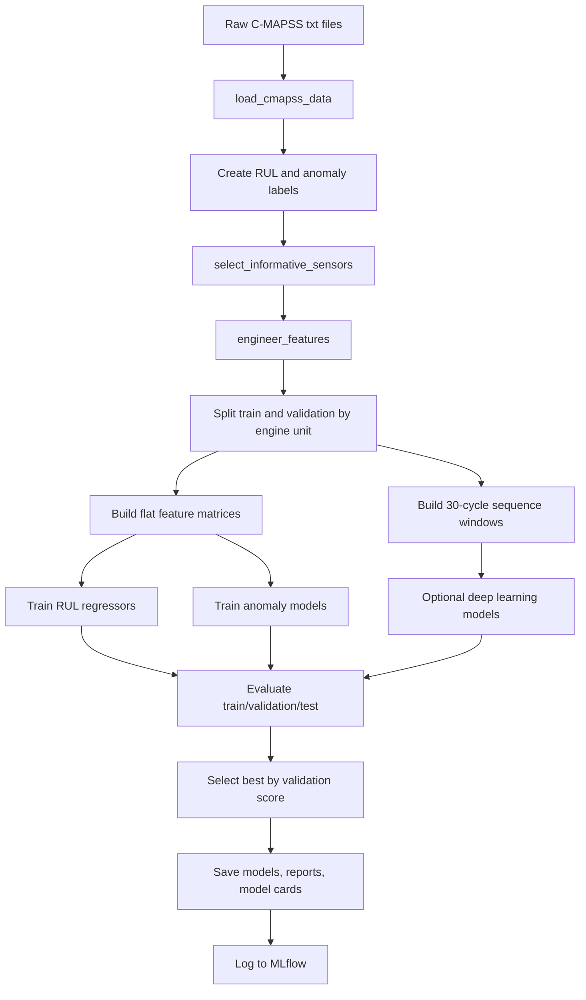
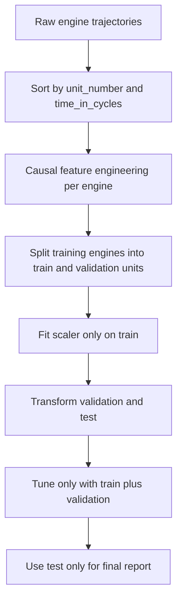
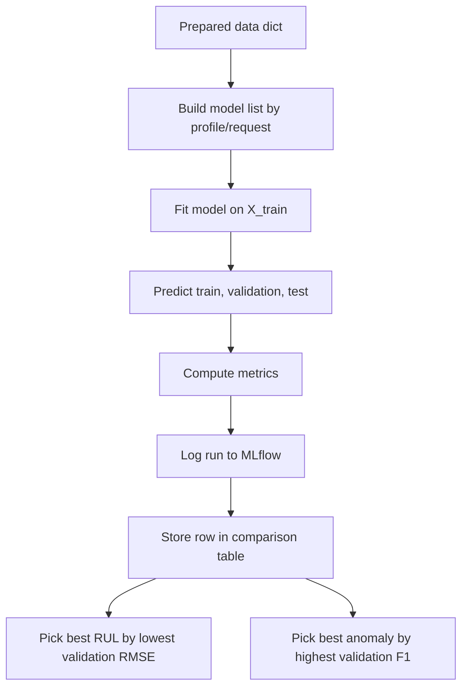
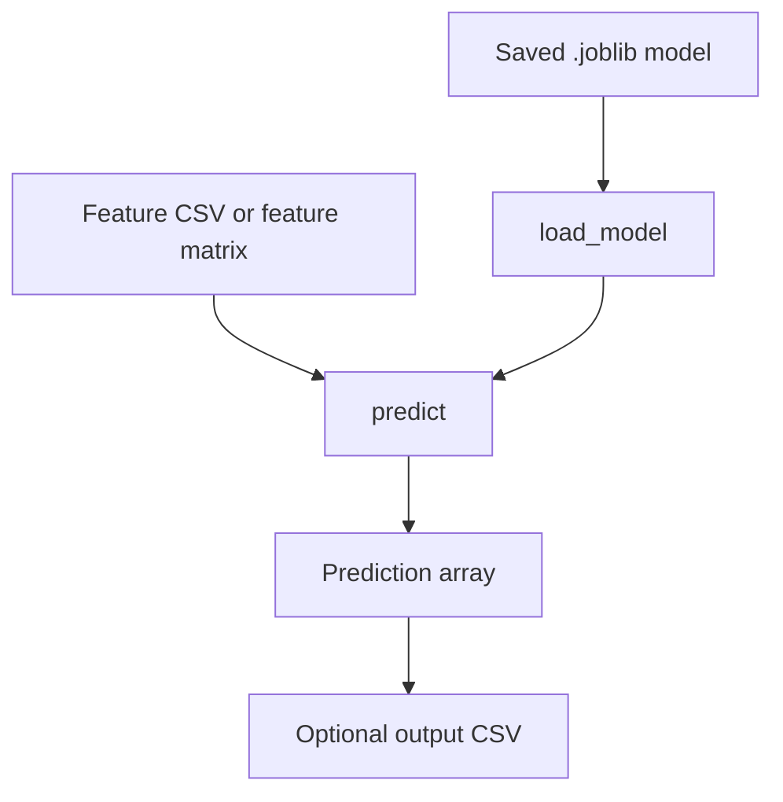

# MechSage ML Project Guide: Beginner to Advanced

Project root: `D:\Capstone\MechSage`

Main ML codebase: `ML`

This guide explains the machine learning decisions, the theory behind them, and the code flow function by function. It is written for a student who needs to understand and present the capstone project clearly.

## 1. Project In Simple Words

MechSage is a predictive maintenance ML project built around the NASA C-MAPSS turbofan engine dataset. The goal is to look at engine sensor readings over time and answer two practical questions:

1. How many cycles of useful life are left before an engine fails?
2. Is the engine currently behaving like it is near failure?

The first task is called Remaining Useful Life prediction, or RUL prediction. It is a regression problem because the model predicts a number, such as `42 cycles remaining`.

The second task is anomaly detection. It is treated as a binary classification problem in some models and as an outlier detection problem in others. The output is usually `0` for nominal/healthy and `1` for anomaly/near-failure.

Machine learning is suitable because turbofan degradation is visible through patterns across many sensors. A rule like "if sensor 9 is high then fail" is too simple. ML can learn combinations of sensor values, recent trends, and degradation patterns.

## 2. File Responsibility Table

| File | Main responsibility |
|---|---|
| `ML/main.py` | CLI entrypoint. Parses arguments and starts the pipeline. |
| `ML/configs/default.yaml` | Default runtime, data, feature, tuning, and model settings. |
| `ML/src/config.py` | Loads YAML config into typed dataclasses. |
| `ML/src/data_loader.py` | Loads raw C-MAPSS files and creates RUL/anomaly labels. |
| `ML/src/preprocessing.py` | Keeps useful sensors, removes target columns from features, provides scaling helper. |
| `ML/src/feature_engineering.py` | Builds causal rolling, delta, expanding, flat, and sequence features. |
| `ML/src/pipeline.py` | Main orchestration: prepare data, train, evaluate, log, save reports. |
| `ML/src/train_rul_models.py` | Extra RUL model definitions and helper trainers. Some are not always used by `pipeline.py`. |
| `ML/src/train_anomaly_models.py` | Extra anomaly model definitions and helper trainers. Some are not always used by `pipeline.py`. |
| `ML/src/hyperparameter_tuning.py` | GridSearchCV, RandomizedSearchCV, Optuna with GroupKFold leakage protection. |
| `ML/src/evaluate.py` | Regression and classification metric functions. |
| `ML/src/mlflow_tracking.py` | Logs params, metrics, artifacts, models, and tuning trials to MLflow. |
| `ML/src/model_registry.py` | Creates model version metadata/model cards. |
| `ML/src/inference.py` | Loads saved `.joblib` models and predicts from matrices or CSVs. |
| `ML/src/data_validation.py` | Validates rows, schema, missing values, duplicates, outliers, and target sanity. |
| `ML/tests/` | Unit, integration, leakage-prevention, tuning, inference, and config tests. |

## 3. ML Decisions Taken

| Decision | Where in code | Why it was taken |
|---|---|---|
| Use NASA C-MAPSS | `data_loader.py:56`, dataset card | It provides engine run-to-failure time-series data, suitable for RUL and anomaly tasks. |
| Derive RUL label from max engine cycle | `data_loader.py:85-91` | Training data contains full engine histories, so remaining life can be computed as `max_cycle - current_cycle`. |
| Use official test RUL file | `data_loader.py:94-104` | Test engines are truncated before failure, so final RUL must come from `RUL_FDxxx.txt`. |
| Clip RUL at 125 | `data_loader.py:90`, `config.py:50` | Very early-life engines are hard to distinguish; clipping stabilizes regression targets. |
| Create anomaly label from RUL threshold | `data_loader.py:91`, `data_loader.py:102` | Samples near failure become `anomaly=1`; default threshold is 30 cycles. |
| Keep 14 informative sensors | `preprocessing.py:10-15` | The project drops near-constant sensors and keeps sensors known to carry degradation information. |
| Exclude target/metadata columns from features | `preprocessing.py:18`, `preprocessing.py:47-50` | Prevents target leakage from `RUL`, `RUL_raw`, `anomaly`, engine id, and cycle id. |
| Split train/validation by engine unit | `pipeline.py:82-92` | All cycles from the same engine stay together, preventing same-engine leakage. |
| Use official test set only for final reporting | `pipeline.py:139-260`, `hyperparameter_tuning.py:595-637` | Test data must not influence model selection. |
| Fit scaler only on training data | `pipeline.py:197-202`, `preprocessing.py:39-43` | Validation/test statistics must not leak into training. |
| Use causal rolling features | `feature_engineering.py:8-34` | Rolling windows summarize recent history without looking into the future. |
| Use sensor deltas | `feature_engineering.py:36-53` | A delta captures whether a current reading is moving away from recent behavior. |
| Use expanding means | `feature_engineering.py:77-82` | Expanding means capture long-term engine-specific history using only past/current cycles. |
| Use GroupKFold for tuning | `hyperparameter_tuning.py:93-124`, `hyperparameter_tuning.py:313`, `hyperparameter_tuning.py:470` | Folds are grouped by engine unit, preventing the same engine from appearing in both train and validation folds. |
| Select best model by validation score | `pipeline.py:849-857` | Validation estimates generalization without touching the final test result. |
| Log everything to MLflow | `mlflow_tracking.py:123-170` | Experiments become reproducible and auditable. |
| Save model cards | `model_registry.py:29-53`, `pipeline.py:861-920` | Model outputs include dataset version, timestamp, git commit, and MLflow run id. |

## 4. Beginner Theory

### Predictive Maintenance

Predictive maintenance means using data to predict equipment problems before they cause downtime. Instead of waiting for an engine to fail, the system reads sensor patterns and warns that the engine is near failure.

### NASA C-MAPSS Dataset

C-MAPSS is a simulated turbofan engine degradation dataset. Each engine unit has many cycles. Every cycle has operational settings and sensor values. The training engines run until failure. The test engines stop before failure and have official RUL labels in a separate file.

### RUL Prediction

Remaining Useful Life is the number of cycles left before failure.

Example:

```text
Engine maximum cycle = 200
Current cycle = 170
RUL = 200 - 170 = 30 cycles
```

In this project, RUL is clipped at 125. So if raw RUL is 180, the model target becomes 125.

### Anomaly Detection

The project labels rows as anomalous when raw RUL is below or equal to the configured threshold, default 30 cycles.

```text
if RUL_raw <= 30:
    anomaly = 1
else:
    anomaly = 0
```

This makes anomaly detection a binary problem: nominal versus near-failure.

## 5. Intermediate Theory

### Supervised Learning

Supervised learning uses examples where the answer is known. Here:

- Inputs: sensor readings, operational settings, engineered features.
- Regression target: `RUL`.
- Classification target: `anomaly`.

### Regression

Regression predicts a continuous number. RUL regression models predict cycles remaining.

Important regression metrics:

- MAE: average absolute error.
- MSE: average squared error.
- RMSE: square root of MSE; same unit as RUL cycles.
- R2: how much variance the model explains.
- NASA score: asymmetric score where late predictions are penalized differently from early predictions.

### Classification And Anomaly Detection

Classification predicts a class. For anomaly detection, the project uses:

- `0`: nominal.
- `1`: anomaly.

Important classification metrics:

- Precision: of predicted anomalies, how many were true anomalies.
- Recall: of true anomalies, how many were caught.
- F1-score: balance between precision and recall.
- ROC-AUC: ranking quality across thresholds.
- PR-AUC: useful when anomalies are rare.

### Time-Series Features

Sensor rows are ordered by cycle. A single row may not show enough context, so the project adds time-series features:

- Rolling mean: recent average.
- Rolling standard deviation: recent variability.
- Delta: current value minus recent mean.
- Expanding mean: average from the first cycle up to the current cycle.
- Sequence windows: 30-cycle tensors for LSTM/GRU/CNN/Transformer models.

### Data Leakage

Data leakage happens when training accidentally uses information that would not be available in real life.

Examples this project avoids:

- Using `RUL` as an input feature.
- Using `max_cycle` or `final_cycle` as features.
- Splitting cycles from the same engine into both train and validation.
- Fitting scalers on train plus validation/test.
- Choosing hyperparameters using test results.

## 6. Advanced Theory

### GroupKFold

Normal KFold can split rows randomly. In time-series engine data, that is dangerous because the same engine can appear in both train and validation folds.

GroupKFold uses a group id, here `unit_number`, so each engine belongs to exactly one side of each fold. The project validates this in `hyperparameter_tuning.py:93-124`.

### Hyperparameter Tuning

Hyperparameters are model settings chosen before training, such as:

- Number of trees.
- Tree depth.
- Learning rate.
- Number of Optuna trials.

The project supports:

- GridSearchCV: tries every combination in a small grid.
- RandomizedSearchCV: samples combinations.
- Optuna: uses Bayesian-style trial search to find better parameters.

The tuning module wraps estimators in a sklearn `Pipeline` with `StandardScaler` at `hyperparameter_tuning.py:127-138`, so scaling happens independently inside each fold.

### Tree-Based Models

Random Forest, LightGBM, XGBoost, and CatBoost are tree-based models. They split data into decision rules.

- Random Forest averages many independent trees.
- LightGBM grows efficient gradient-boosted trees.
- XGBoost is another strong gradient boosting library.
- CatBoost handles categorical features well, though this project mostly uses numeric features.

### Deep Learning Models

The project defines:

- LSTM and GRU regressors for sequence RUL prediction.
- CNN regressor for local temporal patterns.
- Transformer regressor for attention-based sequence modeling.
- Feed-forward autoencoder for reconstruction-based anomaly detection.
- LSTM autoencoder for sequence reconstruction anomaly detection.

Important implementation note: the main pipeline only trains deep learning models when they are explicitly requested through CLI model arguments. The helper classes exist, but they are not always part of a default run.

### MLflow

MLflow is used for experiment tracking. The project logs:

- Dataset id and version.
- Split details.
- Preprocessing settings.
- Feature engineering settings.
- Hyperparameters.
- Train/validation/test metrics.
- Artifacts such as plots and prediction CSV files.
- Model objects.

## 7. Overall ML Pipeline



## 8. Data Leakage Prevention Flow



## 9. Training And Evaluation Flow



## 10. Inference Flow



Important limitation: `inference.py` expects already-prepared feature columns. A full raw-sensor-to-feature inference pipeline is not implemented in `inference.py`.

## 11. Code Walkthrough: CLI And Configuration

### `main.py`

Important functions:

| Function | Line | Purpose |
|---|---:|---|
| `_base_parser` | 24 | Reads only `--config` early. |
| `parse_args` | 31 | Loads config and defines full CLI arguments. |
| `main` | 80 | Configures logging, runs pipeline, reports best models. |

Step by step:

- `main.py:13-17` imports config loading, custom errors, logging setup, and `run_pipeline`.
- `_base_parser` at `main.py:24` exists because the program needs to know the config path before it can set defaults.
- `parse_args` at `main.py:31` loads `configs/default.yaml`, then uses those values as CLI defaults.
- CLI choices restrict datasets to `FD001` through `FD004` and profiles to `quick`, `standard`, and `full`.
- `main` at `main.py:80` calls `run_pipeline(args)` and logs best model results.

### `config.py`

Important classes and functions:

| Item | Line | Purpose |
|---|---:|---|
| `PathConfig` | 24 | Directory defaults. |
| `RuntimeConfig` | 36 | Seed, profile, validation size, tracking URI. |
| `DataConfig` | 46 | Dataset id, RUL clip, anomaly threshold, unit limits. |
| `FeatureConfig` | 57 | Rolling windows and selected sensors. |
| `TrainingConfig` | 66 | CV and tuning settings. |
| `ProjectConfig` | 84 | Full typed project config. |
| `load_config` | 124 | Reads YAML and environment overrides. |

The project uses dataclasses so configuration is structured instead of passed around as loose dictionaries.

## 12. Code Walkthrough: Data Loading

### `data_loader.py`

Important functions:

| Function | Line | Purpose |
|---|---:|---|
| `get_data_dir` | 13 | Finds local dataset directory. |
| `get_dataset_file_paths` | 28 | Builds paths for train/test/RUL files. |
| `compute_dataset_version` | 38 | Hashes raw data files for reproducibility. |
| `load_cmapss_data` | 56 | Loads raw data and creates labels. |

Line-by-line logic for `load_cmapss_data`:

| Lines | Explanation |
|---|---|
| `56-64` | Function signature and arguments: dataset id, RUL clip, anomaly threshold. |
| `66-69` | Resolve train, test, and RUL file paths. |
| `71-76` | Check training file exists, then read train, test, and truth RUL files with whitespace separators. |
| `79-80` | Sort data by engine unit and cycle so time-series operations are ordered. |
| `84-92` | For training engines, compute each engine's max cycle, calculate raw RUL, clip RUL, create anomaly label, then drop `max_cycle`. |
| `94-104` | For test engines, merge official `final_rul`, compute raw RUL, clip RUL, create anomaly label, then drop helper columns. |

Core ML decision:

The training RUL label is computed because training engines run to failure. The test RUL label uses the official file because test engines do not run to failure in the test text file.

## 13. Code Walkthrough: Preprocessing

### `preprocessing.py`

Important constants:

- `INFORMATIVE_SENSORS` at `preprocessing.py:10-15`.
- `OP_SETTINGS` at `preprocessing.py:16`.
- `NON_FEATURE_COLS` at `preprocessing.py:18`.

Important functions:

| Function | Line | Purpose |
|---|---:|---|
| `select_informative_sensors` | 21 | Keeps metadata, operational settings, and 14 informative sensors. |
| `normalize_per_unit` | 32 | Fits MinMaxScaler on train only, transforms test. |
| `get_feature_columns` | 47 | Returns columns usable as model inputs. |

Line-by-line logic for `select_informative_sensors`:

```python
keep_cols = NON_FEATURE_COLS + OP_SETTINGS + INFORMATIVE_SENSORS
keep_cols = [c for c in keep_cols if c in df.columns]
return df[keep_cols].copy()
```

Explanation:

- First line builds the intended schema.
- Second line prevents errors if a column is missing.
- Third line returns only those columns and copies the data so later edits do not mutate the original frame.

Why this matters:

Dropping near-constant/non-informative sensors reduces noise and model complexity. Excluding target columns later prevents leakage.

## 14. Code Walkthrough: Feature Engineering

### `feature_engineering.py`

Important functions:

| Function | Line | Purpose |
|---|---:|---|
| `add_rolling_features` | 8 | Adds per-engine rolling mean and rolling std. |
| `add_degradation_trends` | 36 | Adds current sensor minus rolling mean. |
| `engineer_features` | 56 | Sorts data, checks monotonic cycles, applies all feature steps. |
| `build_sequence_windows` | 88 | Creates 3D windows for sequence models. |
| `get_flat_features` | 132 | Creates 2D feature matrix and target arrays. |

Line-by-line logic for `engineer_features`:

| Lines | Explanation |
|---|---|
| `56-62` | Copy input and sort by engine and cycle. |
| `64-71` | Assert cycles are monotonic per engine. If time order is broken, stop. |
| `73` | Add rolling mean/std features. |
| `74` | Add sensor deltas. |
| `77-82` | Add expanding means per engine. |
| `84` | Return the engineered dataframe. |

Why rolling features are causal:

Pandas rolling windows here operate in sorted time order within each `unit_number`. At cycle 50, the rolling mean uses cycles up to 50, not cycles after 50.

Why sequence windows exist:

Deep learning sequence models expect tensors shaped like:

```text
(number_of_samples, sequence_length, number_of_features)
```

`build_sequence_windows` at `feature_engineering.py:88` builds 30-cycle windows by default.

## 15. Code Walkthrough: Main Pipeline

### `pipeline.py`

This is the main orchestration file. It is the most important file for understanding the project.

Important functions:

| Function | Line | Purpose |
|---|---:|---|
| `_split_train_validation_by_unit` | 82 | Splits training engines into train and validation groups. |
| `write_validation_reports` | 106 | Saves data validation JSON reports. |
| `prepare_data` | 139 | Full data preparation pipeline. |
| `_build_rul_models` | 288 | Builds sklearn RUL model set by profile. |
| `_build_dl_rul_models` | 332 | Builds optional deep RUL models. |
| `_build_anomaly_models` | 349 | Builds anomaly model names by profile. |
| `_build_dl_anomaly_models` | 358 | Builds optional deep anomaly models. |
| `train_rul_model` | 382 | Fits and evaluates a sklearn RUL model. |
| `train_anomaly_model` | 459 | Fits and evaluates a sklearn anomaly model. |
| `train_pytorch_rul_model_pipeline` | 573 | Fits and evaluates a PyTorch RUL model. |
| `train_pytorch_anomaly_model_pipeline` | 695 | Fits and evaluates a PyTorch anomaly model. |
| `_best_rul_row` | 849 | Picks lowest validation RMSE. |
| `_best_anomaly_row` | 855 | Picks highest validation F1. |
| `_save_best_outputs` | 861 | Saves best model, metrics, params, model card. |
| `_save_final_report` | 923 | Writes CSV, JSON, and Markdown reports. |
| `run_pipeline` | 991 | End-to-end training and reporting orchestration. |

### `prepare_data` block-by-block

| Lines | What happens | ML reason |
|---|---|---|
| `139-147` | Compute dataset version and load raw train/test data. | Reproducibility and raw label creation. |
| `149-155` | Apply quick-profile unit limits if needed. | Fast local smoke tests. |
| `157-158` | Engineer features separately for train and test. | Keeps train/test sources separate. |
| `159-161` | Split train into train and validation by engine unit. | Prevents same-engine leakage. |
| `164-166` | Sort and reset indexes. | Keeps features, targets, and groups aligned. |
| `168-171` | Build flat features and targets. | sklearn models need 2D matrices. |
| `173-175` | Save group arrays. | Needed for GroupKFold and leakage checks. |
| `178-180` | Assert alignment of features, targets, and groups. | Prevents silent training bugs. |
| `182-193` | Create split metadata. | Logged to reports and MLflow. |
| `197-202` | Fit MinMaxScaler on train; transform validation/test. | Prevents scaling leakage. |
| `204-225` | Build context metadata. | Documents preprocessing and feature decisions. |
| `238` | Assert train/validation units are disjoint. | Direct leakage guard. |
| `242-250` | Build split manifest. | Reproducible split record. |
| `253-255` | Build 30-cycle sequence tensors. | Supports optional deep sequence models. |
| `257-285` | Return all data objects in one dictionary. | Central interface for training functions. |

Note: train/test unit numbers may overlap numerically in C-MAPSS because official train and test files reuse ids for different engine populations. The code asserts train/validation disjointness, not train/test id disjointness.

### `train_rul_model`

At `pipeline.py:382`, the model is fitted on `X_train` and `y_train_rul`. It predicts all three splits, computes regression metrics, saves plots/predictions/model artifacts, and logs the run to MLflow.

Design decision:

The returned row contains train, validation, and test scores, but `_best_rul_row` chooses by validation score at `pipeline.py:849-852`. This means test score is reported, not used for model selection.

### `train_anomaly_model`

At `pipeline.py:459`, the function trains either:

- `IsolationForest`: unsupervised, fit only on nominal training rows.
- `LightGBM_Anomaly`: supervised classifier, fit on full training rows with anomaly labels.
- `OneClassSVM`: unsupervised, fit only on nominal training rows.

Important design:

- Thresholds are selected using validation data.
- Test predictions are generated after the threshold is chosen.
- Metrics are computed for train, validation, and test.
- Best anomaly model is selected by validation F1 at `pipeline.py:855-858`.

## 16. Code Walkthrough: RUL Model Helpers

### `train_rul_models.py`

Important classes/functions:

| Item | Line | Purpose |
|---|---:|---|
| `LSTMRegressor` | 21 | Sequence model using LSTM memory. |
| `GRURegressor` | 36 | Sequence model using GRU memory. |
| `CNNRegressor` | 51 | 1D convolution over time windows. |
| `TransformerRegressor` | 72 | Attention-based sequence regressor. |
| `train_sklearn_rul_models` | 102 | Helper to train multiple sklearn/tree RUL models. |
| `train_pytorch_rul_model` | 160 | Helper to train one PyTorch RUL model. |
| `train_all_dl_rul_models` | 231 | Helper to train multiple deep RUL models. |

The main pipeline imports the deep classes from this file when optional deep models are requested. The helper training functions are available, but the primary orchestration path is in `pipeline.py`.

## 17. Code Walkthrough: Anomaly Model Helpers

### `train_anomaly_models.py`

Important classes/functions:

| Item | Line | Purpose |
|---|---:|---|
| `Autoencoder` | 22 | Reconstructs flat feature vectors. High reconstruction error means anomaly. |
| `LSTMAutoencoder` | 50 | Reconstructs sequence windows. |
| `train_isolation_forest` | 78 | Trains Isolation Forest on nominal samples. |
| `train_one_class_svm` | 102 | Trains One-Class SVM on nominal samples. |
| `train_lightgbm_anomaly` | 127 | Trains supervised LightGBM classifier. |
| `_compute_reconstruction_error` | 203 | Converts reconstruction difference into anomaly score. |
| `train_autoencoder` | 217 | Trains flat autoencoder. |
| `train_lstm_autoencoder` | 262 | Trains sequence autoencoder. |
| `train_all_anomaly_models` | 307 | Helper to train several anomaly detectors. |

Important note:

The main `pipeline.py` has its own anomaly training path. Some helper code in `train_anomaly_models.py` is not the main production path.

## 18. Code Walkthrough: Hyperparameter Tuning

### `hyperparameter_tuning.py`

Important items:

| Item | Line | Purpose |
|---|---:|---|
| `FORBIDDEN_FEATURES` | 55 | List of future-leaking feature names to reject. |
| `_check_forbidden_features` | 83 | Raises error if forbidden features are present. |
| `validate_group_folds` | 93 | Ensures no engine group overlap inside CV folds. |
| `_build_pipeline` | 127 | Wraps estimator in `StandardScaler` plus model. |
| `_base_specs` | 188 | Defines search spaces for models. |
| `_run_cv_search` | 290 | Runs GridSearchCV or RandomizedSearchCV with GroupKFold. |
| `_run_optuna` | 447 | Runs Optuna with GroupKFold. |
| `run_all_tuning` | 595 | Public tuning entrypoint. |

Key design:

`run_all_tuning` accepts `X_train`, `y_train`, `train_groups`, `X_val`, and `y_val`. It does not accept `X_test` or `y_test`. This is intentional and protects the test set from tuning leakage.

## 19. Code Walkthrough: Evaluation Metrics

### `evaluate.py`

Important functions:

| Function | Line | Purpose |
|---|---:|---|
| `rmse` | 37 | Root mean squared error. |
| `nasa_scoring_function` | 41 | NASA asymmetric RUL score. |
| `adjusted_r2` | 50 | R2 adjusted for number of features. |
| `mape` | 60 | Mean absolute percentage error. |
| `compute_regression_metrics` | 67 | Full regression metrics dictionary. |
| `compute_classification_metrics` | 84 | Full binary classification metrics dictionary. |
| `compute_anomaly_metrics` | 106 | Alias for classification metrics. |

Metric formulas in plain English:

| Metric | Meaning |
|---|---|
| MAE | Average absolute distance between actual and predicted RUL. |
| MSE | Average squared error; punishes large mistakes more. |
| RMSE | Square root of MSE; easier to interpret in cycles. |
| R2 | Fraction of variance explained by model. |
| Adjusted R2 | R2 adjusted for feature count. |
| MAPE | Percentage error. |
| NASA Score | Penalizes RUL over/under prediction asymmetrically. |
| Precision | How trustworthy anomaly alerts are. |
| Recall | How many true anomalies are caught. |
| F1 | Balance between precision and recall. |
| ROC-AUC | Ranking quality across thresholds. |
| PR-AUC | Precision-recall quality, useful for imbalanced anomalies. |

## 20. Code Walkthrough: MLflow And Model Registry

### `mlflow_tracking.py`

Important functions:

| Function | Line | Purpose |
|---|---:|---|
| `setup_mlflow` | 22 | Sets tracking URI and experiment. |
| `log_params` | 55 | Logs parameters safely. |
| `log_metrics` | 60 | Logs numeric metrics only. |
| `write_json` | 66 | Saves JSON artifact. |
| `save_predictions` | 72 | Writes actual/prediction CSV. |
| `plot_feature_importance` | 83 | Saves feature importance plot when supported. |
| `log_model_run` | 123 | Logs one trained model run. |
| `log_tuning_trial` | 173 | Logs one tuning candidate. |
| `mark_best_trial` | 204 | Marks best tuning trial. |
| `log_final_best_model` | 209 | Logs final selected model. |
| `log_final_test_evaluation` | 243 | Separate final test evaluation logger. |

### `model_registry.py`

Important functions:

| Function | Line | Purpose |
|---|---:|---|
| `get_git_commit` | 13 | Reads current git commit hash. |
| `build_model_version` | 29 | Creates model metadata dictionary. |
| `save_model_card` | 55 | Saves metadata as JSON. |

Model cards make the experiment auditable. They answer: what model, what dataset version, what code commit, what MLflow run, and when was it trained?

## 21. Code Walkthrough: Inference

### `inference.py`

Important functions:

| Function | Line | Purpose |
|---|---:|---|
| `load_model` | 21 | Loads `.joblib` model from disk. |
| `predict` | 42 | Calls model `.predict()` and returns numpy array. |
| `predict_from_csv` | 60 | Reads CSV, predicts, writes CSV with `prediction` column. |

Line-by-line logic for `predict_from_csv`:

| Lines | Explanation |
|---|---|
| `60-70` | Function signature and argument documentation. |
| `72` | Load saved model. |
| `73` | Read feature CSV. |
| `74` | Add prediction column by calling `predict`. |
| `75-77` | Ensure output folder exists and write CSV. |
| `78` | Return output path as string. |

Important limitation:

`predict_from_csv` does not recreate sensor selection, rolling features, scaling, or sequence windows. The CSV must already match the trained model's feature format.

## 22. Model Comparison Table

| Model | Task | Implemented where | Default use |
|---|---|---|---|
| LinearRegression | RUL regression | `pipeline.py:288`, `train_rul_models.py:124` | Quick/standard/full RUL baseline. |
| RandomForestRegressor | RUL regression | `pipeline.py:292`, `train_rul_models.py:125` | Quick/standard/full RUL model. |
| LightGBM Regressor | RUL regression | `pipeline.py:300` | Standard/full RUL model. |
| XGBoost Regressor | RUL regression | `pipeline.py:309` | Full profile only. |
| CatBoost Regressor | RUL regression | `pipeline.py:319` | Full profile only. |
| LSTM | RUL regression | `train_rul_models.py:21`, `pipeline.py:332` | Only when requested. |
| GRU | RUL regression | `train_rul_models.py:36`, `pipeline.py:332` | Only when requested. |
| CNN_1D | RUL regression | `train_rul_models.py:51`, `pipeline.py:332` | Only when requested in full profile. |
| Transformer | RUL regression | `train_rul_models.py:72`, `pipeline.py:332` | Only when requested in full profile. |
| IsolationForest | Anomaly detection | `pipeline.py:467`, `train_anomaly_models.py:78` | Quick/standard/full anomaly model. |
| LightGBM_Anomaly | Anomaly detection | `pipeline.py:494`, `train_anomaly_models.py:127` | Quick/standard/full anomaly model. |
| OneClassSVM | Anomaly detection | `pipeline.py:488`, `train_anomaly_models.py:102` | Full profile only. |
| Autoencoder | Anomaly detection | `train_anomaly_models.py:22`, `pipeline.py:358` | Only when requested. |
| LSTM_Autoencoder | Anomaly detection | `train_anomaly_models.py:50`, `pipeline.py:358` | Only when requested. |

## 23. Tests And What They Protect

| Test file | What it checks |
|---|---|
| `tests/test_data_pipeline.py` | Leakage prevention, group splits, causal rolling features, deterministic splits, feature alignment. |
| `tests/test_metrics.py` | Regression and anomaly metric outputs. |
| `tests/test_validation_inference_config.py` | Config loading, validation reports, model loading, prediction writing. |
| `tests/test_integration_cli.py` | End-to-end CLI run creates reports. |
| `tests/test_tuning.py` | Tuning and MLflow trial behavior, though this file appears stale relative to current tuning function signature. |

## 24. Common Viva Questions And Answers

| Question | Answer |
|---|---|
| What problem does this project solve? | It predicts turbofan engine Remaining Useful Life and detects near-failure anomalies from sensor data. |
| Why is RUL prediction regression? | Because the output is a continuous number of cycles remaining. |
| Why is anomaly detection classification? | Because the output is nominal or anomalous. |
| Why clip RUL at 125? | To reduce instability from very large early-life RUL values that are hard to distinguish. |
| Why drop some sensors? | Near-constant or uninformative sensors add noise and cost without improving learning. |
| Why split by engine unit? | Rows from the same engine are highly related; splitting them across train/validation would leak engine-specific patterns. |
| What is data leakage? | Any situation where training uses future, validation, test, or target information that would not be available at prediction time. |
| How is leakage prevented? | Targets are excluded, forbidden future features are checked, scalers fit only train data, GroupKFold uses engine groups, and test data is not passed to tuning. |
| Why use rolling features? | They summarize recent sensor history, which is important for degradation trends. |
| Why use expanding mean? | It summarizes long-term behavior of each engine up to the current cycle. |
| Why use Random Forest? | It is a strong baseline that handles nonlinear relationships and feature interactions. |
| Why use LightGBM/XGBoost/CatBoost? | They are powerful gradient boosting models often strong on tabular ML. |
| Why use Isolation Forest? | It can learn normal behavior from nominal rows and score unusual rows as anomalies. |
| Why use Autoencoders? | They learn to reconstruct normal behavior; high reconstruction error can indicate abnormal behavior. |
| Why use MLflow? | To track experiments, metrics, models, parameters, and artifacts reproducibly. |
| Why select by validation score? | Validation is used for model choice; test should be saved for final unbiased reporting. |
| What is not implemented in inference? | Full raw sensor preprocessing and feature engineering from raw C-MAPSS rows is not implemented in `inference.py`. |

## 25. Known Risky Or Unclear Areas

1. `tests/test_tuning.py` appears stale. It calls `run_all_tuning` with `X_test`, `y_test`, and `cv`, but current `run_all_tuning` at `hyperparameter_tuning.py:595` accepts `train_groups` and `n_splits`, and intentionally does not accept test data.
2. In a prior leakage test run, `test_validate_group_folds_raises_on_overlap` failed because the contrived KFold example did not actually create overlapping groups. The intended guard is good, but that specific negative test should be corrected.
3. `train_anomaly_models.py` helper code includes an unused `_y_test_seq` variable around the sequence anomaly helper path. The main `pipeline.py` path is separate.
4. `inference.py` is model-serving minimal. It loads models and predicts on ready features; it does not guarantee production feature parity from raw sensor files.
5. Deep learning models are defined, but they are not trained by default. They must be explicitly requested.

## 26. How To Explain The Project In A Presentation

Use this story:

1. "We use NASA turbofan degradation data to predict engine health."
2. "The first output is RUL, a regression target in cycles."
3. "The second output is anomaly state, built from RUL threshold."
4. "We select informative sensors and engineer time-aware features."
5. "We split by engine unit to prevent leakage."
6. "We train baseline, tree, boosting, anomaly, and optional deep models."
7. "We tune only on training/validation data using GroupKFold."
8. "We report final test metrics only after model selection."
9. "We log experiments and artifacts in MLflow."
10. "We save best models and model cards for reproducibility."

## 27. Final Mental Model

Think of the project as four layers:

1. Data layer: read C-MAPSS, create labels, validate quality.
2. Feature layer: select sensors and create causal time-series features.
3. Model layer: train RUL regressors and anomaly detectors.
4. MLOps layer: tune, evaluate, log, save reports, and create model cards.

The most important engineering principle is leakage control. Every major decision in the code supports that principle: grouped splitting, causal features, train-only scaling, validation-only model selection, and final-only test evaluation.
